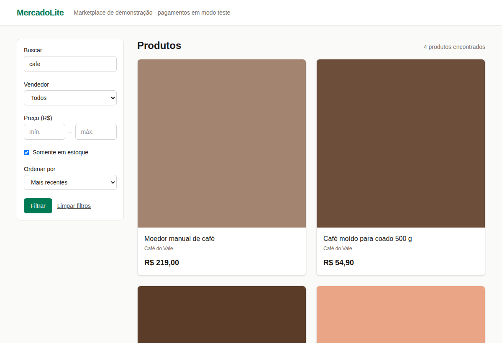
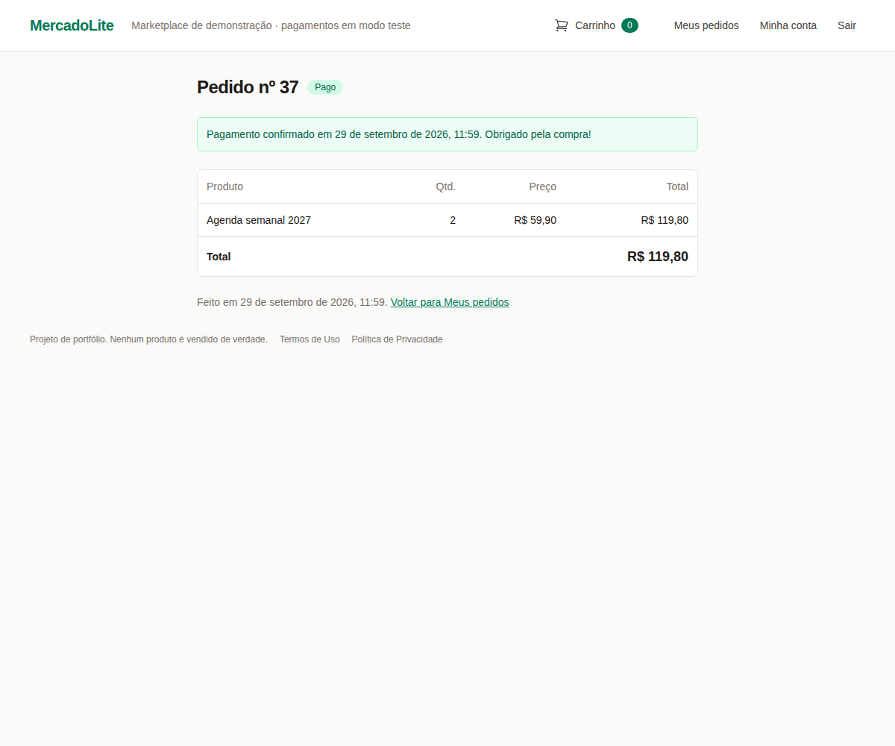

# MercadoLite

Marketplace com catálogo, carrinho, checkout Stripe (modo teste), pedidos e estoque — com o pagamento tratado como ponto crítico de segurança.

> 🚧 **Em construção — fases 1, 2 e 3 concluídas (catálogo, carrinho, login e checkout com Stripe).** Parte do portfólio
> [Projetos-e-ideias](https://github.com/Everett-gi/Projetos-e-ideias).



## O que é

Loja/marketplace com produtos, carrinho, **checkout via Stripe (modo teste, gratuito)**,
pedidos com status e controle de estoque.

**Já funciona:**
- **Fase 1:** vitrine com busca sem acento, filtros (vendedor, faixa de preço, em estoque),
  ordenação e paginação; página de produto com imagens (Active Storage) e estoque.
- **Fase 2:** carrinho na sessão (sem login), adicionado via Turbo Stream sem recarregar a
  página, com quantidade e estoque conferidos, preço sempre lido do banco e limpeza diária de
  carrinhos abandonados.
- **Fase 3a:** conta de comprador (Devise) com confirmação de e-mail, "esqueci minha senha",
  expiração por inatividade e exclusão da conta; o carrinho de visitante passa a ser da conta
  no login.
- **Fase 3b:** checkout com o **Stripe Checkout** (modo teste): o carrinho vira pedido com o
  preço congelado, o comprador paga na página do Stripe (o cartão nunca passa pela loja) e o
  pagamento é confirmado por **webhook assinado**; "Meus pedidos" com autorização pelo
  **Pundit**.



## Stack

Ruby 4.0.7 · Rails 8.1.4 · PostgreSQL 16 · Hotwire (Turbo + Stimulus) · Tailwind CSS ·
Active Storage + libvips · Devise · Pundit · **Stripe** (modo teste, Stripe Checkout + webhooks) ·
Mailpit (e-mail em desenvolvimento) · RSpec + FactoryBot + WebMock · RuboCop · Brakeman ·
bundler-audit.

## Modelos

- ✅ **Vendor** · **Product** (vendedor, preço em centavos, até 5 imagens) · **Inventory** (1:1 com o produto)
- ✅ **Cart** + **CartItem** (de 1 a 10 unidades por linha, sem coluna de preço; de visitante ou de uma conta)
- ✅ **User** (e-mail confirmado, hash bcrypt da senha, data do aceite dos termos)
- ✅ **Order** (status: pending|paid|shipped|canceled, total em centavos, sessão do Stripe) + **OrderItem** (nome e preço congelados na compra)
- ✅ **StripeEvent** (eventos de webhook já processados: só o id e o tipo)

## Segurança

Resumo das medidas (detalhes no [`SECURITY.md`](SECURITY.md)):

- Regras críticas **também no banco** (CHECK de preço e estoque, chaves estrangeiras, índices únicos).
- Busca sem SQL injection (placeholders, `sanitize_sql_like`, ordenação por *allowlist*) — com teste.
- Escape de HTML em todas as views + **CSP com nonce** por requisição — um script injetado é bloqueado (verificado no navegador).
- Uploads restritos a JPEG/PNG/WebP (SVG recusado), com limites de tamanho e quantidade.
- Carrinho com **anti-IDOR** (itens procurados só no carrinho da sessão), **CSRF** em três camadas (token, `Origin`, `SameSite`) — um ataque real foi barrado — e **rate limit** (429).
- Sessão em cookie cifrado e autenticado (AES-256-GCM), `HttpOnly`, `SameSite=Lax`, `Secure` em produção.
- Segredos só em variáveis de ambiente; CI bloqueante com Brakeman, bundler-audit e importmap audit; Dependabot.
- O **preço nunca vem do navegador**: o carrinho usa sempre o preço do banco (com teste).
- Login com **bcrypt** (senha de 15 a 72 bytes, sem senhas previsíveis), **modo paranoico** (nem a mensagem nem o tempo de resposta revelam quem tem conta) e **rate limit por IP e por e-mail**.
- **"Sair" invalida todas as cópias do cookie de sessão** (um cookie copiado não volta a entrar); sessão expira com 2 horas sem uso.
- Tokens de e-mail com validade curta, e **fora dos logs** (achado e corrigido na fase 3a).
- **Pagamento:** o **preço sai do banco** e é congelado no pedido; só o Stripe confirma o pagamento (a URL de retorno não prova nada), e o valor e a moeda precisam bater com o pedido.
- **Webhooks do Stripe** com **assinatura HMAC verificada** (corpo cru, comparação em tempo constante, recusa de eventos com mais de 5 minutos contra *replay*, limite de 64 KB) e **idempotência** em duas camadas (índice único por evento + `SELECT ... FOR UPDATE`), testada com duas conexões concorrentes.
- **Só chaves de teste** (a aplicação não sobe com chave de produção), de preferência a chave **restrita**; nos testes, nenhuma chamada de rede (WebMock).
- Pedidos com **Pundit**: cada comprador vê só os seus (o de outra pessoa dá 404), com negação por padrão.
- **LGPD:** coleta mínima, aceite dos termos, exclusão da conta pelo próprio usuário (os pedidos ficam, sem dono), limpeza de contas não confirmadas e dados do comprador fora dos logs (inclusive os que vêm nos webhooks).

## Rodando localmente

Passo a passo completo (WSL 2 + Ubuntu no Windows 11) na
[Lição 00](docs/tutorial/00-ambiente-wsl.md). Resumo, no terminal do Ubuntu:

```bash
cp .env.example .env            # e defina DATABASE_PASSWORD
docker compose up -d            # PostgreSQL 16 e Mailpit (e-mails em http://localhost:8025)
bundle install
bin/rails db:prepare db:seed    # bancos, schema e dados de exemplo
bin/dev                         # http://localhost:3000
```

Para o checkout funcionar, ponha no `.env` uma **chave restrita de teste** do Stripe e o
segredo do `stripe listen` (passo a passo na
[lição da fase 3b](docs/tutorial/fase-3b-checkout.md#17-mão-na-massa)). Sem elas, a loja funciona e
o botão "Finalizar compra" avisa que o pagamento não está configurado.

Testes e verificações (as mesmas do CI):

```bash
bundle exec rspec     # testes
bin/rubocop           # estilo
bin/brakeman          # análise de segurança
bin/bundler-audit     # vulnerabilidades nas gems
bin/ci                # tudo de uma vez
```

## Roadmap

1. ✅ Catálogo (produtos + imagens + busca/filtros)
2. ✅ Carrinho (sessão, CSRF, anti-IDOR, rate limit, Turbo Streams)
3. ✅ Login do comprador (3a: Devise, e-mail confirmado, LGPD) + checkout com Stripe em modo teste (3b: Pundit, webhook assinado e idempotente)
4. ⬜ Pedidos + estoque (baixa no pagamento confirmado)
5. ⬜ Painel do vendedor
6. ⬜ Deploy (Docker Compose + Caddy, ver [`docs/DEPLOY.md`](docs/DEPLOY.md))

## Modo tutorial

Cada fase concluída ganha uma lição em [`docs/tutorial/`](docs/tutorial/):

| Lição | Conteúdo |
|---|---|
| [00 — Ambiente](docs/tutorial/00-ambiente-wsl.md) | WSL 2, Ubuntu, Ruby com mise, Docker Desktop, VS Code |
| [01 — Ruby para quem vem do C/C++](docs/tutorial/01-ruby-para-quem-vem-do-c.md) | objetos, blocos, símbolos, mixins, exceções, Bundler |
| [Fase 1 — Catálogo](docs/tutorial/fase-1-catalogo.md) | Rails, Active Record, migrations e restrições, SQL injection, XSS, CSP, Active Storage, RSpec, CI |
| [Fase 2 — Carrinho](docs/tutorial/fase-2-carrinho.md) | cookies e sessão (AES-256-GCM), CSRF com ataque real, IDOR, rate limiting, Turbo Streams, concerns, jobs com Solid Queue |
| [Fase 3a — Login](docs/tutorial/fase-3a-login.md) | hash de senha (bcrypt, sal, custo, 72 bytes), Devise e Warden, enumeração e ataques de tempo, revogação de sessão, rate limit por e-mail, e-mail com Mailpit, token no log, LGPD |
| [Fase 3b — Checkout](docs/tutorial/fase-3b-checkout.md) | pedido com preço congelado, Pundit, chaves do Stripe, Stripe Checkout, chave de idempotência, webhooks e HMAC à mão, *replay*, idempotência com trava de linha e concorrência nos testes, CSP e Turbo, WebMock, pagamento real na sandbox |
