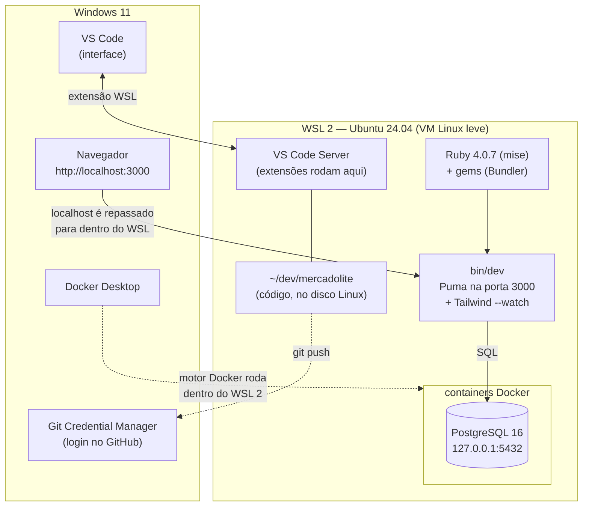
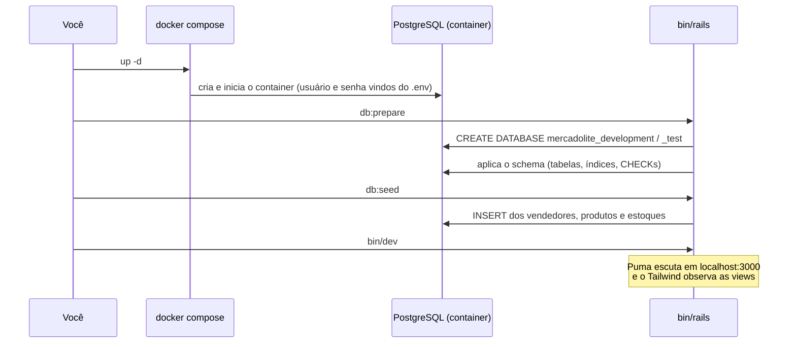

# Lição 00 — Ambiente: WSL 2, Ruby, Docker e VS Code

> **Objetivo:** deixar o seu Windows 11 pronto para rodar o MercadoLite do mesmo jeito que
> ele roda no CI e no servidor: **em Linux**. No fim desta lição, `http://localhost:3000`
> mostra a vitrine da loja no navegador do Windows.
>
> **Tempo estimado:** 40–60 minutos (a maior parte é download e compilação).

**Sumário**
1. [Por que WSL 2 (e não Ruby direto no Windows)](#1-por-que-wsl-2-e-não-ruby-direto-no-windows)
2. [O mapa do ambiente](#2-o-mapa-do-ambiente)
3. [Instalar o WSL 2 com Ubuntu](#3-instalar-o-wsl-2-com-ubuntu)
4. [Pacotes de sistema do Ubuntu](#4-pacotes-de-sistema-do-ubuntu)
5. [Ruby com o mise](#5-ruby-com-o-mise)
6. [Git dentro do WSL](#6-git-dentro-do-wsl)
7. [Onde clonar: `~/dev`, e não `C:\dev`](#7-onde-clonar-dev-e-não-cdev)
8. [VS Code conectado ao WSL](#8-vs-code-conectado-ao-wsl)
9. [Docker Desktop e o PostgreSQL](#9-docker-desktop-e-o-postgresql)
10. [Rodando o MercadoLite](#10-rodando-o-mercadolite)
11. [Problemas comuns](#11-problemas-comuns)
12. [Glossário](#12-glossário)

---

## 1. Por que WSL 2 (e não Ruby direto no Windows)

O Ruby nasceu no mundo Unix, e o ecossistema segue lá: muitas gems são **extensões nativas
em C** que compilam na instalação e se ligam a bibliotecas do sistema (a `pg` à `libpq`, a
`ruby-vips` à `libvips`). No Windows isso exige um toolchain à parte (MSYS2), e cada
biblioteca nativa vira uma pequena aventura. O próprio guia do Rails recomenda o WSL para
quem usa Windows.

Há um motivo mais forte: **o MercadoLite roda em Linux em todo lugar** — no CI do GitHub
(Ubuntu), no container Docker (Debian) e no servidor da Oracle (Ubuntu). Desenvolver em
Linux elimina a classe inteira de bugs do tipo "funciona na minha máquina".

O **WSL 2** (*Windows Subsystem for Linux*) roda um kernel Linux de verdade numa máquina
virtual leve, integrada ao Windows: você abre um terminal Ubuntu, e os arquivos, as portas
de rede e o VS Code conversam com o Windows quase sem atrito.

> **E o PowerShell?** Os passos do lado do Windows (instalar o WSL, o Docker Desktop, o VS
> Code) são em PowerShell. **Todo o resto, a partir da seção 4, é bash dentro do Ubuntu** —
> e todas as lições do MercadoLite seguem assim.

---

## 2. O mapa do ambiente



- O **código e o Ruby** ficam dentro do Ubuntu.
- O **PostgreSQL** roda num container (o `docker-compose.yml` do projeto), e você não
  instala banco nenhum na mão.
- O **VS Code** do Windows é só a janela: com a extensão *WSL*, ele roda um "servidor" dentro
  do Ubuntu, e o terminal, o depurador e as extensões enxergam o Ruby do Linux.
- O **navegador** do Windows acessa `localhost:3000`, que o WSL repassa para o Puma.

---

## 3. Instalar o WSL 2 com Ubuntu

No **PowerShell como administrador** (botão direito no ícone → *Executar como
administrador*):

```powershell
wsl --install -d Ubuntu-24.04
```

- `wsl --install` liga os recursos do Windows necessários (a *Plataforma de Máquina Virtual*),
  baixa o kernel Linux e instala a distribuição pedida. `-d` escolhe qual: a **24.04 LTS** é
  a mesma do nosso CI.
- **Reinicie** o Windows quando ele pedir.
- Na volta, o Ubuntu abre sozinho e pede um **usuário e uma senha do Linux**. Eles são só
  do Ubuntu, sem relação com a sua conta do Windows. A senha é a do `sudo` (o "executar como
  administrador" do Linux); o terminal não mostra nada enquanto você digita, e isso é
  normal.

Confira no PowerShell (agora sem precisar de administrador):

```powershell
wsl --status           # "Versão Padrão: 2"
wsl --list --verbose   # Ubuntu-24.04 ... VERSION 2
```

Para entrar no Ubuntu a qualquer momento: abra o **Windows Terminal** e escolha o perfil
*Ubuntu-24.04* na setinha do lado da aba, ou digite `wsl` num PowerShell.

---

## 4. Pacotes de sistema do Ubuntu

Daqui em diante, **tudo no terminal do Ubuntu** (bash):

```bash
sudo apt update && sudo apt upgrade -y
sudo apt install -y build-essential git curl pkg-config \
  libssl-dev libyaml-dev zlib1g-dev libffi-dev \
  libpq-dev libvips42t64
```

- `apt` é o gerenciador de pacotes do Ubuntu (o `winget` do Windows, mas para bibliotecas
  também). `update` baixa a lista de pacotes; `upgrade` atualiza os instalados.
- `\` no fim da linha continua o comando na linha de baixo.

| Pacote | Para quê |
|---|---|
| `build-essential` | gcc, make e cia.: compilar o Ruby e as extensões nativas das gems |
| `git`, `curl` | controle de versão e downloads |
| `pkg-config` | ajuda a compilação a achar bibliotecas instaladas |
| `libssl-dev`, `libyaml-dev`, `zlib1g-dev`, `libffi-dev` | headers de que o próprio Ruby precisa (HTTPS, YAML, compressão, chamadas a C) |
| `libpq-dev` | biblioteca cliente do PostgreSQL, para o caso de a gem `pg` precisar ser compilada (em geral, o Bundler baixa uma versão já compilada) |
| `libvips42t64` | a libvips: gera as miniaturas das imagens dos produtos |

> **"-dev" em nome de pacote** significa "com os headers (`.h`) e os links para compilar",
> exatamente o que você instalaria para compilar um programa C que usa a biblioteca.

---

## 5. Ruby com o mise

Não use o `ruby` do `apt`: ele vem numa versão antiga e é compartilhado com o sistema. Um
**gerenciador de versões** instala o Ruby na sua pasta pessoal e troca de versão por
projeto — como ter vários toolchains de gcc lado a lado. Vamos usar o **mise**, que também
gerencia Node, Python etc., se um dia você precisar.

```bash
curl https://mise.run | sh
echo 'eval "$(~/.local/bin/mise activate bash)"' >> ~/.bashrc
source ~/.bashrc
mise --version
```

- `curl https://mise.run | sh` baixa o instalador e o executa. **Hábito de segurança:**
  antes de rodar um script da internet, você pode baixá-lo e ler
  (`curl https://mise.run -o mise.sh && less mise.sh`).
- `mise activate` ajusta o `PATH` do terminal para que `ruby` aponte para a versão do mise.
  O `>> ~/.bashrc` grava isso no script que o bash roda a cada terminal aberto (o análogo do
  seu perfil do PowerShell).

Agora instale o Ruby e deixe-o como padrão:

```bash
mise use -g ruby@4.0.7
ruby -v        # ruby 4.0.7 (...)
```

`-g` = global (grava em `~/.config/mise/config.toml`). Na nossa verificação, o mise baixou
um Ruby **pré-compilado** para Linux x86-64 em menos de 10 segundos. Onde não houver binário
pronto, ele baixa o código-fonte e **compila** (o `./configure && make && make install` que
você conhece do C), e aí leva alguns minutos — é para isso que servem os pacotes `-dev` da
seção 4.

O projeto também tem um arquivo `.ruby-version` (`ruby-4.0.7`), a versão lida pelo CI e pelo
`Dockerfile`. As versões recentes do mise **não** leem esse arquivo por padrão; como
instalamos a mesma versão como global, não faz diferença. Se um dia outro projeto pedir
outra versão, ligue a leitura com
`mise settings add idiomatic_version_file_enable_tools ruby`.

O **Bundler** (o gerenciador de dependências, veja a Lição 01) já vem com o Ruby.

---

## 6. Git dentro do WSL

O Ubuntu tem o próprio Git, com configuração própria:

```bash
git config --global user.name "Seu Nome"
git config --global user.email "seu-email@exemplo.com"
git config --global init.defaultBranch main
```

Para não ter que digitar token a cada `push`, reaproveite o **Git Credential Manager** que
já veio com o Git para Windows (é a configuração que a própria Microsoft recomenda para o
WSL):

```bash
git config --global credential.helper "/mnt/c/Program\ Files/Git/mingw64/bin/git-credential-manager.exe"
```

`/mnt/c/` é o seu `C:\` visto de dentro do Linux: o Ubuntu consegue rodar executáveis do
Windows. No primeiro `push`, o navegador do Windows abre para você autorizar, como já
acontece hoje no PowerShell.

---

## 7. Onde clonar: `~/dev`, e não `C:\dev`

Os outros projetos do portfólio ficam em `C:\dev`. **Este fica dentro do Linux:**

```bash
mkdir -p ~/dev && cd ~/dev
git clone https://github.com/Everett-gi/mercadolite.git
cd mercadolite
```

`~` é a sua pasta pessoal no Linux (`/home/<seu-usuário>`). Por que não `/mnt/c/dev`?

| | `~/dev` (disco do Linux) | `/mnt/c/dev` (disco do Windows) |
|---|---|---|
| Velocidade | nativa | **muito** mais lenta: cada acesso atravessa a fronteira Windows↔Linux (protocolo 9P) — e o Rails lê milhares de arquivos ao subir |
| Permissões Unix (`chmod +x` dos scripts em `bin/`) | funcionam | emuladas, com surpresas |
| Detecção de mudança (recarregar ao salvar) | funciona | falha com frequência |

Para ver os arquivos pelo Explorer do Windows, rode `explorer.exe .` dentro da pasta, ou
abra `\\wsl$\Ubuntu-24.04\home\<seu-usuário>\dev` na barra de endereço.

---

## 8. VS Code conectado ao WSL

1. No VS Code do Windows, instale a extensão **WSL** (Microsoft).
2. No terminal do Ubuntu, dentro da pasta do projeto:

   ```bash
   code .
   ```

   Na primeira vez, ele instala o "VS Code Server" no Ubuntu. O canto inferior esquerdo da
   janela passa a mostrar **WSL: Ubuntu-24.04**: a janela é do Windows, mas o terminal
   integrado, a busca e as extensões rodam no Linux.
3. Com a janela conectada ao WSL, instale estas extensões (elas são instaladas "no WSL"):

| Extensão | Para quê |
|---|---|
| **Ruby LSP** (Shopify) | autocompletar, ir para a definição, erros enquanto digita, formatação com RuboCop |
| **Tailwind CSS IntelliSense** | autocompletar das classes CSS nas views |

---

## 9. Docker Desktop e o PostgreSQL

O banco de desenvolvimento roda num container, definido no `docker-compose.yml` do
projeto.

1. **No Windows:** instale o Docker Desktop (PowerShell):

   ```powershell
   winget install Docker.DockerDesktop
   ```

2. Abra o Docker Desktop → **Settings → General**: confirme *Use the WSL 2 based engine*.
3. **Settings → Resources → WSL integration**: ligue a chave do **Ubuntu-24.04** e clique em
   *Apply & restart*.
4. **No Ubuntu**, teste:

   ```bash
   docker run --rm hello-world
   ```

   `--rm` apaga o container ao terminar. Se aparecer *Hello from Docker!*, o Ubuntu está
   falando com o motor do Docker Desktop.

> **Container × máquina virtual:** um container não tem kernel próprio. É um processo
> comum do Linux, isolado por *namespaces* (o processo só enxerga os próprios arquivos,
> processos e rede) e limitado por *cgroups* (CPU e memória). Por isso sobe em segundos.

---

## 10. Rodando o MercadoLite

Dentro de `~/dev/mercadolite`:

```bash
# 1. Configuração local (o .env nunca vai para o Git)
cp .env.example .env
nano .env        # troque DATABASE_PASSWORD por uma senha qualquer (ex.: a saída de: openssl rand -base64 24)

# 2. Banco de dados (PostgreSQL 16 no Docker)
docker compose up -d
docker compose ps          # o serviço "db" deve aparecer como "healthy"

# 3. Gems
bundle install

# 4. Cria os bancos, aplica as migrations e carrega os dados de exemplo
bin/rails db:prepare
bin/rails db:seed

# 5. Sobe o servidor (Puma + Tailwind recompilando ao salvar)
bin/dev
```

Abra **http://localhost:3000** no navegador do Windows. Para parar o servidor, use
`Ctrl+C` no terminal. Para parar o banco, `docker compose down` (os dados continuam no volume;
`docker compose down -v` apaga tudo).

O que cada passo fez:



Para confirmar que tudo está saudável, rode a mesma bateria do CI:

```bash
bundle exec rspec        # testes
bin/rubocop              # estilo
bin/brakeman             # segurança do código
bin/bundler-audit        # vulnerabilidades nas gems
```

Ou tudo de uma vez: `bin/ci`.

---

## 11. Problemas comuns

| Sintoma | Causa provável e solução |
|---|---|
| `wsl --install` diz que a virtualização está desligada | Ative *Virtualization Technology* (Intel VT-x / AMD-V) na BIOS/UEFI. |
| `ruby -v` mostra outra versão (ou "command not found") | O `mise activate` não está no `~/.bashrc`, ou o terminal é anterior à mudança: rode `source ~/.bashrc`. |
| `bundle install` falha na gem `pg` | Falta a `libpq-dev` (seção 4). |
| `connection to server at "localhost" ... failed` | O banco não está de pé: `docker compose up -d` e `docker compose ps`. Confira se a senha do `.env` é a mesma com que o volume foi criado; se trocou a senha depois, recrie com `docker compose down -v`. |
| `docker: command not found` no Ubuntu | Falta ligar a integração WSL no Docker Desktop (seção 9, passo 3). |
| `localhost:3000` não abre no navegador | Confira se o `bin/dev` está rodando e sem erro. Em redes/VPNs corporativas, o repasse de `localhost` do WSL pode falhar: tente o IP mostrado por `hostname -I`. |
| Tudo lento, recarregamento não funciona | O projeto está em `/mnt/c/...`. Clone em `~/dev` (seção 7). |
| `Permission denied` ao rodar `bin/rails` | O arquivo perdeu o bit de execução (acontece fora do disco Linux): `chmod +x bin/*`. |

---

## 12. Glossário

| Termo | O que é |
|---|---|
| **WSL 2** | Subsistema Windows para Linux: um kernel Linux real numa VM leve, integrada ao Windows. |
| **distribuição** | um "sabor" de Linux (Ubuntu, Debian...): o kernel mais os programas e o gerenciador de pacotes. |
| **apt** | o gerenciador de pacotes do Ubuntu/Debian. |
| **sudo** | executa um comando como administrador (*root*). |
| **mise** | gerenciador de versões de linguagens (Ruby, Node, Python...). |
| **extensão nativa** | parte de uma gem escrita em C, compilada na instalação. |
| **Docker / container** | processo isolado com o próprio sistema de arquivos, criado a partir de uma *imagem*. |
| **Docker Compose** | descreve vários containers num YAML (`docker-compose.yml`) e os sobe juntos. |
| **volume** | pasta gerenciada pelo Docker onde o container guarda dados que sobrevivem a ele. |
| **VS Code Server** | a parte do VS Code que roda dentro do WSL quando você usa a extensão WSL. |
| **`.env`** | arquivo com variáveis de ambiente locais (senhas de desenvolvimento). Nunca vai para o Git. |

---

**Próxima:** [Lição 01 — Ruby para quem vem do C/C++](01-ruby-para-quem-vem-do-c.md).
