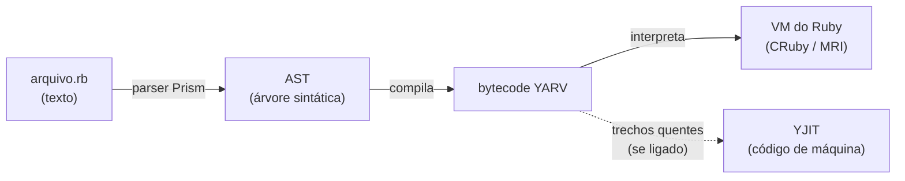
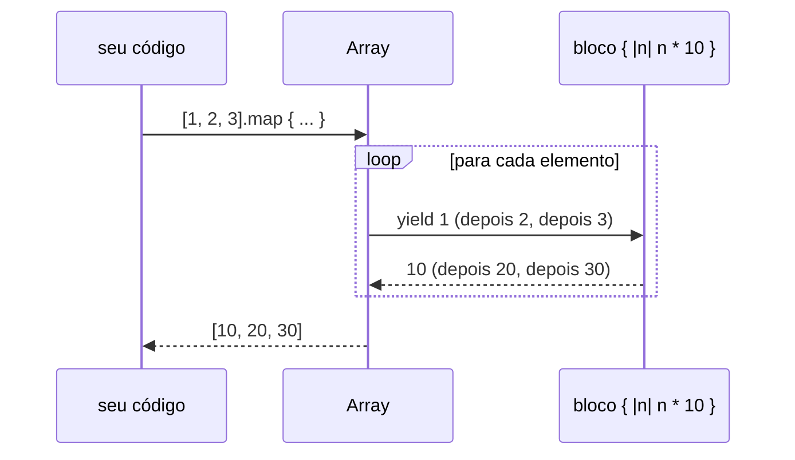
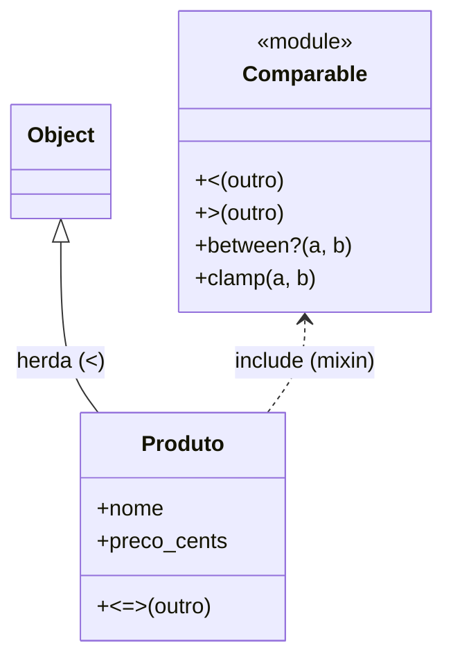
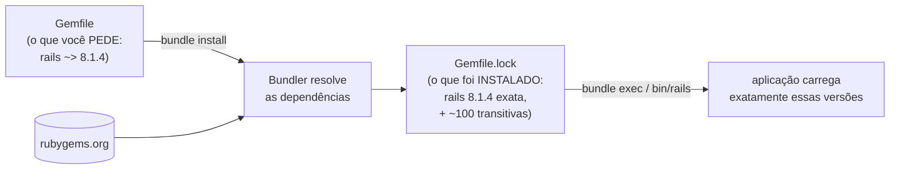

# Lição 01 — Ruby para quem vem do C/C++

> **Objetivo:** montar o modelo mental certo de Ruby a partir do que você já sabe de C/C++.
> Não é um curso de lógica: é um mapa do que **muda**, com as armadilhas de quem chega do C.
>
> **Pré-requisito:** [Lição 00 — ambiente (WSL 2 + Ruby)](00-ambiente-wsl.md).
>
> **Como estudar:** abra o terminal do Ubuntu (WSL), rode `irb` (o modo interativo do Ruby,
> o equivalente ao REPL do Python) e teste cada trecho. Dentro do `irb`, `obj.class` mostra o
> tipo, `obj.methods.sort` lista o que o objeto sabe fazer e `exit` sai. No terminal,
> `ri Array#map` abre a documentação de um método (se a documentação foi instalada junto
> com o Ruby; senão, use https://docs.ruby-lang.org). **Todas as saídas desta lição foram conferidas no
> Ruby 4.0.7.** As linhas `# =>` mostram o valor devolvido, `# saída:` o que foi impresso
> e `# !!` a exceção levantada.

**Sumário**
1. [Modelo de execução](#1-modelo-de-execução)
2. [Tudo é objeto (até o `nil`)](#2-tudo-é-objeto-até-o-nil)
3. [Variáveis são referências](#3-variáveis-são-referências)
4. [Tipagem dinâmica e forte; só `nil` e `false` são falsos](#4-tipagem-dinâmica-e-forte-só-nil-e-false-são-falsos)
5. [Números](#5-números)
6. [Strings e símbolos](#6-strings-e-símbolos)
7. [Coleções: Array, Hash e Range](#7-coleções-array-hash-e-range)
8. [Métodos](#8-métodos)
9. [Blocos, procs e lambdas](#9-blocos-procs-e-lambdas)
10. [Classes](#10-classes)
11. [Módulos e mixins](#11-módulos-e-mixins)
12. [Exceções e o "RAII" do Ruby](#12-exceções-e-o-raii-do-ruby)
13. [Controle de fluxo idiomático](#13-controle-de-fluxo-idiomático)
14. [Struct e Data](#14-struct-e-data)
15. [Gems e Bundler](#15-gems-e-bundler)
16. [E os tipos explícitos?](#16-e-os-tipos-explícitos)
17. [Estilo e RuboCop](#17-estilo-e-rubocop)
18. [Colinha C/C++ → Ruby](#18-colinha-cc--ruby)
19. [Glossário](#19-glossário)
20. [Exercícios](#20-exercícios)

---

## 1. Modelo de execução



- **Não há etapa de compilação separada.** `ruby arquivo.rb` lê, compila para bytecode (o
  YARV, uma máquina virtual de pilha) e executa na hora. Um erro de sintaxe impede o arquivo
  de rodar, mas um nome errado dentro de um método só explode quando aquela linha executar
  — o equivalente a descobrir um erro de link só em tempo de execução. É por isso que
  **testes** importam tanto em Ruby: eles fazem o papel da checagem que o compilador do C faz.
- **O arquivo roda de cima para baixo.** `def` e `class` são *comandos* que criam métodos e
  classes quando a linha executa. Não há `main()`.
- **YJIT** é o compilador JIT (*just-in-time*) do Ruby: ele transforma em código de máquina
  os trechos executados muitas vezes. Vem desligado; o Rails liga sozinho em produção.
- **Gerenciamento de memória:** há um *garbage collector* (GC). Não existe `free`, `delete`
  nem destrutor determinístico. Para liberar recursos na hora certa, usa-se um bloco
  (seção 12), o análogo do RAII.
- A implementação oficial se chama **CRuby** (ou MRI) e é escrita em C. Muitas gems (como a
  `pg`, do PostgreSQL) são **extensões nativas**: código C compilado na instalação e ligado
  a bibliotecas do sistema (`libpq`). É por isso que a Lição 00 instala `build-essential`.

---

## 2. Tudo é objeto (até o `nil`)

Em C, `1` é um valor num registrador. Em Ruby, **tudo** é objeto e responde a métodos:

```ruby
1.class
# => Integer

1.class.ancestors
# => [Integer, Numeric, Comparable, Object, Kernel, BasicObject]

5.times.to_a
# => [0, 1, 2, 3, 4]

-7.abs
# => 7

"MercadoLite".length
# => 11
```

`ancestors` mostra a cadeia de busca de métodos: quando você chama `1.algo`, o Ruby procura
`algo` em `Integer`, depois em `Numeric`, `Comparable` e assim por diante, como a busca de
um método virtual subindo a hierarquia de classes do C++.

**O `nil` também é objeto** — é o único objeto da classe `NilClass`. Isso muda o erro
clássico do C:

```ruby
nil.class
# => NilClass

nil.to_a
# => []

nil.upcase
# !! NoMethodError: undefined method 'upcase' for nil
```

| C/C++ | Ruby |
|---|---|
| desreferenciar `NULL` → *segmentation fault*, comportamento indefinido | chamar método em `nil` → exceção `NoMethodError`, com linha e mensagem |

Menos grave, mas é **o** erro mais comum de Ruby em produção. A seção 13 mostra as defesas.

---

## 3. Variáveis são referências

Uma variável Ruby não é uma "caixa com o valor": é um **nome que aponta para um objeto**,
como um ponteiro (ou uma `std::shared_ptr`) que você nunca precisa desreferenciar.

```ruby
a = "caneca"
b = a
b << " azul"   # << MODIFICA o objeto (acrescenta texto nele)
a
# => "caneca azul"

a.equal?(b)    # os dois nomes apontam para o MESMO objeto?
# => true
```

```
  a ──┐
      ├──►  "caneca azul"   (um objeto só, na memória do Ruby)
  b ──┘
```

Para ter um objeto separado, copie com `dup` (uma cópia rasa, como um construtor de cópia
que não copia o que os ponteiros internos apontam):

```ruby
c = a.dup
c << "!"
[a, c]
# => ["caneca azul", "caneca azul!"]
```

E **reatribuir** é diferente de **modificar**: `=` só faz o nome apontar para outro objeto.

```ruby
x = "vaso"
y = x
y = "prato"    # y passa a apontar para outro objeto; x continua no antigo
[x, y]
# => ["vaso", "prato"]
```

**Passagem de argumentos:** o método recebe uma cópia da *referência* (como passar um
ponteiro por valor em C). Ele pode modificar o objeto recebido, mas reatribuir o parâmetro
não afeta quem chamou.

### `freeze`: o `const` do Ruby

```ruby
s = "texto".freeze
s << "!"
# !! FrozenError: can't modify frozen String: "texto"
```

`freeze` torna o **objeto** imutável (não o nome: `s = "outro"` continua permitido). Ele
é verificado em tempo de execução, não de compilação.

**Strings literais no Ruby 4.0.** Um literal como `"literal"` ainda pode ser modificado, mas
já nasce "resfriado" (*chilled*): com avisos ligados, o Ruby alerta que isso vai virar erro.

```bash
$ ruby -W:deprecated chilled.rb
chilled.rb:3: warning: literal string will be frozen in the future
```

Um arquivo que começa com o comentário mágico `# frozen_string_literal: true` já congela
todos os literais hoje. No MercadoLite, as constantes de texto são congeladas explicitamente
com `.freeze` (ex.: `ALLOWED_IMAGE_TYPES`).

---

## 4. Tipagem dinâmica e forte; só `nil` e `false` são falsos

- **Dinâmica:** o tipo pertence ao **objeto**, não à variável. `x = 1` e depois
  `x = "um"` é permitido.
- **Forte:** não há conversão implícita entre tipos incompatíveis (nada do `"1" + 1` do
  JavaScript):

```ruby
1 + "2"
# !! TypeError: String can't be coerced into Integer

1 + "2".to_i
# => 3

"2" * 3        # String#* repete a string: é um método de String, não uma conversão
# => "222"
```

- **Duck typing** ("se anda como pato e grasna como pato..."): um método não exige um tipo,
  exige que o objeto **responda** aos métodos que ele chama. É o polimorfismo de templates
  do C++, só que verificado em tempo de execução.

### A armadilha nº 1 de quem vem do C

Em Ruby, **só `nil` e `false` são falsos**. `0`, `""`, `[]` e `{}` são **verdadeiros**:

```ruby
[0, "", [], {}, nil, false].map { |v| v ? "verdadeiro" : "falso" }
# => ["verdadeiro", "verdadeiro", "verdadeiro", "verdadeiro", "falso", "falso"]
```

Um `if quantidade` com `quantidade = 0` **entra no if**. Seja explícito: `quantidade.zero?`,
`quantidade.positive?`, `lista.empty?`. É exatamente o que o MercadoLite faz em
`Product#in_stock?` (`inventory.quantity.positive?`).

---

## 5. Números

```ruby
7 / 2          # divisão entre Integer é inteira, como em C
# => 3

-7 / 2         # ...mas arredonda para BAIXO (piso), e o C trunca para zero (-3)!
# => -4

-7.fdiv(2)     # divisão real
# => -3.5

-7 % 3         # o resto segue o sinal do divisor (em C daria -1)
# => 2

-7.remainder(3)  # este é o resto "do C"
# => -1
```

**Integer não estoura.** Não há `int`/`long`/`uint64_t`: o Ruby troca a representação
interna sozinho quando o número cresce.

```ruby
2**100
# => 1267650600228229401496703205376

(2**64).class
# => Integer
```

**Float é o `double` do C**, com os mesmos problemas de arredondamento binário:

```ruby
0.1 + 0.2
# => 0.30000000000000004

0.1 + 0.2 == 0.3
# => false
```

Para dinheiro, há duas saídas: **inteiros em centavos** (a que o MercadoLite usa no banco)
ou **`BigDecimal`**, decimal exato (a que ele usa para exibir):

```ruby
require "bigdecimal"
BigDecimal("0.1") + BigDecimal("0.2") == BigDecimal("0.3")
# => true

Rational(1, 3) + Rational(1, 6)   # frações exatas também existem
# => (1/2)
```

**Convertendo texto em número** — atenção ao zero à esquerda:

```ruby
"08".to_i            # to_i é tolerante: pega o que der
# => 8

"abc".to_i           # ...tolerante DEMAIS: lixo vira 0, sem erro
# => 0

Integer("abc")       # Integer() é estrito: falha alto
# !! ArgumentError: invalid value for Integer(): "abc"

Integer("08")        # e interpreta "0..." como OCTAL (como o strtol do C com base 0)
# !! ArgumentError: invalid value for Integer(): "08"

Integer("08", 10)    # informe a base
# => 8
```

Por isso o `Brl.parse_cents` do projeto valida o formato com uma expressão regular antes de
converter: nada de `to_i` engolindo lixo em silêncio.

Números grandes podem ter `_` como separador visual: `1_000_000` é `1000000`.

---

## 6. Strings e símbolos

### Strings

```ruby
nome = "Caneca"
preco = 49.9
"#{nome} custa R$ #{preco}"      # interpolação: só com aspas DUPLAS
# => "Caneca custa R$ 49.9"

'#{nome} fica literal com aspas simples'
# => "\#{nome} fica literal com aspas simples"
```

`#{...}` é como um `snprintf` embutido: avalia a expressão e chama `to_s` no resultado.

**String ≠ array de `char`.** Uma `String` Ruby é um objeto com **codificação** (UTF-8 por
padrão). O tamanho em caracteres e em bytes pode diferir — o `strlen` do C conta bytes:

```ruby
"café".length       # caracteres
# => 4

"café".bytesize     # bytes (o que o strlen contaria)
# => 5

"café".bytes        # o "é" ocupa dois bytes em UTF-8
# => [99, 97, 102, 195, 169]

"ABC"[0]            # indexar devolve uma String de 1 caractere, não um char
# => "A"

"ABC"[0].ord        # o código numérico
# => 65
```

### Símbolos

Um **símbolo** (`:vermelho`) é um nome imutável e *único*: todo `:vermelho` do programa é o
mesmo objeto. Pense num `enum` do C, ou numa string "internada" (o compilador guardando uma
só cópia de cada literal).

```ruby
:vermelho.object_id == :vermelho.object_id    # o mesmo objeto, sempre
# => true

"vermelho".object_id == "vermelho".object_id  # duas strings, dois objetos
# => false

"verde".to_sym
# => :verde
```

**Quando usar cada um?** String para **dados** (texto que vem do usuário ou vai para a
tela). Símbolo para **nomes** dentro do código: chaves de hash, nomes de métodos e opções.
O Rails usa símbolos em toda parte: `validates :name`, `has_many :products`,
`only: %i[index show]`.

> ⚠️ **Nunca converta texto do usuário em símbolo** (`params[:x].to_sym`) para escolher
> um método ou uma coluna. É o equivalente Ruby a montar um nome de função a partir da
> entrada. O MercadoLite usa uma lista fechada (`ProductSearch::SORTS`) justamente para isso.

---

## 7. Coleções: Array, Hash e Range

### Array ≈ `std::vector` de qualquer coisa

```ruby
itens = [10, 20, 30]
itens << 40              # push_back
itens
# => [10, 20, 30, 40]

itens[-1]                # índice negativo conta do fim
# => 40

itens[10]                # fora dos limites: nil, não lixo de memória
# => nil
```

Não há *buffer overflow*: ler além do fim devolve `nil`, e escrever além do fim aumenta o
array.

### Hash ≈ `std::unordered_map`, só que **mantém a ordem de inserção**

```ruby
produto = { nome: "Caneca", preco_cents: 4990 }   # chaves símbolo (atalho de :nome =>)
# => {nome: "Caneca", preco_cents: 4990}

produto[:nome]
# => "Caneca"

produto[:inexistente]                  # chave ausente: nil
# => nil

produto.fetch(:inexistente)            # fetch: falha alto se não existir
# !! KeyError: key not found: :inexistente

produto.fetch(:inexistente, "padrão")  # ...ou devolve um padrão
# => "padrão"

{ "chave" => 1 }["chave"]              # chaves podem ser de qualquer tipo
# => 1
```

`fetch` é o `std::map::at` (que lança `out_of_range`); `[]` é mais permissivo que o
`operator[]` do C++, porque não insere nada: só devolve `nil`. O `ProductSearch` usa
`SORTS.fetch(sort)`: se um valor inválido escapasse da validação, o código falharia em vez
de ordenar de um jeito qualquer.

### Range: intervalos como objetos

```ruby
(1..5).to_a       # inclui o fim
# => [1, 2, 3, 4, 5]

(1...5).to_a      # três pontos: exclui o fim
# => [1, 2, 3, 4]

(18..).include?(99)   # sem fim ("de 18 em diante")
# => true
```

O Active Record transforma ranges em SQL. No projeto,
`where(price_cents: min_price_cents..)` vira `WHERE price_cents >= 4990`, e
`where(inventories: { quantity: 1.. })` vira `quantity >= 1`.

### Desestruturação e atalhos

```ruby
primeiro, *resto = [1, 2, 3, 4]    # * junta "o resto" num array
[primeiro, resto]
# => [1, [2, 3, 4]]

%w[recentes menor_preco nome]      # array de strings sem aspas e vírgulas
# => ["recentes", "menor_preco", "nome"]

%i[index show]                     # array de símbolos
# => [:index, :show]
```

---

## 8. Métodos

```ruby
def dobro(n)
  n * 2      # a última expressão é o valor de retorno (return implícito)
end
dobro(21)
# => 42

dobro 21     # parênteses são opcionais na chamada
# => 42
```

**Argumentos nomeados** (*keyword arguments*) — o Ruby confere os nomes, e a ordem não
importa:

```ruby
def preco(cents:, moeda: "BRL")    # cents é obrigatório; moeda tem valor padrão
  "#{moeda} #{cents}"
end
preco(cents: 4990)
# => "BRL 4990"

preco(moeda: "USD", cents: 100)
# => "USD 100"

preco(4990)
# !! ArgumentError: wrong number of arguments (given 1, expected 0; required keyword: cents)
```

O projeto usa muito isso, por exemplo em
`Pagination.build(requested_page:, per_page:, total_count:)`: ninguém troca a página pelo
total sem perceber. E o atalho `per_page:` (sem valor) significa `per_page: per_page`.

**Método em uma linha** (*endless method*): `def triplo(n) = n * 3`.

### As convenções `?` e `!`

São parte do nome do método, e não operadores:

- `?` no fim: o método **pergunta** algo e devolve verdadeiro/falso (`empty?`, `zero?`,
  `in_stock?`).
- `!` no fim: versão **"perigosa"** — em geral, modifica o próprio objeto ou levanta
  exceção em vez de devolver `false`.

```ruby
nome = "caneca"
nome.upcase     # devolve um objeto NOVO
# => "CANECA"
nome
# => "caneca"

nome.upcase!    # modifica o PRÓPRIO objeto
# => "CANECA"
nome
# => "CANECA"
```

No Rails: `save` devolve `false` se a validação falhar; `save!` levanta exceção. O
`find_or_create_by!` dos seeds usa a versão com `!` para que um dado inválido pare tudo em
vez de passar em silêncio.

---

## 9. Blocos, procs e lambdas

Esta é **a** característica mais marcante do Ruby. Um **bloco** é um trecho de código
passado para um método, entre `{ }` (uma linha) ou `do ... end` (várias linhas). É como
passar uma lambda do C++ como último argumento — só que com sintaxe própria:

```ruby
[1, 2, 3].map { |n| n * 10 }       # |n| é o parâmetro do bloco
# => [10, 20, 30]
```

Em C++ seria:

```cpp
std::vector<int> v{1, 2, 3}, out;
std::transform(v.begin(), v.end(), std::back_inserter(out), [](int n) { return n * 10; });
```



### Os métodos de coleção que você vai usar todo dia

```ruby
[1, 2, 3].each { |n| puts n * 10 }            # percorre (o "for"); devolve o próprio array
# saída: 10
# saída: 20
# saída: 30
# => [1, 2, 3]

[1, 2, 3, 4].select { |n| n.even? }           # filtra (std::copy_if)
# => [2, 4]

[1, 2, 3, 4].reduce(0) { |acumulado, n| acumulado + n }   # dobra (std::accumulate)
# => 10

{ caneca: 4990, bule: 12950 }.select { |_nome, cents| cents > 5000 }  # hashes também
# => {bule: 12950}
```

**Atalho `&:metodo`:** `lista.map(&:upcase)` é o mesmo que `lista.map { |s| s.upcase }`.

```ruby
%w[caneca bule].map(&:upcase)
# => ["CANECA", "BULE"]
```

O Ruby 3.4+ também aceita `it` como nome implícito do parâmetro: `[1, 2, 3].map { it * 10 }`.

### `yield`: escrevendo um método que recebe bloco

```ruby
def repete(vezes)
  vezes.times { |i| yield i }   # yield "chama" o bloco que foi passado
end
repete(3) { |i| puts "volta #{i}" }
# saída: volta 0
# saída: volta 1
# saída: volta 2
```

### Lambdas e procs: blocos guardados em variáveis

Um bloco não é um objeto: ele existe só durante a chamada. Para guardá-lo, transforme-o num
**Proc**. Há dois sabores:

```ruby
quadrado = ->(x) { x * x }      # lambda (seta "stabby")
[quadrado.call(4), quadrado.(5), quadrado[6]]
# => [16, 25, 36]

quadrado.call(1, 2)             # lambda confere a quantidade de argumentos
# !! ArgumentError: wrong number of arguments (given 2, expected 1)

proc_solto = proc { |a, b| [a, b] }
proc_solto.call(1)              # proc não confere: o que falta vira nil
# => [1, nil]
```

**Closures:** blocos e lambdas **capturam as variáveis** do lugar onde foram criados, por
referência — como uma lambda do C++ com `[&]`, mas sem risco de referência pendurada: o GC
mantém a variável viva enquanto a lambda existir.

```ruby
contador = 0
incrementa = -> { contador += 1 }
3.times { incrementa.call }
contador
# => 3
```

No projeto, lambdas aparecem como **configuração que roda depois**:
`scope :active, -> { where(active: true) }` guarda a consulta para ser executada quando
alguém chamar `Product.active`, e `normalizes :name, with: ->(name) { name.squish }`
guarda a regra de limpeza.

---

## 10. Classes

```ruby
class Conta
  attr_reader :saldo_cents          # gera o método de leitura "saldo_cents"

  def initialize(saldo_cents = 0)   # o "construtor"
    @saldo_cents = saldo_cents      # @ = variável de instância (um campo do objeto)
  end

  def depositar(cents)
    raise ArgumentError, "valor deve ser positivo" unless cents.positive?
    @saldo_cents += cents
    self                            # devolve o próprio objeto (permite encadear)
  end
end
conta = Conta.new(100)              # new aloca e chama initialize
conta.depositar(50).depositar(25).saldo_cents
# => 175
```

O que muda em relação ao C++:

| C++ | Ruby |
|---|---|
| campos declarados na classe | `@campo` passa a existir quando recebe um valor; **sempre privado** |
| `obj.campo` (se público) | não existe acesso direto a campo: `obj.campo` é sempre uma **chamada de método** |
| escrever getter/setter à mão | `attr_reader :x` (leitura), `attr_writer :x` (escrita), `attr_accessor :x` (os dois) |
| `this` | `self` |
| `static` | `def self.metodo` |
| destrutor | não há (o GC decide quando liberar) |

```ruby
conta.saldo_cents = 0               # só existe leitura (attr_reader)
# !! NoMethodError: undefined method 'saldo_cents=' for an instance of Conta

class Conta
  def self.zerada = new(0)          # método de CLASSE (o static do C++)
end
Conta.zerada.saldo_cents
# => 0
```

Repare que a segunda `class Conta` **reabriu** a classe e acrescentou um método: em Ruby,
classes são **abertas** (seção 11). E a própria classe é um objeto: `Conta.class` é `Class`.

### `private`

```ruby
class Segredo
  def publico = "#{interno} (via método público)"

  private                           # daqui para baixo, tudo é privado

  def interno = "detalhe interno"
end
Segredo.new.publico
# => "detalhe interno (via método público)"

Segredo.new.interno
# !! NoMethodError: private method 'interno' called for an instance of Segredo

Segredo.new.send(:interno)          # send fura o private...
# => "detalhe interno"
```

`private` em Ruby é uma **convenção protegida por padrão**, não uma barreira: `send`
consegue chamar qualquer método (o C++ também não protege contra quem faz `#define private
public`). Por isso, nunca use `send` com um nome que venha do usuário.

### Herança

Herança **simples**, com `<`: `class Product < ApplicationRecord`. É assim que todo modelo do
Rails ganha os poderes do Active Record. Para compartilhar comportamento entre classes não
relacionadas, o Ruby usa **módulos** em vez de herança múltipla.

---

## 11. Módulos e mixins

Um **módulo** tem dois papéis:

1. **Namespace**, como o `namespace` do C++: `Loja::TAXA`, `ActiveRecord::Base`.
2. **Mixin**: um pacote de métodos que se "mistura" numa classe com `include`.

```ruby
class Produto
  include Comparable                  # "misture os métodos de Comparable aqui"
  attr_reader :nome, :preco_cents

  def initialize(nome, preco_cents)
    @nome = nome
    @preco_cents = preco_cents
  end

  def <=>(outro) = preco_cents <=> outro.preco_cents   # o único método que Comparable exige

  def to_s = "#{nome} (#{preco_cents})"
end
caneca = Produto.new("Caneca", 4990)
bule = Produto.new("Bule", 12950)
[caneca < bule, [bule, caneca].min.to_s, caneca.between?(caneca, bule)]
# => [true, "Caneca (4990)", true]

Produto.ancestors.take(4)             # o módulo entrou na cadeia de busca de métodos
# => [Produto, Comparable, Object, Kernel]
```

Definimos **um** operador (`<=>`, o *spaceship*, que devolve -1, 0 ou 1 como um
comparador do `qsort`) e ganhamos `<`, `>`, `between?`, `clamp`, `min`... Em C++ você teria
o mesmo efeito com herança de uma classe base com métodos template, ou com o
`operator<=>` do C++20.



O mixin mais poderoso é o **`Enumerable`**: implemente só `each`, e a classe ganha `map`,
`select`, `sum`, `sort`, `count` e dezenas de outros:

```ruby
class Carrinho
  include Enumerable

  def initialize(*produtos) = @produtos = produtos

  def each(&bloco)            # &bloco recebe o bloco como objeto Proc
    @produtos.each(&bloco)    # ...e o repassa adiante
    self
  end
end
carrinho = Carrinho.new(caneca, bule)
[carrinho.map(&:nome), carrinho.sum(&:preco_cents), carrinho.sort.map(&:nome), carrinho.count]
# => [["Caneca", "Bule"], 17940, ["Caneca", "Bule"], 2]
```

No projeto: `ProductSearch` faz `include ActiveModel::Model` e
`include ActiveModel::Attributes` para ganhar validações e atributos tipados **sem** herdar
do Active Record (ele não tem tabela).

### Classes abertas (*monkey patching*)

Qualquer classe pode ser reaberta, **inclusive as da biblioteca padrão**:

```ruby
class Integer
  def reais = self * 100
end
5.reais
# => 500
```

É assim que o Rails acrescenta `5.megabytes` ou `2.days` aos inteiros (o *Active Support*).
É poderoso e perigoso: é como poder editar a `libc` em tempo de execução. Regra do
projeto: **não reabrimos classes da biblioteca padrão.** Se precisar, crie um módulo seu,
como o `Brl`.

---

## 12. Exceções e o "RAII" do Ruby

```ruby
def converte(texto)
  Integer(texto, 10)
rescue ArgumentError => e          # rescue = catch
  puts "falhou: #{e.message}"
  nil
ensure                             # ensure = finally: roda com ou sem exceção
  puts "ensure roda sempre"
end
converte("abc")
# saída: falhou: invalid value for Integer(): "abc"
# saída: ensure roda sempre
# => nil
```

| C++ | Ruby |
|---|---|
| `throw` | `raise` |
| `try { } catch (const T& e) { }` | `begin ... rescue T => e ... end` (dentro de um `def`, o `begin` é opcional) |
| (não tem; usa RAII) | `ensure` |
| `std::exception` | `StandardError` (a base das exceções "de aplicação") |

A hierarquia: `ArgumentError < StandardError < Exception`. Um `rescue` sem classe pega só
`StandardError` e as filhas. **Nunca faça `rescue Exception`**, porque isso engoliria até o
Ctrl+C (`Interrupt`) e o `exit`.

Exceções próprias são só classes:

```ruby
class EstoqueInsuficiente < StandardError; end
begin
  raise EstoqueInsuficiente, "só há 2 unidades"
rescue EstoqueInsuficiente => e
  "#{e.class}: #{e.message}"
end
# => "EstoqueInsuficiente: só há 2 unidades"
```

### Blocos fazem o papel do RAII

Não há destrutor determinístico, então o Ruby usa **métodos que recebem bloco** e limpam
tudo ao sair dele:

```ruby
File.open("/tmp/exemplo.txt", "w") { |f| f.write("olá") }   # fecha o arquivo ao sair do bloco
File.read("/tmp/exemplo.txt")
# => "olá"
```

É o mesmo padrão do `std::lock_guard`: o recurso vive exatamente o escopo do bloco, mesmo
que uma exceção aconteça no meio. O Rails usa isso em `ActiveRecord::Base.transaction do
... end` (COMMIT ao sair, ROLLBACK se houver exceção), e é o que vamos usar na baixa de
estoque da fase 4.

---

## 13. Controle de fluxo idiomático

```ruby
estoque = 0
estoque.zero? ? "Esgotado" : "Disponível"   # ternário, como em C
# => "Esgotado"

puts "sem estoque" unless estoque.positive?  # unless = if not; condição no FIM da linha
# saída: sem estoque
```

`return nil if b.zero?` no começo de um método é a **cláusula de guarda** (*guard clause*):
trata o caso especial e sai, em vez de aninhar `if`s.

**`case` compara com `===`**, e isso funciona com ranges, classes e expressões regulares:

```ruby
def classifica(cents)
  case cents
  when 0 then "grátis"
  when 1...5_000 then "barato"     # Range#=== testa "está no intervalo?"
  when 5_000.. then "caro"
  end
end
[classifica(0), classifica(4990), classifica(12950)]
# => ["grátis", "barato", "caro"]
```

**Pattern matching** (`case/in`) desmonta estruturas, útil para os eventos do Stripe na
fase 3:

```ruby
def descreve(pedido)
  case pedido
  in { status: "paid", total: Integer => total } then "pago: #{total}"
  in { status: "pending" } then "aguardando"
  end
end
[descreve({ status: "paid", total: 4990 }), descreve({ status: "pending" })]
# => ["pago: 4990", "aguardando"]
```

### Defesas contra `nil`

```ruby
usuario = nil
usuario&.nome                       # "safe navigation": se for nil, devolve nil sem chamar
# => nil

cache = nil
cache ||= "calculado uma vez"       # atribui só se for nil/false (memoização)
cache ||= "não sobrescreve"
cache
# => "calculado uma vez"
```

Use `&.` com moderação: muitas vezes o certo é **falhar alto** (como o `fetch`) em vez de
propagar `nil` em silêncio.

---

## 14. Struct e Data

Para agrupar campos, como uma `struct` do C:

```ruby
Point = Struct.new(:x, :y)          # mutável, como uma struct comum
pt = Point.new(1, 2)
pt.x = 10
pt
# => #<struct Point x=10, y=2>

Coord = Data.define(:lat, :lng)     # IMUTÁVEL (Ruby 3.2+): como uma struct de campos const
c = Coord.new(lat: -23.5, lng: -46.6)
c.frozen?
# => true

c.with(lat: 0)                      # "alterar" = criar uma cópia com um campo trocado
# => #<data Coord lat=0, lng=-46.6>

Coord.new(lat: 1)                   # todos os campos são obrigatórios
# !! ArgumentError: missing keyword: :lng
```

O `Pagination` do MercadoLite é um `Data`: um valor calculado uma vez, que ninguém consegue
alterar por engano depois.

---

## 15. Gems e Bundler



| C/C++ | Ruby |
|---|---|
| biblioteca (`.a`, `.so`) + headers | **gem** (pacote com código Ruby e, às vezes, C) |
| vcpkg / Conan | **Bundler** (+ o repositório público rubygems.org) |
| `vcpkg.json` / `conanfile.txt` | **`Gemfile`** |
| lockfile / *baseline* | **`Gemfile.lock`** (vai para o Git: todo mundo usa as mesmas versões) |
| `#include` | `require "nome"` (o Rails faz quase todos sozinho) |

Comandos do dia a dia:

```bash
bundle install            # instala o que está no Gemfile.lock (ou resolve, se ele mudou)
bundle add nome_da_gem    # acrescenta ao Gemfile e instala
bundle exec rspec         # roda um executável com as versões do Gemfile.lock
bundle outdated           # o que tem versão nova
```

O operador `~>` do Gemfile é o **pessimista**: `"~> 8.1.4"` aceita `8.1.5`, mas não `8.2`.
Os scripts em `bin/` (`bin/rails`, `bin/rubocop`...) já fazem o `bundle exec` por você.

**Segurança:** cada gem é código de terceiros rodando com as suas permissões. O CI roda o
`bundler-audit` (vulnerabilidades conhecidas nas versões do lock) e o Dependabot abre PRs de
atualização toda semana.

---

## 16. E os tipos explícitos?

O Ruby **não tem** anotação de tipo na linguagem, como os *type hints* do Python. Existem
duas ferramentas externas — a **RBS** (arquivos `.rbs` à parte, checados pelo Steep) e o
**Sorbet** (anotações `sig` no código) —, mas nenhuma das duas faz parte do Rails padrão, e
ambas dão bastante atrito com a "mágica" do framework.

A convenção "tipos explícitos sempre" do portfólio é cumprida no MercadoLite assim:

1. **Banco de dados:** cada coluna tem tipo, `NOT NULL` e restrições (`CHECK`) no schema.
2. **Atributos tipados** do Active Model: `attribute :vendor_id, :integer` converte e
   garante o tipo na fronteira com o usuário (o `ProductSearch`).
3. **Documentação YARD** nos métodos públicos: `# @param cents [Integer]` e
   `# @return [String]`. O editor mostra isso ao passar o mouse.
4. **Testes** que exercitam os tipos das bordas (ex.: `Brl.from_cents` devolve `BigDecimal`).

Adotar RBS/Steep no futuro fica como um bom exercício de pesquisa.

---

## 17. Estilo e RuboCop

| Coisa | Convenção | Exemplo |
|---|---|---|
| métodos e variáveis | `snake_case` | `price_cents`, `in_stock?` |
| classes e módulos | `CamelCase` | `ProductSearch` |
| constantes | `MAIÚSCULAS` | `MAX_IMAGES` |
| arquivos | `snake_case.rb`, com o nome da classe | `product_search.rb` ↔ `ProductSearch` |
| indentação | **2 espaços** | |
| aspas | duplas (regra do Rails *omakase*) | `"texto"` |

O nome do arquivo **não é opcional** no Rails: o carregador automático (Zeitwerk) procura
`ProductSearch` em `product_search.rb`. É a "convenção sobre configuração" (a fase 1 detalha).

O **RuboCop** é o clang-tidy + clang-format do Ruby: `bin/rubocop` aponta problemas, e
`bin/rubocop -a` corrige os seguros sozinho. O CI exige zero ofensas.

---

## 18. Colinha C/C++ → Ruby

| C/C++ | Ruby |
|---|---|
| `int main() { ... }` | o arquivo roda de cima para baixo |
| `printf("%d\n", x)` | `puts x` · `p x` (mostra o `inspect`, bom para depurar) |
| `NULL` / `nullptr` | `nil` (um objeto) |
| `if (x)` com `x == 0` → falso | `0` é **verdadeiro**; use `x.zero?` |
| `for (int i = 0; i < n; i++)` | `n.times { \|i\| ... }` · `lista.each { \|x\| ... }` |
| `std::vector<T>` | `Array` |
| `std::unordered_map<K, V>` | `Hash` (ordenado por inserção) |
| `enum Cor { VERMELHO }` | símbolo `:vermelho` |
| `const` | `.freeze` (no objeto) · CONSTANTE (no nome) |
| `struct` | `Struct` (mutável) · `Data` (imutável) |
| `class B : public A` | `class B < A` |
| herança múltipla / CRTP | módulos + `include` (mixins) |
| `static void f()` | `def self.f` |
| `this` | `self` |
| lambda `[&](int x) { ... }` | bloco `{ \|x\| ... }` · `->(x) { ... }` |
| `try / catch / throw` | `begin / rescue / raise` |
| RAII / destrutor | método com bloco (`File.open { }`) · `ensure` |
| `std::sort(v.begin(), v.end())` | `v.sort` (nova) · `v.sort!` (no lugar) |
| `x / y` com negativos: trunca | arredonda para baixo (`-7 / 2 == -4`) |
| `strlen(s)` | `s.bytesize` (bytes) · `s.length` (caracteres) |
| vcpkg / Conan + `vcpkg.json` | Bundler + `Gemfile` |
| gdb | gem `debug`: escreva `debugger` na linha e rode |

---

## 19. Glossário

| Termo | O que é |
|---|---|
| **irb** | *Interactive Ruby*: o console onde se testa código linha a linha. `bin/rails console` é o irb com a aplicação carregada. |
| **objeto** | tudo em Ruby: números, strings, `nil`, classes. Tem estado (variáveis de instância) e responde a métodos. |
| **variável de instância** | `@nome`: um campo do objeto, sempre privado. |
| **símbolo** | `:nome`: identificador imutável e único; usado como nome/chave. |
| **bloco** | código entre `{ }` ou `do...end` passado a um método, que o executa com `yield`. |
| **Proc / lambda** | um bloco transformado em objeto, que pode ser guardado e chamado depois. |
| **closure** | função que captura as variáveis do lugar onde foi criada. |
| **módulo** | namespace e/ou pacote de métodos para misturar em classes. |
| **mixin** | módulo incluído numa classe com `include` (ex.: `Comparable`, `Enumerable`). |
| **duck typing** | o que importa é o objeto *responder* ao método, não a classe dele. |
| **monkey patching** | reabrir uma classe existente (até da biblioteca padrão) para alterá-la. |
| **gem** | pacote/biblioteca Ruby. |
| **Bundler** | resolve e trava as versões das gems (`Gemfile` → `Gemfile.lock`). |
| **YARV / YJIT** | a máquina virtual de bytecode do Ruby / o compilador JIT dela. |
| **GC** | *garbage collector*: libera objetos que ninguém mais referencia. |
| **frozen** | objeto congelado (imutável); modificar levanta `FrozenError`. |
| **YARD** | formato de comentários de documentação (`@param`, `@return`). |
| **RuboCop** | linter e formatador de Ruby. |

---

## 20. Exercícios

Faça no `irb`, e confira com as respostas só depois.

1. **Verdade em Ruby.** Sem rodar, diga o que `[nil, 0, "0", [], false, "false"].count { |v| v }`
   devolve. Depois confira.
2. **Divisão.** Qual é o resultado de `-9 / 4`, `-9 % 4` e `-9.remainder(4)`? E em C, o que
   `-9 / 4` e `-9 % 4` dariam?
3. **Referências.** Escreva um método `grita!(texto)` que deixa a string recebida em
   maiúsculas **no lugar** (quem chamou vê a mudança). Depois um `grita(texto)` que devolve
   uma nova, sem alterar a original.
4. **Blocos.** Dado `precos = { caneca: 4990, bule: 12950, pires: 1500 }`, use métodos de
   Hash e blocos para obter: (a) só os que custam menos de R$ 50,00; (b) o total em centavos;
   (c) um array de strings no formato `"caneca: 4990"`.
5. **Seu próprio iterador.** Escreva `cada_par(lista)`, que chama o bloco uma vez para cada
   par de elementos vizinhos: `cada_par([1, 2, 3]) { |a, b| p [a, b] }` imprime `[1, 2]` e
   `[2, 3]`. (Dica: `each_cons`.)
6. **Mixin.** Crie uma classe `Pedido` com `total_cents` e use `Comparable` para que
   `[pedido_a, pedido_b].max` devolva o de maior valor.
7. **`Data`.** Crie `Dinheiro = Data.define(:cents)` com um método `+(outro)` que devolve um
   novo `Dinheiro`. Confirme que `a + b` não altera `a`.
8. **Falhar alto.** Por que o `Brl.parse_cents` do projeto não usa simplesmente
   `(texto.to_f * 100).to_i`? Dê dois exemplos de entrada em que isso daria errado.

<details>
<summary>Respostas</summary>

1. `4`. Só `nil` e `false` são falsos; `0`, `"0"`, `[]` e `"false"` (uma string!) são
   verdadeiros.
2. Em Ruby: `-9 / 4 == -3` (piso de -2,25), `-9 % 4 == 3` e `-9.remainder(4) == -1`. Em C
   (C99 em diante, que trunca para zero): `-9 / 4 == -2` e `-9 % 4 == -1`.
3. ```ruby
   def grita!(texto) = texto.upcase!   # modifica o objeto recebido
   def grita(texto) = texto.upcase     # devolve um novo
   s = "oi"; grita!(s); s              # => "OI"
   ```
   Atenção: `upcase!` devolve `nil` quando não há nada para mudar (`"OI".upcase!`), outra
   convenção dos métodos com `!`.
4. ```ruby
   precos.select { |_nome, cents| cents < 5000 }   # => {caneca: 4990, pires: 1500}
   precos.values.sum                               # => 19440
   precos.map { |nome, cents| "#{nome}: #{cents}" }
   ```
5. ```ruby
   def cada_par(lista)
     lista.each_cons(2) { |a, b| yield a, b }
   end
   ```
6. ```ruby
   class Pedido
     include Comparable
     attr_reader :total_cents
     def initialize(total_cents) = @total_cents = total_cents
     def <=>(outro) = total_cents <=> outro.total_cents
   end
   [Pedido.new(100), Pedido.new(300)].max.total_cents   # => 300
   ```
7. ```ruby
   Dinheiro = Data.define(:cents) do
     def +(outro) = with(cents: cents + outro.cents)
   end
   a = Dinheiro.new(cents: 100)
   b = a + Dinheiro.new(cents: 50)
   [a.cents, b.cents]   # => [100, 150]
   ```
8. Por dois motivos: `to_f` é tolerante (`"abc".to_f == 0.0`, e o filtro viraria
   "preço mínimo R$ 0" em silêncio) e o float erra no arredondamento: `("0.29".to_f * 100).to_i`
   dá `28`, e não `29` (confira no irb!). Além disso, `"1.234,56".to_f` dá `1.234`.

</details>

---

**Próxima:** [Fase 1 — o catálogo](fase-1-catalogo.md), onde tudo isso aparece dentro de uma
aplicação Rails de verdade.
