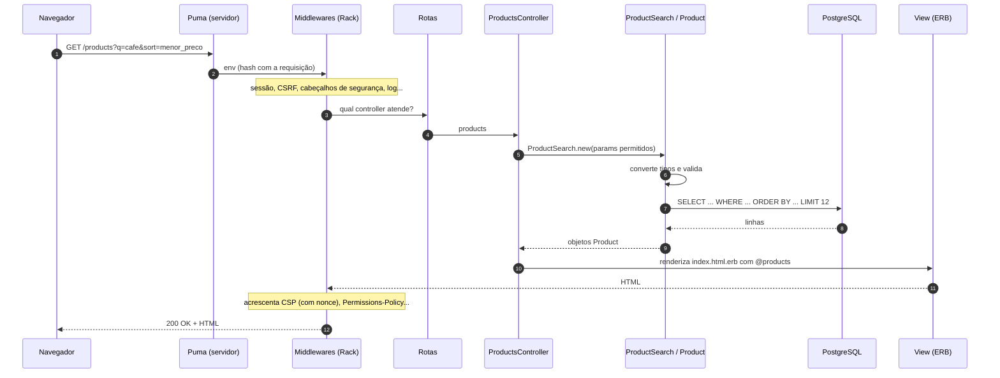
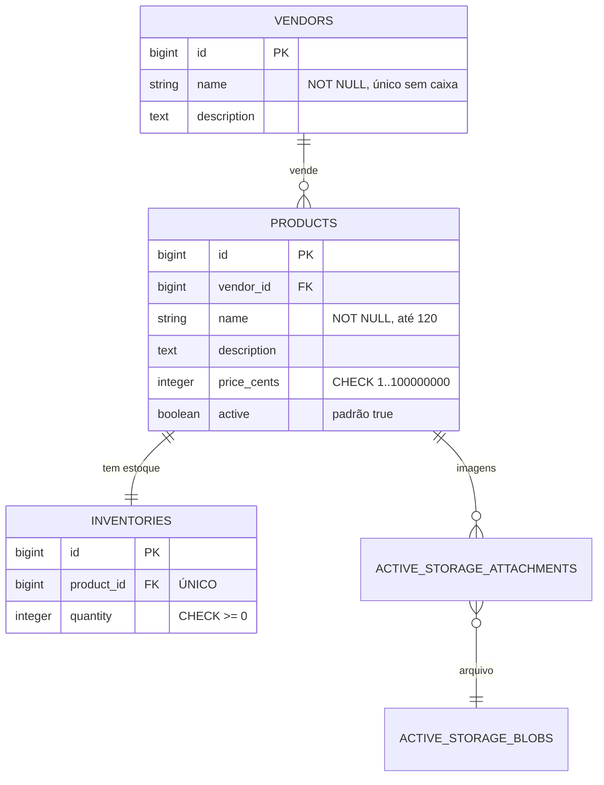
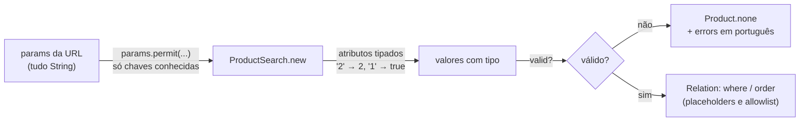
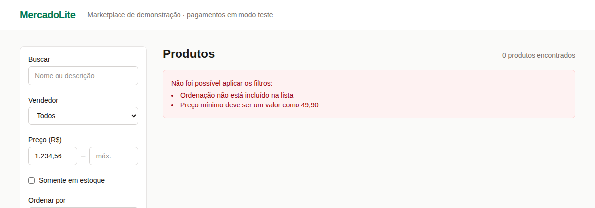
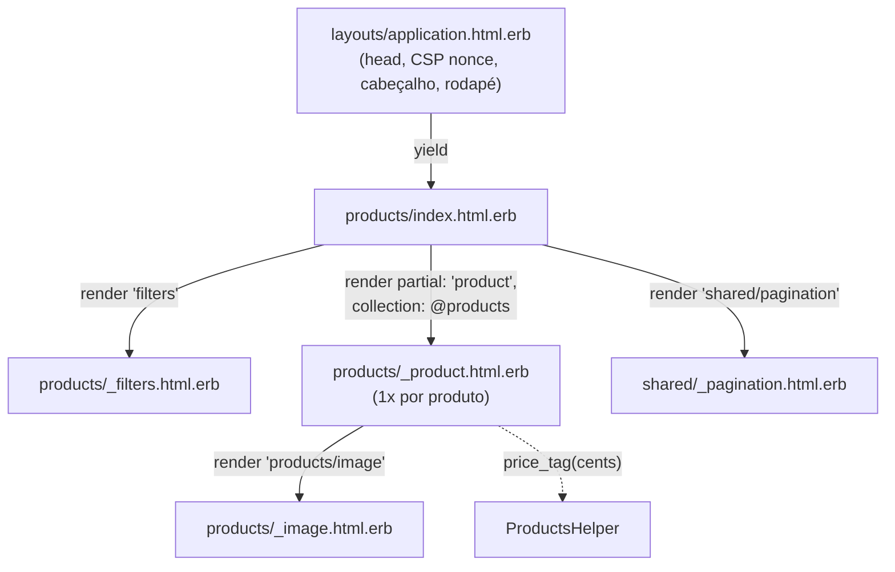
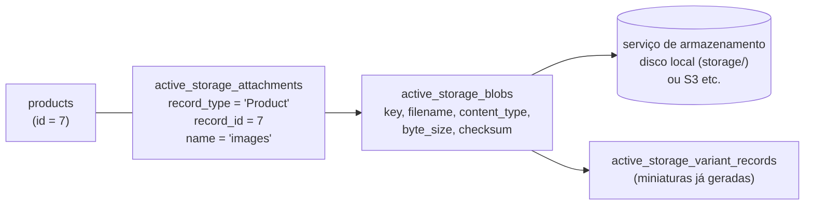
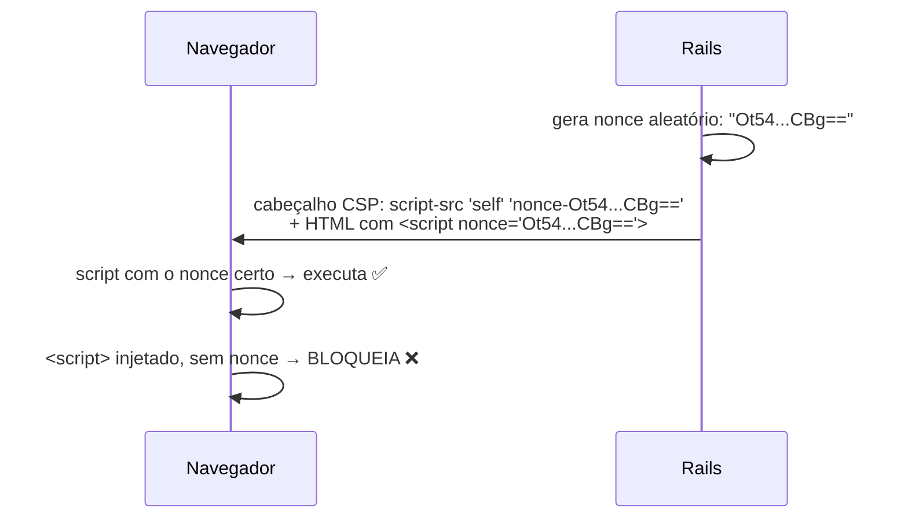
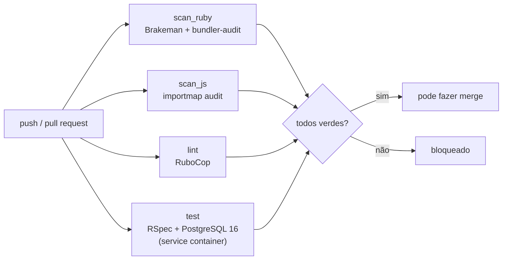

# MercadoLite — Fase 1: o catálogo

> **Objetivo:** construir a vitrine da loja — vendedores, produtos com imagens, estoque,
> busca com filtros e paginação — com as regras de negócio garantidas **também pelo banco**
> e cada entrada do usuário tratada como hostil.
>
> **Pré-requisitos:** [Lição 00 (ambiente)](00-ambiente-wsl.md) e
> [Lição 01 (Ruby para quem vem do C/C++)](01-ruby-para-quem-vem-do-c.md).

**O que você vai aprender:** a anatomia de um projeto Rails e a "convenção sobre
configuração" · o caminho de uma requisição (MVC) · migrations e restrições no banco · Active
Record (associações, validações, escopos, consultas preguiçosas, N+1) · dinheiro sem float ·
SQL injection e como o Rails a evita · form objects com Active Model · ERB e escape de HTML
(XSS) · Active Storage · Content Security Policy · RSpec e FactoryBot · RuboCop, Brakeman e
bundler-audit no CI.


**Sumário**
1. [Versões e o `rails new`](#1-versões-e-o-rails-new)
2. [Anatomia de um projeto Rails](#2-anatomia-de-um-projeto-rails)
3. [O caminho de uma requisição](#3-o-caminho-de-uma-requisição)
4. [O banco: migrations e restrições](#4-o-banco-migrations-e-restrições)
5. [Active Record: os modelos](#5-active-record-os-modelos)
6. [Consultas: preguiçosas, encadeáveis — e o N+1](#6-consultas-preguiçosas-encadeáveis--e-o-n1)
7. [Dinheiro sem float](#7-dinheiro-sem-float)
8. [Busca segura: SQL injection na prática](#8-busca-segura-sql-injection-na-prática)
9. [`ProductSearch`: um form object](#9-productsearch-um-form-object)
10. [Paginação que não confia na URL](#10-paginação-que-não-confia-na-url)
11. [Rotas e controller](#11-rotas-e-controller)
12. [Views: ERB, escape de HTML e XSS](#12-views-erb-escape-de-html-e-xss)
13. [Imagens com Active Storage](#13-imagens-com-active-storage)
14. [Cabeçalhos de segurança e CSP](#14-cabeçalhos-de-segurança-e-csp)
15. [Segredos e configuração](#15-segredos-e-configuração)
16. [Testes com RSpec](#16-testes-com-rspec)
17. [Qualidade e CI](#17-qualidade-e-ci)
18. [Seeds](#18-seeds)
19. [O que os testes nos ensinaram nesta fase](#19-o-que-os-testes-nos-ensinaram-nesta-fase)
20. [Mão na massa](#20-mão-na-massa)
21. [Decisões de design (bom assunto para entrevista)](#21-decisões-de-design-bom-assunto-para-entrevista)
22. [Glossário](#22-glossário)
23. [Exercícios](#23-exercícios)
24. [Próxima fase](#24-próxima-fase)

---

## 1. Versões e o `rails new`

O blueprint citava Ruby 3.3 e Rails 8. Em 29/09/2026, as estáveis atuais eram **Ruby 4.0.7**
(ruby-lang.org) e **Rails 8.1.4** (rubygems.org), e foram essas as escolhidas. A versão do
Ruby fica registrada em três lugares, que precisam concordar: `.ruby-version` (lido pelo CI),
`Dockerfile` (`ARG RUBY_VERSION=4.0.7`) e o `mise` da sua máquina.

O projeto foi gerado dentro do repositório já existente:

```bash
rails new . --database=postgresql --css=tailwind --skip-git --skip-test --skip \
  --skip-kamal --skip-thruster --skip-action-mailbox --skip-action-text \
  --skip-jbuilder --skip-action-cable
```

| Opção | Por quê |
|---|---|
| `--database=postgresql` | o banco do portfólio |
| `--css=tailwind` | CSS utilitário, compilado por um executável próprio, sem Node |
| `--skip-git` | o repositório já existia |
| `--skip-test` | usamos RSpec em vez do Minitest padrão |
| `--skip` | não sobrescrever arquivos existentes (`README.md`, `.gitignore`...) |
| `--skip-kamal`, `--skip-thruster` | o deploy do portfólio é Docker Compose + Caddy (fase 6), e o Caddy já faz HTTPS e compressão |
| `--skip-action-mailbox`, `-text`, `-cable`, `--skip-jbuilder` | recursos que não vamos usar (e-mails recebidos, editor rico, WebSockets, APIs JSON). **Cada componente a menos é superfície de ataque a menos.** |

Depois, foram adicionadas as gems `rspec-rails`, `factory_bot_rails`, `rails-i18n` e
`dotenv` (veja o `Gemfile`, todo comentado).

---

## 2. Anatomia de um projeto Rails

```
mercadolite/
├── app/                        ← o código da aplicação
│   ├── models/                 ← classes de domínio (product.rb, product_search.rb...)
│   ├── controllers/            ← recebem requisições (products_controller.rb)
│   ├── views/                  ← templates HTML (.html.erb)
│   │   ├── layouts/            ← a "moldura" comum a todas as páginas
│   │   ├── products/           ← views do ProductsController
│   │   └── shared/             ← partials reutilizados (paginação)
│   ├── helpers/                ← funções para as views (price_tag)
│   ├── javascript/             ← Stimulus/Turbo, via import maps
│   └── assets/tailwind/        ← CSS de origem
├── config/
│   ├── routes.rb               ← URL → controller#ação
│   ├── database.yml            ← conexão com o banco (lida do ambiente)
│   ├── application.rb          ← configurações gerais (fuso, idioma)
│   ├── environments/           ← development.rb, test.rb, production.rb
│   ├── initializers/           ← código que roda no boot (CSP, cabeçalhos)
│   └── locales/pt-BR.yml       ← traduções
├── db/
│   ├── migrate/                ← migrations (a história do schema)
│   ├── schema.rb               ← o schema ATUAL (gerado; não edite à mão)
│   └── seeds.rb                ← dados de exemplo
├── lib/                        ← código puro, independente do Rails (brl.rb, pagination.rb)
├── spec/                       ← testes RSpec
└── bin/                        ← rails, dev, rubocop, brakeman, ci...
```

### Convenção sobre configuração

Este é o princípio central do Rails: **o nome das coisas é a configuração.**

| Você escreve | O Rails deduz |
|---|---|
| `class Product < ApplicationRecord` em `app/models/product.rb` | a tabela é `products`; cada coluna vira um método (`product.price_cents`) |
| `belongs_to :vendor` | a coluna é `vendor_id` e aponta para a tabela `vendors` |
| `ProductsController#index` | o template é `app/views/products/index.html.erb` |
| `render partial: "product", collection: @products` | o arquivo é `_product.html.erb`, e cada item chega numa variável `product` |
| `ProductSearch` | está em `product_search.rb` (e o autoloader carrega sozinho) |

Em C++ você escreveria o `CMakeLists.txt` listando cada arquivo e os `#include`s. No Rails,
o carregador **Zeitwerk** encontra a classe pelo nome: ao ver `ProductSearch` pela primeira
vez, ele procura `product_search.rb` nas pastas de `app/` e em `lib/`. Por isso, **o nome do
arquivo precisa bater com o da classe**, e não há `require` nos nossos arquivos.

### Três ambientes

O mesmo código roda em três modos, escolhidos pela variável `RAILS_ENV`:

| | `development` | `test` | `production` |
|---|---|---|---|
| Recarrega o código ao salvar | sim | não | não |
| Mostra os detalhes dos erros | sim (com console na página) | sim | **não** (página genérica) |
| Banco | `mercadolite_development` | `mercadolite_test` (apagado a cada teste) | `mercadolite_production` |
| HTTPS obrigatório (`force_ssl`) | não | não | **sim** |

---

## 3. O caminho de uma requisição

O Rails segue o padrão **MVC** (*Model–View–Controller*): o *model* sabe as regras e fala com o
banco, a *view* monta o HTML e o *controller* coordena os dois.



- **Puma** é o servidor HTTP. Ele mantém um *pool* de threads, e cada requisição é atendida
  por uma delas.
- **Rack** é a interface entre o servidor e a aplicação: uma requisição entra como um hash
  (`env`), e a resposta sai como `[status, headers, body]`. Um **middleware** é uma camada
  que embrulha a aplicação, como uma cadeia de decoradores. A CSP (seção 14) é aplicada
  por um middleware. Liste todos com `bin/rails middleware`.

---

## 4. O banco: migrations e restrições

### Migrations

Uma **migration** é um arquivo Ruby, versionado no Git, que descreve **uma mudança** no
schema. Pense nela como um *patch* do banco: aplicadas em ordem (pelo timestamp do nome),
elas reconstroem o schema em qualquer máquina.

```bash
bin/rails generate model Product vendor:references name:string price_cents:integer ...
bin/rails db:migrate          # aplica as pendentes
bin/rails db:rollback         # desfaz a última
bin/rails db:migrate:status   # o que já foi aplicado
```

O gerador cria a migration, o modelo, o spec e a fábrica. **Depois, a migration foi editada
à mão** para acrescentar o que o gerador não sabe: `null: false`, limites de tamanho,
valores padrão e restrições.

```ruby
# db/migrate/20260929004958_create_products.rb
create_table :products do |t|
  t.references :vendor, null: false, foreign_key: true
  t.string :name, null: false, limit: 120
  t.text :description, null: false, default: ""
  t.integer :price_cents, null: false
  t.boolean :active, null: false, default: true
  t.timestamps
end

add_check_constraint :products, "price_cents > 0 AND price_cents <= 100000000",
  name: "products_price_cents_range"
```

- `t.references :vendor` cria a coluna `vendor_id` (bigint) com índice; `foreign_key: true`
  cria a **chave estrangeira**: o banco recusa um produto apontando para um vendedor que não
  existe.
- `t.timestamps` cria `created_at` e `updated_at`, que o Rails preenche sozinho.
- O método `change` é **reversível**: o Rails sabe desfazer um `create_table` (vira
  `drop_table`) sem que você escreva o `down`.

O `db/schema.rb` é o **retrato atual** do banco, gerado depois de cada migração. Um banco
novo (o do CI, por exemplo) é criado a partir dele (`db:prepare`), sem rodar migration por
migration.

### O modelo de dados



### Defesa em camadas: modelo **e** banco

Cada regra importante existe duas vezes:

```
 entrada ──► validação do MODELO ──────────► mensagem amigável em português
                │                             ("Preço deve ser maior que 0")
                │  update_column, SQL direto, um bug, dois pedidos simultâneos...
                ▼  (tudo isso PULA a validação do modelo)
             restrição do BANCO ──────────► a gravação é recusada, sempre
             (CHECK, UNIQUE, NOT NULL, FK)
```

| Regra | No modelo | No banco |
|---|---|---|
| preço entre 1 centavo e R$ 1 milhão | `validates :price_cents, numericality: {...}` | `CHECK (price_cents > 0 AND price_cents <= 100000000)` |
| estoque nunca negativo | `validates :quantity, numericality: { >= 0 }` | `CHECK (quantity >= 0)` |
| um estoque por produto | `has_one :inventory` | índice **único** em `product_id` |
| nome de vendedor único, sem diferenciar maiúsculas | `uniqueness: { case_sensitive: false }` | índice único na **expressão** `lower(name)` |

**Por que a validação de unicidade do modelo não basta?** Ela faz um `SELECT` antes do
`INSERT`. Dois pedidos simultâneos podem fazer o `SELECT` ao mesmo tempo, os dois veem "não
existe", e os dois inserem — uma **condição de corrida** (*race condition*), o mesmo problema
de um *check-then-act* sem mutex entre threads em C. O índice único é o "mutex": o banco
garante atomicamente. O teste `vendor_spec.rb` prova isso gravando com `validate: false`.

**Por que o estoque é uma tabela separada?** Na fase 4, a baixa de estoque vai **travar a
linha** (`SELECT ... FOR UPDATE`) enquanto o pagamento é confirmado. Com o estoque numa
tabela própria, a trava pega só aquela linha, e ninguém que esteja editando a descrição do
produto fica bloqueado.

---

## 5. Active Record: os modelos

**Active Record** é o ORM (*Object-Relational Mapper*) do Rails: cada classe é uma tabela, e
cada objeto é uma linha. Você não declara os campos: eles são lidos do banco quando a
aplicação sobe.

```ruby
# app/models/product.rb (trechos)
class Product < ApplicationRecord
  belongs_to :vendor                      # product.vendor  (via vendor_id)
  has_one :inventory, dependent: :destroy # product.inventory; apagar o produto apaga o estoque
  has_many_attached :images do |attachable| ... end   # seção 13

  normalizes :name, with: ->(name) { name.squish }

  validates :name, presence: true, length: { maximum: MAX_NAME_LENGTH }
  validates :price_cents, numericality: {
    only_integer: true, greater_than: 0, less_than_or_equal_to: MAX_PRICE_CENTS
  }

  before_validation :build_default_inventory, on: :create

  scope :active, -> { where(active: true) }
  scope :in_stock, -> { joins(:inventory).where(inventories: { quantity: 1.. }) }
end
```

Linha por linha:

- **Associações** (`belongs_to`, `has_one`, `has_many`) são *métodos de classe* chamados no
  corpo da classe (Lição 01: `def` e `class` são comandos que rodam). Cada um **gera
  métodos**: `product.vendor`, `product.inventory`, `vendor.products`,
  `product.build_inventory`... É metaprogramação: código que escreve código quando a classe
  é carregada, algo que em C++ você faria com templates ou macros.
- **`belongs_to` é obrigatório por padrão**: um produto sem vendedor não passa na validação
  ("Vendedor é obrigatório(a)").
- **`normalizes`** limpa o valor **antes** de validar e gravar: `"  Caneca   azul "` vira
  `"Caneca azul"` (`squish` tira os espaços das pontas e junta os repetidos).
- **Validações** rodam em `valid?`, `save` e `create`. Se falharem, `save` devolve `false` e
  `errors` guarda as mensagens (já em português, via `rails-i18n` + `config/locales/pt-BR.yml`):

  ```ruby
  pr = Product.new(name: " ", price_cents: -5)
  pr.valid?
  pr.errors.full_messages
  # => ["Vendedor é obrigatório(a)", "Nome não pode ficar em branco", "Preço deve ser maior que 0"]
  ```

- **Callback** `before_validation ..., on: :create`: roda antes de validar um registro novo.
  Aqui ele cria o estoque zerado em memória, e o `has_one` grava os dois juntos. Use
  callbacks com moderação: é fácil esconder lógica demais neles.
- **Escopos** são consultas nomeadas e reutilizáveis: `Product.active.in_stock`.
- **Constantes** (`MAX_PRICE_CENTS`) deixam os limites com nome e num lugar só; os testes
  usam as mesmas constantes.

`Vendor` segue o mesmo modelo. Destaque para `has_many :products, dependent:
:restrict_with_error`: tentar apagar um vendedor que tem produtos devolve `false` com um erro,
em vez de apagar tudo em cascata (e, na fase 4, destruir o histórico de pedidos).

---

## 6. Consultas: preguiçosas, encadeáveis — e o N+1

```ruby
Product.active.class
# => Product::ActiveRecord_Relation
```

`Product.active` **não consulta o banco**. Ele devolve uma `Relation`: um objeto que
*descreve* a consulta. Cada `.where`, `.order` ou `.limit` devolve uma nova Relation, e o SQL
só é executado quando alguém **precisa dos dados** (`each`, `to_a`, `count`, `first`...). É
avaliação preguiçosa, como um *range* do C++20 que só calcula ao ser iterado.

Veja o SQL de qualquer Relation com `to_sql`. Este é o da busca da vitrine (`q: "cafe"`,
preço mínimo 10, só em estoque, menor preço primeiro):

```sql
SELECT "products".* FROM "products"
INNER JOIN "inventories" ON "inventories"."product_id" = "products"."id"
WHERE "products"."active" = TRUE
  AND (unaccent(products.name) ILIKE unaccent('%cafe%')
       OR unaccent(products.description) ILIKE unaccent('%cafe%'))
  AND "products"."price_cents" >= 1000
  AND "inventories"."quantity" >= 1
ORDER BY "products"."price_cents" ASC, "products"."id" ASC
```

### O problema N+1

A vitrine mostra, para cada produto, o nome do vendedor e se há estoque. Sem cuidado:

```ruby
Product.active.limit(12).each do |product|
  product.vendor.name          # 1 SELECT em vendors  POR PRODUTO
  product.inventory.quantity   # 1 SELECT em inventories POR PRODUTO
end
```

**Medido no banco de desenvolvimento, sem cache:** 25 consultas (1 para os produtos + 12 +
12). Com `includes`:

```ruby
Product.active.includes(:vendor, :inventory).limit(12).each { ... }
```

**3 consultas**, sempre:

```sql
SELECT "products".* FROM "products" WHERE "products"."active" = TRUE ... LIMIT 12
SELECT "vendors".* FROM "vendors" WHERE "vendors"."id" IN (1, 2, 3)
SELECT "inventories".* FROM "inventories" WHERE "inventories"."product_id" IN (1, 2, 3, 4, ...)
```

O nome "N+1" vem daí: 1 consulta para a lista, mais N para os detalhes. Cada consulta é
uma ida e volta pela rede até o banco; com 100 produtos, a página ficaria lenta à toa. O
`ProductSearch#results` usa `includes(:vendor, :inventory).with_attached_images` pelo mesmo
motivo (`with_attached_images` é o `includes` das imagens).

---

## 7. Dinheiro sem float

| Onde | Tipo | Exemplo |
|---|---|---|
| banco | `integer` (centavos) | `4990` |
| código Ruby | `Integer` (centavos) | `product.price_cents` |
| cálculo em reais | `BigDecimal` (decimal exato) | `product.price` → `49.9` |
| tela | `String` formatada no locale | `"R$ 49,90"` |
| entrada do usuário | `String` → `Brl.parse_cents` → `Integer` | `"49,90"` → `4990` |

O `lib/brl.rb` concentra as conversões em **funções puras** — o mesmo padrão *functional core,
imperative shell* do PwnCheck: não acessam banco, rede nem Rails; recebem dados e devolvem
dados.

```ruby
module Brl
  PRICE_PATTERN = /\A(\d{1,7})(?:[.,](\d{1,2}))?\z/

  def self.parse_cents(text)
    match = PRICE_PATTERN.match(text.to_s.strip)
    return nil if match.nil?

    reais, cents = match.captures
    (reais.to_i * 100) + cents.to_s.ljust(2, "0").to_i
  end

  def self.from_cents(cents)
    BigDecimal(cents) / 100
  end
end
```

- **A expressão regular** (`/.../`): `\A` e `\z` ancoram no começo e no fim **do texto**
  (não use `^` e `$`, que em Ruby ancoram em cada **linha**, e um `"10\n<lixo>"` passaria). `(\d{1,7})` captura de 1 a 7
  dígitos; `(?:[.,](\d{1,2}))?` é um grupo opcional, sem captura, com vírgula ou ponto e 1 ou
  2 dígitos (esses capturados).
- **Separador de milhar é recusado de propósito:** `"1.234"` seria R$ 1.234,00 ou R$ 1,234?
  Ambíguo → inválido → mensagem de erro. Recusar é melhor que adivinhar.
- `ljust(2, "0")` completa à direita: `"12,5"` são 50 centavos, não 5.
- `self.parse_cents` define um método **do módulo** (como uma função livre num `namespace` do
  C++), chamado como `Brl.parse_cents("49,90")`.

Na tela, o helper `price_tag` usa `number_to_currency`, que segue o locale pt-BR da gem
`rails-i18n` (unidade `R$`, vírgula decimal, ponto de milhar): `price_tag(123_456)` →
`"R$ 1.234,56"`.

---

## 8. Busca segura: SQL injection na prática

### O ataque

Imagine a busca escrita do jeito ingênuo, **interpolando** o texto do usuário no SQL:

```ruby
Product.where("name ILIKE '%#{termo}%'")      # NUNCA faça isso
```

Rodamos isto no banco de desenvolvimento (15 produtos, nenhum com esse nome) usando como
termo `') OR 1=1 --`:

```sql
SELECT "products".* FROM "products" WHERE (name ILIKE '%') OR 1=1 --%')
```

```
encontrados (inseguro): 15 de 15
encontrados (seguro):   0
```

O `'` do atacante **fecha a string**, o `)` fecha o parêntese, `OR 1=1` torna a condição
sempre verdadeira, e `--` transforma o resto da linha em comentário. Aqui o estrago é "só"
listar tudo, mas a mesma técnica lê tabelas inteiras (`UNION SELECT` com as senhas...) ou
altera dados.

> **Curiosidade da nossa verificação:** a primeira tentativa, `' OR 1=1 --`, deu **erro de
> sintaxe** — o Rails põe a condição entre parênteses, e o `--` comentou o `)` de
> fechamento. Bastou ao "atacante" ajustar para `') OR 1=1 --`. Erro de sintaxe no log
> costuma ser o primeiro sinal de alguém sondando uma injeção.

É o mesmo problema de passar entrada do usuário como **string de formato** para um
`printf` em C: dado virando código.

### A defesa: dado nunca vira código

```ruby
def self.matching(term)
  pattern = "%#{sanitize_sql_like(term)}%"
  where(
    "unaccent(products.name) ILIKE unaccent(:pattern) " \
    "OR unaccent(products.description) ILIKE unaccent(:pattern)",
    pattern:
  )
end
```

1. **Placeholder** (`:pattern`): o texto entra separado do SQL. O Active Record **escapa e
   cita** o valor, e ele vira sempre um literal de texto. Veja o que acontece com uma aspa:

   ```sql
   ... ILIKE unaccent('%O''Brien%') ...
   ```

   A aspa virou `''` (a forma de escrever uma aspa *dentro* de uma string SQL) e não fecha
   nada. Nas condições com hash (`where(vendor_id: 3)`), o Rails vai além e usa parâmetros
   do protocolo do PostgreSQL, que viajam separados do SQL.
2. **`sanitize_sql_like`**: dentro do `LIKE`, `%` significa "qualquer sequência" e `_`
   significa "qualquer caractere". Sem escapar, buscar `%` acharia **todos** os produtos. Não
   é injeção de SQL, mas é entrada do usuário mudando o significado da consulta. Os testes
   provam: `"%"` só acha o produto com `%` no nome, e `"C_neca"` não acha "Caneca".
3. **`unaccent`**: uma extensão do PostgreSQL (ligada numa migration) que tira os acentos, e
   assim `cafe` encontra `café`. Detalhe de desempenho: `ILIKE '%...%'` não usa índice comum
   e lê a tabela toda. Para um catálogo pequeno isso é irrelevante; o exercício 7 aponta a
   solução para catálogos grandes.

### E o `ORDER BY`?

A ordenação vem da URL (`?sort=menor_preco`), mas `ORDER BY` **não aceita placeholder**
(placeholders são para *valores*, não para nomes de coluna). Por isso a URL só escolhe uma
**chave** numa tabela nossa:

```ruby
SORTS = {
  "recentes" => { created_at: :desc },
  "menor_preco" => { price_cents: :asc },
  "maior_preco" => { price_cents: :desc },
  "nome" => { name: :asc }
}.freeze

scope.order(SORTS.fetch(sort))   # o SQL vem daqui, nunca do texto do usuário
```

Qualquer outro valor é recusado pela validação (`inclusion: { in: SORTS.keys }`). É uma
*allowlist*: em segurança, liste o que é permitido, em vez de tentar listar o que é proibido.

---

## 9. `ProductSearch`: um form object

Os filtros da vitrine não são uma tabela, mas precisam de conversão de tipos e validação. A
solução é uma classe comum que **inclui só as partes** do Active Model de que precisa (os
mixins da Lição 01):

```ruby
class ProductSearch
  include ActiveModel::Model        # new(hash), valid?, errors
  include ActiveModel::Attributes   # atributos com tipo

  attribute :q, :string
  attribute :vendor_id, :integer
  attribute :in_stock, :boolean, default: false
  attribute :sort, :string, default: DEFAULT_SORT
  attribute :page, :integer, default: 1

  validates :q, length: { maximum: MAX_QUERY_LENGTH }
  validates :vendor_id, numericality: { only_integer: true, greater_than: 0 }, allow_nil: true
  validates :sort, inclusion: { in: SORTS.keys }
  validate :prices_must_be_valid

  def results
    return Product.none if invalid?
    # ... monta a Relation filtro a filtro ...
  end
end
```



### Conversão de tipo **não é** validação

Os atributos tipados convertem de forma **tolerante**, porque usam `to_i` por baixo. Isto foi
medido:

| Entrada (`:integer`) | Resultado |
|---|---|
| `"3"` | `3` |
| `"abc"` | `0` |
| `"12abc"` | `12` |
| `"3.9"` | `3` |
| `""` | `nil` |

| Entrada (`:boolean`) | Resultado |
|---|---|
| `"1"`, `"sim"` | `true` |
| `"0"`, `"false"` | `false` |
| `""` | `nil` |

A conversão garante o **tipo** (depois dela, `vendor_id` é sempre um `Integer`, e não há
como carregar SQL), mas não garante que o valor faça **sentido**. Por isso existe a
validação `numericality: { greater_than: 0 }`, que recusa `"abc"` (virou 0), `"0"` e `"-1"`
com a mensagem "Vendedor deve ser maior que 0". O `"12abc"` passa como 12. Para um filtro,
isso é aceitável: no pior caso, a pessoa vê os produtos do vendedor 12.

### Strong parameters

No controller:

```ruby
def search_params
  params.permit(:q, :vendor_id, :min_price, :max_price, :in_stock, :sort, :page)
end
```

`params.permit` devolve só as chaves listadas. Aqui o `ProductSearch` só tem esses
atributos, mas o hábito importa nas próximas fases: sem `permit`, um formulário de cadastro
que recebesse `?admin=true` ou `?price_cents=1` poderia gravar campos que o usuário nunca
deveria controlar — a vulnerabilidade de *mass assignment*. **Nunca confie no preço vindo do
cliente** é uma das regras do blueprint para o checkout.



---

## 10. Paginação que não confia na URL

```ruby
Pagination = Data.define(:page, :per_page, :total_count) do
  def self.build(requested_page:, per_page:, total_count:)
    raise ArgumentError, "per_page deve ser positivo" unless per_page.positive?
    raise ArgumentError, "total_count não pode ser negativo" if total_count.negative?

    last_page = pages_for(total_count, per_page)
    new(page: requested_page.to_i.clamp(1, last_page), per_page:, total_count:)
  end

  def self.pages_for(total_count, per_page)
    [ (total_count + per_page - 1) / per_page, 1 ].max
  end

  def offset = (page - 1) * per_page
  # ...
end
```

- `Data.define` cria uma classe de **valor imutável** (Lição 01, seção 14). Uma paginação
  calculada não muda depois.
- `(total + per_page - 1) / per_page` é a divisão inteira arredondando para cima — o mesmo
  truque que você usaria em C.
- **`clamp(1, last_page)` é a defesa:** `?page=999999999999` vira a última página. Sem isso, o
  banco receberia um `OFFSET` gigantesco (e, com `?page=-5`, um offset negativo, que dá
  erro). Uma URL maliciosa nunca deve conseguir gerar trabalho arbitrário no servidor.
- **Por que escrever a paginação em vez de usar uma gem** (como a `pagy`)? São 40 linhas,
  puras e testadas, e cada gem a menos é uma dependência a menos para auditar. Se o catálogo
  crescer e precisar de mais recursos (links numerados, *cursor pagination*), trocamos.

O controller usa assim:

```ruby
results = @search.results
@pagination = Pagination.build(requested_page: @search.page,
                               per_page: ProductSearch::PER_PAGE,
                               total_count: results.count)            # SELECT COUNT(*)
@products = results.offset(@pagination.offset).limit(@pagination.per_page)
```

---

## 11. Rotas e controller

```ruby
# config/routes.rb
Rails.application.routes.draw do
  root "products#index"
  resources :products, only: %i[index show]
  get "up" => "rails/health#show", as: :rails_health_check
end
```

`bin/rails routes` mostra a tabela gerada (trecho):

```
            Prefix Verb URI Pattern                Controller#Action
              root GET  /                          products#index
          products GET  /products(.:format)        products#index
           product GET  /products/:id(.:format)    products#show
rails_health_check GET  /up(.:format)              rails/health#show
```

- `resources` é a convenção **REST**: um "recurso" (produtos) com ações padrão (`index`
  lista, `show` mostra, e, nas próximas fases, `new`/`create`/`edit`/`update`/`destroy`).
  `only:` limita às duas que existem: rota que não existe não pode ser atacada.
- Cada linha gera **helpers de URL**: `products_path` → `"/products"`,
  `product_path(product)` → `"/products/7"`. Nas views, nunca se escreve URL à mão.
- `/up` é o *health check*: responde 200 se a aplicação subiu. O Docker e o Caddy vão usá-lo
  no deploy.

```ruby
class ProductsController < ApplicationController
  def index
    @search = ProductSearch.new(search_params)
    # ...
  end

  def show
    @product = Product.active.includes(:vendor, :inventory).with_attached_images.find(params[:id])
  end
end
```

- Variáveis `@...` do controller ficam visíveis na view: é assim que os dados passam de um
  para o outro.
- **`Product.active...find(id)`:** buscar a partir do escopo `active` faz um produto inativo
  dar `ActiveRecord::RecordNotFound`, que o Rails transforma em **404**. É a mesma resposta
  de um id que não existe, então ninguém descobre, testando ids, quais produtos estão ocultos.
  Este padrão ("buscar sempre a partir do escopo permitido") é a base da proteção
  **anti-IDOR** da fase 3: `current_user.orders.find(id)`, e nunca `Order.find(id)`.

---

## 12. Views: ERB, escape de HTML e XSS

**ERB** (*Embedded Ruby*) é HTML com Ruby embutido:

| Tag | Faz |
|---|---|
| `<% codigo %>` | executa, sem imprimir (laços, ifs) |
| `<%= expressao %>` | executa e **imprime o resultado escapado** |
| `<%# comentário %>` | comentário, que não vai para o HTML |

### Escape automático: a defesa padrão contra XSS

**XSS** (*Cross-Site Scripting*) é conseguir que o navegador de outra pessoa execute um
script seu, pela página de um site legítimo. Um vendedor malicioso poderia cadastrar um
produto chamado `<script>roubaCookie()</script>`, e todo visitante da vitrine o executaria.

O `<%= %>` **escapa** tudo por padrão: `<` vira `&lt;`, `>` vira `&gt;`, `"` vira `&quot;`. O
navegador mostra o texto, e não o executa. Há um teste para isso:

```ruby
it "escapa HTML vindo do banco (XSS armazenado)" do
  create(:product, name: "<script>alert(1)</script>")
  get root_path
  expect(response.body).to include("&lt;script&gt;alert(1)&lt;/script&gt;")
end
```

Existem formas de **desligar** o escape (`raw`, `html_safe`, `<%==`). O projeto não usa
nenhuma, e o Brakeman (seção 17) avisa se alguém usar com dados do usuário.

### A pegadinha do `simple_format`

Para exibir a descrição com as quebras de linha, o natural seria
`simple_format(@product.description)`. Um teste nosso mostrou que o `simple_format`
**sanitiza** em vez de escapar: ele remove o que é perigoso (`onerror`, `<script>`), mas
**mantém** as tags que considera seguras:

```ruby
simple_format("\n<b>oi</b> <script>x</script>")
# => "<p>\n<br /><b>oi</b> x</p>"
```

Nada executa, mas a descrição passaria a aceitar HTML: imagens, links e formatação que
nenhum vendedor deveria controlar. A correção foi escapar **antes**:

```erb
<%= simple_format(h(@product.description)) %>
```

`h()` escapa tudo; o `simple_format` só acrescenta os `<p>` e `<br />`. **Sanitizar ≠
escapar:** sanitizar é filtrar HTML (útil quando se *quer* aceitar HTML); escapar é tratar
tudo como texto (o que queremos aqui).

### Layout, partials e helpers



- O **layout** é a moldura; `yield` é onde entra o conteúdo de cada página.
  `content_for :title, "..."` numa view preenche o `<title>` do layout.
- **Partials** (arquivos com `_` na frente) são pedaços reutilizáveis. `render partial:
  "product", collection: @products` renderiza um por item, sem você escrever o laço.
- **Helpers** tiram lógica de formatação do HTML (`price_tag`, `sort_options`) e podem ser
  testados isoladamente.
- O **Turbo** (do Hotwire) intercepta cliques em links e envios de formulário, busca a página
  nova por `fetch` e troca só o `<body>`: a navegação fica com cara de SPA sem que você
  escreva JavaScript.
- As classes CSS (`rounded-lg`, `text-stone-500`...) são do **Tailwind**: cada classe é uma
  propriedade CSS. O `bin/dev` roda o compilador do Tailwind, que lê as views e gera só o
  CSS das classes usadas.

---

## 13. Imagens com Active Storage

O **Active Storage** guarda arquivos anexados a qualquer modelo, sem colunas novas na tabela
do modelo:



- **Blob** = o arquivo (metadados no banco e bytes no serviço de armazenamento).
  **Attachment** = a ligação polimórfica "este blob é a imagem nº 2 do produto 7".
- **Variantes** são versões transformadas (`:thumb` 400×400, `:large` 1200×1200), geradas
  pela **libvips** na primeira vez que alguém pede e guardadas para as próximas.
- Na view: `image_tag image.variant(:thumb)`. A URL gerada é **assinada**
  (`/rails/active_storage/representations/redirect/<id assinado>/...`): ninguém consegue
  forjar a URL de outro arquivo trocando um número.

### Validação das imagens

O Rails 8.1 não traz validação de anexos pronta, então ela é escrita no modelo:

```ruby
MAX_IMAGES = 5
MAX_IMAGE_BYTES = 5.megabytes
ALLOWED_IMAGE_TYPES = %w[image/jpeg image/png image/webp].freeze
```

- **Por que não SVG?** Um SVG é XML e pode conter `<script>`. Servido pelo nosso domínio,
  ele executaria com os nossos cookies: XSS por upload. O teste usa um SVG com
  `<script>alert(document.cookie)</script>`.
- **Como o tipo é descoberto?** O Active Storage usa a gem **Marcel**, que lê os primeiros
  bytes do arquivo (a *assinatura*, ou *magic number*: todo PNG começa com `\x89PNG`, todo
  JPEG com `\xFF\xD8\xFF`), além do nome e do tipo declarado. Um teste confirma que um SVG
  renomeado para `inocente.png`, declarado como `image/png`, é identificado como
  `image/svg+xml` e recusado.
- **Limite conhecido, descoberto pelos testes:** texto puro não tem assinatura. Nesse caso,
  a Marcel confia no nome e no tipo declarado, e um `.txt` renomeado para `.png` passa como
  `image/png`. Hoje isso não é explorável: não há upload pela web (o cadastro chega na fase
  5), e o cabeçalho `X-Content-Type-Options: nosniff` impede o navegador de "adivinhar" que
  aquilo é HTML. O teste ficou marcado como **`pending`** (seção 16): ele roda, falha como
  esperado e **vai avisar** quando a fase 5 fizer a correção (decodificar a imagem com a
  libvips antes de aceitar).

---

## 14. Cabeçalhos de segurança e CSP

Resposta real da vitrine (`curl -I http://localhost:3000/`):

```
content-security-policy: default-src 'self'; script-src 'self' 'nonce-Ot545EPbijeQ/eYV92DBCg==';
  style-src 'self' 'nonce-Ot545EPbijeQ/eYV92DBCg=='; img-src 'self'; font-src 'self';
  connect-src 'self'; object-src 'none'; base-uri 'self'; form-action 'self'; frame-ancestors 'none'
permissions-policy: camera=(), microphone=(), geolocation=(), usb=(), gyroscope=(), payment=(), fullscreen=(self)
x-frame-options: DENY
x-content-type-options: nosniff
referrer-policy: strict-origin-when-cross-origin
```

### Content Security Policy

A **CSP** diz ao navegador de onde a página pode carregar cada tipo de recurso. É a segunda
linha de defesa contra XSS: se um script escapar do escape da seção 12, o navegador se
recusa a executá-lo.



| Diretiva | Efeito |
|---|---|
| `default-src 'self'` | por padrão, só recursos do próprio site |
| `script-src 'self' 'nonce-...'` | JS só de arquivos do site ou de tags `<script>` com o nonce desta resposta |
| `object-src 'none'` | nada de plugins (`<object>`, `<embed>`) |
| `base-uri 'self'` | um `<base href>` injetado não consegue desviar os links relativos |
| `form-action 'self'` | formulários só enviam para o próprio site (sem roubo de dados por formulário injetado) |
| `frame-ancestors 'none'` | ninguém coloca a loja num `<iframe>` (defesa contra *clickjacking*) |

O **nonce** (*number used once*) é um valor aleatório **novo a cada requisição**
(`SecureRandom.base64(16)`). O Rails o coloca no cabeçalho e nas tags legítimas (o
`javascript_importmap_tags` já faz isso); um atacante que injeta HTML não sabe o valor.

**Verificamos no navegador de verdade:** simulamos uma injeção inserindo
`<script>window.marcaExecutado()</script>` na página (mantendo os cabeçalhos do servidor), e o
Chromium respondeu:

```
Refused to execute inline script because it violates the following Content Security Policy
directive: "script-src 'self' 'nonce-hKhyk/ODmE2xxuAMBAGbDQ=='". Either the 'unsafe-inline'
keyword, a hash ('sha256-...'), or a nonce ('nonce-...') is required to enable inline execution.
```

E o script não executou. Os testes garantem que a política não seja afrouxada por engano
(nada de `unsafe-inline` ou `unsafe-eval`) e que o nonce muda a cada requisição.

### Os outros cabeçalhos

- **`Permissions-Policy`**: desliga câmera, microfone, geolocalização etc. Um script
  malicioso não consegue pedir essas permissões.
- **`X-Frame-Options: DENY`**: o equivalente antigo do `frame-ancestors`, para navegadores
  antigos.
- **`X-Content-Type-Options: nosniff`**: o navegador obedece o `Content-Type` e não tenta
  adivinhar (é isso que neutraliza o "texto disfarçado de PNG" da seção 13).
- **HSTS** (`Strict-Transport-Security`): em produção, `config.force_ssl = true` redireciona
  HTTP para HTTPS e envia o HSTS, que faz o navegador usar HTTPS sempre, mesmo que alguém
  digite `http://`. `config.assume_ssl = true` avisa o Rails que o Caddy, na frente dele, já
  terminou o TLS.

---

## 15. Segredos e configuração

- **Nenhum segredo no repositório.** A conexão com o banco vem de variáveis de ambiente
  (`DATABASE_HOST`, `DATABASE_PASSWORD`...), lidas no `config/database.yml`:

  ```yaml
  password: <%= ENV["DATABASE_PASSWORD"] %>
  ```

  (O `.yml` passa pelo ERB antes de ser lido, como um arquivo passando pelo pré-processador
  do C.)
- Em desenvolvimento e teste, a gem **dotenv** carrega o `.env`. O `.env` está no
  `.gitignore` e no `.dockerignore`; o repositório só tem o `.env.example`, com valores
  fictícios.
- **Por que removemos o `config/credentials.yml.enc`?** O Rails oferece um arquivo de
  segredos **cifrado**, que só abre com a chave `config/master.key`. Mas essa chave foi gerada
  na máquina onde o projeto nasceu e nunca iria para o Git — você não teria como abri-lo. A
  regra do portfólio é mais simples: segredo só em variável de ambiente. Em produção, a
  `SECRET_KEY_BASE` (que assina e cifra os cookies de sessão) vem do `.env` do servidor. Em
  desenvolvimento, o Rails gera uma sozinho em `tmp/local_secret.txt`.
- **Logs sem dados sensíveis:** o `config/initializers/filter_parameter_logging.rb` troca por
  `[FILTERED]` qualquer parâmetro cujo nome contenha `passw`, `email`, `token`, `secret`,
  `_key`, `cvv`... antes de ir para o log.

---

## 16. Testes com RSpec

### RSpec × GoogleTest

| GoogleTest (C++) | RSpec |
|---|---|
| `TEST(Suite, Nome) { ... }` | `describe "Suite" do ... it "nome" do ... end end` |
| `EXPECT_EQ(a, b)` | `expect(a).to eq(b)` |
| `EXPECT_THROW(f(), T)` | `expect { f }.to raise_error(T)` |
| `TEST_F` + `SetUp()` | `before { ... }` e `let(:x) { ... }` |
| `TEST_P` (parametrizado) | um laço gerando `it`s (veja `brl_spec.rb`) |
| `GTEST_SKIP()` | `skip` · `pending` (roda e **espera** falhar) |

```ruby
RSpec.describe ProductSearch do
  describe "#results" do
    let(:vendor) { create(:vendor) }          # preguiçoso: criado no primeiro uso
    let!(:caneca) { create(:product, vendor:, name: "Caneca", price_cents: 4_990, stock: 3) }  # let! = imediato

    it "filtra por texto" do
      expect(described_class.new(q: "  caneca ").results).to contain_exactly(caneca)
    end
  end
end
```

- `describe` agrupa, `it` é um caso de teste, `expect(...).to <matcher>` é a asserção.
- `described_class` é a classe do `describe` (`ProductSearch`).
- **Matchers** úteis: `eq`, `be_valid` (chama `valid?`), `be_in_stock` (chama `in_stock?`:
  qualquer método com `?` vira um matcher `be_...`), `include`, `contain_exactly` (mesmos
  elementos, em qualquer ordem), `raise_error`, `change { ... }.by(n)`, `have_http_status`.

Saída com `--format documentation` (os nomes descrevem o comportamento, em português):

```
ProductSearch
  validação
    limita o tamanho da busca
    só aceita ordenações da lista fechada
    recusa preço em formato inválido
    recusa preço mínimo maior que o máximo
  #results
    lista só produtos ativos
    filtra por faixa de preço (em reais, inclusive nas pontas)
    ordena pelo menor preço
```

### Tipos de teste do projeto

| Pasta | Tipo | Testa | Exemplo |
|---|---|---|---|
| `spec/lib/` | unitário puro | funções sem banco | `Brl.parse_cents("49,90") == 4990` |
| `spec/models/` | modelo | validações, escopos, **restrições do banco** | `update_column(:quantity, -1)` falha |
| `spec/helpers/` | helper | formatação | `price_tag(4_990) == "R$ 49,90"` |
| `spec/requests/` | requisição HTTP | rota + controller + view | `get root_path`; status e HTML |

### FactoryBot

Fábricas criam objetos válidos com o mínimo de código (`spec/factories/`):

```ruby
factory :product do
  vendor                                  # cria um vendedor junto (associação)
  sequence(:name) { |n| "Produto #{n}" }  # "Produto 1", "Produto 2"...
  price_cents { 1_000 }

  transient do
    stock { 0 }                           # opção da fábrica, não do modelo
  end

  trait :inactive do
    active { false }
  end
end

create(:product, :inactive, stock: 5)     # grava no banco
build(:product, price_cents: 0)           # só em memória (mais rápido; bom para validações)
```

### Cada teste com o banco limpo

`config.use_transactional_fixtures = true` (no `rails_helper.rb`) roda cada exemplo dentro de
uma **transação que é desfeita** no fim. O banco de teste volta vazio sem apagar nada — é
rápido e isola os testes entre si. A ordem dos testes também é **aleatória**
(`config.order = :random`), o que revela testes que dependem uns dos outros sem querer.

> **Curiosidade vista durante a verificação:** num mesmo bloco de transação, depois do primeiro
> erro do PostgreSQL (uma `CheckViolation`), **todo** comando seguinte falha com
> `current transaction is aborted` até o `ROLLBACK`. Por isso cada teste que provoca um erro
> de banco faz isso uma única vez.

### Comandos

```bash
bundle exec rspec                                  # tudo (110 exemplos, 1 pending, ~2 s)
bundle exec rspec spec/models/product_spec.rb      # um arquivo
bundle exec rspec spec/models/product_spec.rb:42   # o exemplo da linha 42
bundle exec rspec --format documentation           # um exemplo por linha, com os nomes
bundle exec rspec --only-failures                  # só os que falharam da última vez
```

---

## 17. Qualidade e CI

| Ferramenta | O que faz | Equivalente em C/C++ |
|---|---|---|
| **RuboCop** (`bin/rubocop`) | estilo e bugs prováveis (regras *omakase* do Rails) | clang-tidy + clang-format |
| **Brakeman** (`bin/brakeman`) | análise estática de **segurança** de apps Rails: SQL injection, XSS, *mass assignment*, redirects abertos... | um analisador estático focado em CWE |
| **bundler-audit** (`bin/bundler-audit`) | compara o `Gemfile.lock` com a base pública de vulnerabilidades de gems | scanner de SBOM/CVE |
| **importmap audit** (`bin/importmap audit`) | o mesmo, para os pacotes JavaScript | — |
| **Dependabot** (`.github/dependabot.yml`) | abre PRs semanais atualizando gems e actions | — |

O CI (`.github/workflows/ci.yml`) roda tudo em paralelo a cada push e PR:



- O job `test` sobe um **PostgreSQL 16 de verdade** como *service container*, com
  credenciais descartáveis (o banco morre com o job), e roda os testes contra ele. Testar
  contra o mesmo banco da produção pega problemas que um banco falso esconderia (as CHECK
  constraints e o `unaccent`, por exemplo).
- `permissions: contents: read`: o token do CI só pode ler o repositório (menor
  privilégio, como no PwnCheck).
- Localmente, `bin/ci` roda a mesma bateria (`config/ci.rb`).

---

## 18. Seeds

`db/seeds.rb` cria 3 vendedores e 15 produtos (3 esgotados) com imagens:

- **Idempotente:** `find_or_create_by!` procura antes de criar; rodar `bin/rails db:seed`
  duas vezes dá o mesmo resultado (verificado: "3 vendedores, 15 produtos" nas duas vezes).
- **Recusado em produção:** `abort(...) if Rails.env.production?`.
- **Sem downloads:** as imagens são quadros de cor gerados na hora pela libvips
  (`Vips::Image.black(800, 800).new_from_image(rgb)`).
- Repare na desestruturação no bloco:
  `each_with_index do |(name, price_cents, quantity, description), index|` — os parênteses
  "abrem" o array de cada produto em quatro variáveis.

---

## 19. O que os testes nos ensinaram nesta fase

Quatro vezes nesta fase, rodar o código desmentiu uma suposição:

| Suposição | Realidade (medida) | O que mudou |
|---|---|---|
| "O `config.permissions_policy` do Rails envia `Permissions-Policy`" | o Rails 8.1 envia o cabeçalho **antigo**, `Feature-Policy`, que os navegadores atuais ignoram | o cabeçalho moderno é enviado direto por `default_headers` (`config/initializers/security_headers.rb`) |
| "O `simple_format` escapa o HTML" | ele **sanitiza**: `` e `<b>` passam | `simple_format(h(...))` e um teste com essas tags |
| "O Active Storage descobre o tipo real pelos bytes" | só quando há **assinatura**; texto puro passa com o tipo declarado | teste `pending` cobrando a correção na fase 5, e o limite documentado no `SECURITY.md` |
| "Um atributo `:integer` transforma `"abc"` em `nil`" | vira **`0`** (e `"12abc"` vira 12) | validação `numericality` no `vendor_id` e a tabela da seção 9 |

É a mesma lição do PwnCheck: **testes de funcionalidade não protegem propriedades de
segurança**, e comentários podem mentir. Garantia de segurança importante precisa de um
teste próprio.

---

## 20. Mão na massa

No Ubuntu (WSL), dentro de `~/dev/mercadolite`, com o banco de pé (`docker compose up -d`):

```bash
bundle exec rspec          # esperado: 110 examples, 0 failures, 1 pending
bin/rubocop                # esperado: no offenses detected
bin/brakeman -q            # esperado: No warnings found
bin/dev                    # e abra http://localhost:3000
```

Depois, explore o banco pelo **console do Rails** (`bin/rails console`, o irb com a aplicação
carregada):

```ruby
Product.count
Product.active.in_stock.count
Product.matching("cafe").pluck(:name)
Product.matching("cafe").to_sql            # veja o SQL
ProductSearch.new(sort: "menor_preco").results.first(3).map(&:name)
p = Product.first
p.inventory
p.price                                     # BigDecimal
p.vendor.products.count
Vendor.first.destroy                        # => false (tem produtos). Veja .errors.full_messages
```

No navegador, abra as **Ferramentas do desenvolvedor** (F12): em *Rede* (Network), clique na
requisição da página e procure o `content-security-policy` nos cabeçalhos da resposta. Recarregue
e veja o nonce mudar.

---

## 21. Decisões de design (bom assunto para entrevista)

- **Regras no banco, não só no modelo.** Validação de modelo dá mensagem boa; restrição de
  banco dá **garantia**, inclusive contra condições de corrida (índice único) e código que
  pula validações.
- **Dinheiro em centavos inteiros.** Sem float em lugar nenhum do caminho do dinheiro; o
  `BigDecimal` só aparece para exibir.
- **Allowlist para tudo que vira estrutura de SQL** (ordenação) e placeholders para tudo que
  é valor. Nunca interpolação.
- **Buscar a partir do escopo permitido** (`Product.active.find`), o que dá 404 sem revelar
  existência. Na fase 3, isso vira `current_user.orders.find`: a principal defesa anti-IDOR.
- **Form object** em vez de lógica de filtro no controller: fica testável sem HTTP e
  concentra conversão e validação.
- **Menos componentes, menos superfície:** Action Cable, Mailbox, Text e Jbuilder ficaram de
  fora; a paginação é própria (40 linhas testadas) em vez de mais uma gem.
- **Para refletir (fase 5):** hoje a imagem é validada pelo tipo que a Marcel detecta. A
  defesa mais forte é **decodificar** a imagem com a libvips (se não abre como imagem, não é
  imagem) e, de quebra, **regravá-la**, o que descarta metadados (EXIF com localização GPS
  da foto do vendedor!) e qualquer conteúdo escondido. Vale a troca de CPU a mais por
  upload?

---

## 22. Glossário

| Termo | O que é |
|---|---|
| **MVC** | *Model–View–Controller*: separação entre regras/dados, apresentação e coordenação. |
| **Rack / middleware** | interface entre servidor e aplicação / camada que embrulha a aplicação (sessão, CSP, logs). |
| **Puma** | o servidor HTTP que roda a aplicação. |
| **rota** | regra "verbo + caminho → controller#ação" (`config/routes.rb`). |
| **REST / resources** | convenção de URLs e ações padrão para um recurso (`index`, `show`, `create`...). |
| **ORM / Active Record** | mapeia classes ↔ tabelas e objetos ↔ linhas. |
| **migration** | arquivo versionado que altera o schema do banco. |
| **schema.rb** | o retrato atual do schema, gerado pelas migrations. |
| **associação** | relação entre modelos: `belongs_to`, `has_one`, `has_many`. |
| **validação** | regra verificada antes de gravar (`validates`). |
| **callback** | método chamado num momento do ciclo de vida (`before_validation`). |
| **escopo (scope)** | consulta nomeada e reutilizável (`Product.active`). |
| **Relation** | objeto que descreve uma consulta; executa só quando os dados são pedidos. |
| **N+1** | 1 consulta para a lista + 1 por item; resolvido com `includes`. |
| **CHECK constraint** | regra verificada pelo próprio banco a cada gravação. |
| **chave estrangeira (FK)** | coluna que precisa apontar para uma linha existente de outra tabela. |
| **índice único** | garante que não haja valores repetidos (atomicamente, sem corrida). |
| **condição de corrida** | resultado errado causado pela ordem de execução de operações simultâneas. |
| **SQL injection** | entrada do usuário alterando a estrutura de um comando SQL. |
| **placeholder** | marcador (`:pattern`, `?`) onde o valor entra escapado, nunca como SQL. |
| **allowlist** | lista do que é permitido; todo o resto é recusado. |
| **form object** | classe sem tabela que converte e valida a entrada de um formulário. |
| **strong parameters** | `params.permit(...)`: só as chaves listadas passam. |
| **mass assignment** | gravar vários atributos de uma vez a partir da entrada, incluindo os que não deveriam. |
| **ERB** | HTML com Ruby embutido (`<%= %>`). |
| **XSS** | *Cross-Site Scripting*: executar script no navegador de outra pessoa pelo site. |
| **escapar × sanitizar** | tratar tudo como texto × filtrar o HTML permitindo parte dele. |
| **partial / layout / helper** | pedaço de view reutilizável / moldura comum / função para views. |
| **Turbo** | faz a navegação sem recarregar a página inteira (parte do Hotwire). |
| **Active Storage / blob / variante** | anexos de arquivos / o arquivo em si / versão transformada (miniatura). |
| **magic number** | bytes iniciais que identificam o formato de um arquivo. |
| **CSP / nonce** | política de origens permitidas / valor aleatório por resposta que autoriza scripts legítimos. |
| **HSTS** | cabeçalho que obriga o navegador a usar HTTPS no domínio. |
| **clickjacking** | enganar o usuário a clicar num site escondido dentro de um `<iframe>`. |
| **IDOR** | *Insecure Direct Object Reference*: acessar o recurso de outra pessoa trocando o id. |
| **fábrica (FactoryBot)** | molde de objetos válidos para testes. |
| **pending** | teste que roda esperando falhar; avisa quando passar a funcionar. |
| **idempotente** | rodar duas vezes tem o mesmo efeito de rodar uma. |

---

## 23. Exercícios

1. **Veja a CHECK constraint.** No `bin/rails console`, rode
   `Product.first.update_column(:price_cents, 0)`. Qual exceção aparece, e por que a
   validação do modelo não impediu?
2. **Veja o N+1.** No console, primeiro mande o log do SQL para a tela com
   `ActiveRecord::Base.logger = Logger.new($stdout)`. Depois compare as linhas `... Load`
   de `Product.active.limit(12).each { |p| p.vendor.name }` com as da mesma linha usando
   `.includes(:vendor)`. Quantos `SELECT` cada uma fez?
3. **Veja a injeção.** No console, rode
   `Product.where("name ILIKE '%#{"') OR 1=1 --"}%'").count` e depois
   `Product.matching("') OR 1=1 --").count`. Explique a diferença olhando o `to_sql` dos dois.
4. **Nova ordenação.** Acrescente a ordenação "Nome (Z–A)". O que precisa mudar, e qual teste
   falha se você esquecer uma das partes?
5. **Normalização antes da unicidade.** Escreva um teste em `vendor_spec.rb` provando que,
   com "Loja X" já cadastrada, `"  loja   x "` é recusado.
6. **CSP.** Por que a política **não** inclui `'unsafe-inline'` em `script-src`? O que
   aconteceria com a proteção se incluísse?
7. **Desafio (pesquisa): busca rápida.** `ILIKE '%termo%'` lê a tabela inteira. Pesquise a
   extensão `pg_trgm` do PostgreSQL e o índice GIN com `gin_trgm_ops`: o que eles
   permitiriam? Por que o `unaccent` atrapalha o uso do índice (dica: funções `IMMUTABLE`)?
8. **Desafio: vitrine do vendedor.** Crie a rota `GET /vendors/:id` que mostra o nome do
   vendedor e os produtos **ativos** dele, reaproveitando o partial `_product`. Escreva o
   request spec, incluindo o caso de um produto inativo do vendedor que **não** pode aparecer.

<details>
<summary>Respostas</summary>

1. `ActiveRecord::CheckViolation` (que é uma `ActiveRecord::StatementInvalid`), com a
   mensagem `new row for relation "products" violates check constraint
   "products_price_cents_range"`. O `update_column` grava direto, **sem** validações nem
   callbacks. Só o banco estava lá para impedir.
2. Com os seeds, medido no console: sem `includes`, **13** (`Product Load` + 12
   `Vendor Load`, um por produto — mesmo repetindo o vendedor, porque o console não usa o
   *query cache* das requisições). Com `includes(:vendor)`, **2** (os produtos + um único
   `SELECT ... FROM vendors WHERE id IN (1, 2, 3)`). Lendo vendedor **e** estoque, como na
   vitrine, foram 25 contra 3 (seção 6).
3. O primeiro devolve **15** (todos): o `to_sql` mostra
   `WHERE (name ILIKE '%') OR 1=1 --%')`, e o texto virou SQL. O segundo devolve **0**: o
   `to_sql` mostra o termo inteiro dentro de uma string (`'%'') OR 1=1 --%'`), com a aspa
   dobrada, e ele é só um texto que nenhum produto contém.
4. Duas partes: a entrada `"nome_desc" => { name: :desc }` em `ProductSearch::SORTS` e a
   opção `[ "Nome (Z–A)", "nome_desc" ]` em `ProductsHelper#sort_options`. Se só a opção
   for adicionada, a validação recusa a escolha; se só o `SORTS`, o `products_helper_spec`
   ("oferece exatamente as ordenações aceitas") falha, porque as duas listas precisam bater.
   Acrescente também um teste de ordenação em `product_search_spec.rb`.
5. ```ruby
   it "normaliza antes de verificar a unicidade" do
     create(:vendor, name: "Loja X")
     duplicate = build(:vendor, name: "  loja   x ")

     expect(duplicate.name).to eq("loja x")
     expect(duplicate).not_to be_valid
     expect(duplicate.errors[:name]).to include("já está em uso")
   end
   ```
   (Conferido no console: `"  loja   x "` vira `"loja x"`, e o erro é "Nome já está em uso".)
6. `'unsafe-inline'` autorizaria **qualquer** `<script>` inline — justamente o que um XSS
   injeta. O nonce existe para autorizar só os scripts inline legítimos. (Detalhe: se o
   nonce estiver presente, navegadores modernos ignoram o `'unsafe-inline'`, mas os antigos
   não. Não inclua.)
7. O `pg_trgm` quebra os textos em trigramas (sequências de 3 caracteres) e, com um índice
   GIN (`gin_trgm_ops`), acelera `LIKE`/`ILIKE '%...%'` e buscas por similaridade. O índice
   precisa ser sobre a **mesma expressão** usada na consulta, e o PostgreSQL só indexa
   expressões com funções `IMMUTABLE`. O `unaccent()` é marcado como `STABLE` (depende do
   dicionário configurado), por isso a solução comum é criar uma função própria `IMMUTABLE`
   que chama o `unaccent` com o dicionário fixo, e indexar essa função.
8. Rota `resources :vendors, only: :show`; `VendorsController#show` com
   `@vendor = Vendor.find(params[:id])` e
   `@products = @vendor.products.active.includes(:inventory).with_attached_images`; view
   com `render partial: "products/product", collection: @products`. No spec: crie um
   produto ativo e um inativo do mesmo vendedor e confira que só o nome do ativo aparece.

</details>

---

## 24. Próxima fase

**Fase 2 — Carrinho.** O visitante vai poder colocar produtos num carrinho (`Cart` +
`CartItem`) guardado na **sessão** (um cookie cifrado e assinado com a `SECRET_KEY_BASE`),
com quantidades validadas contra o estoque. Você vai conhecer a proteção **CSRF** dos
formulários `POST` (o `csrf_meta_tags` do layout já está lá esperando), o `rate_limit` do
Rails 8 e o Turbo Frames para atualizar o carrinho sem recarregar a página. E uma regra que
vai nos acompanhar até o checkout: o **preço vem sempre do banco**, nunca do formulário.
