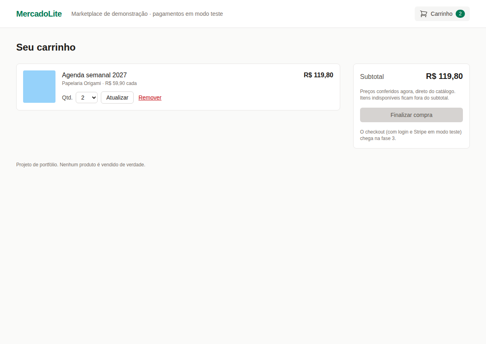
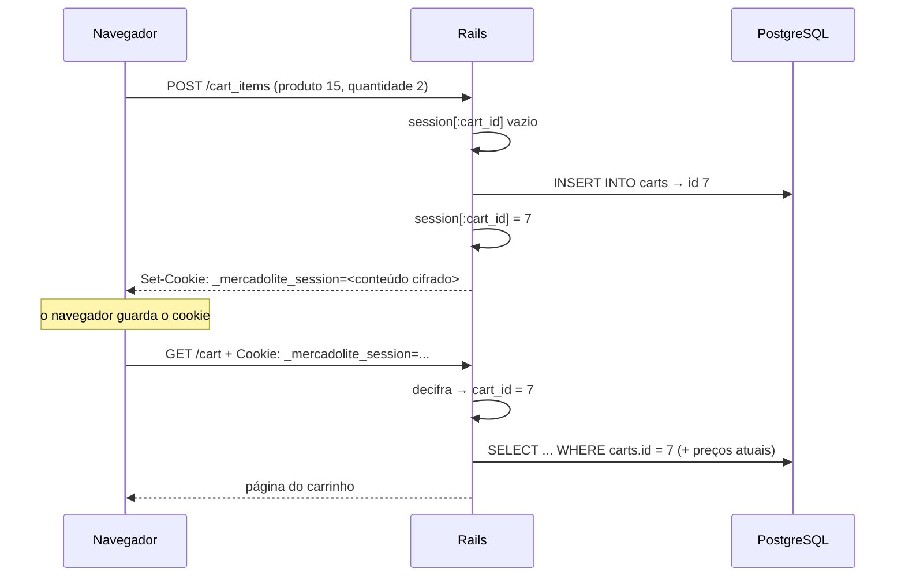
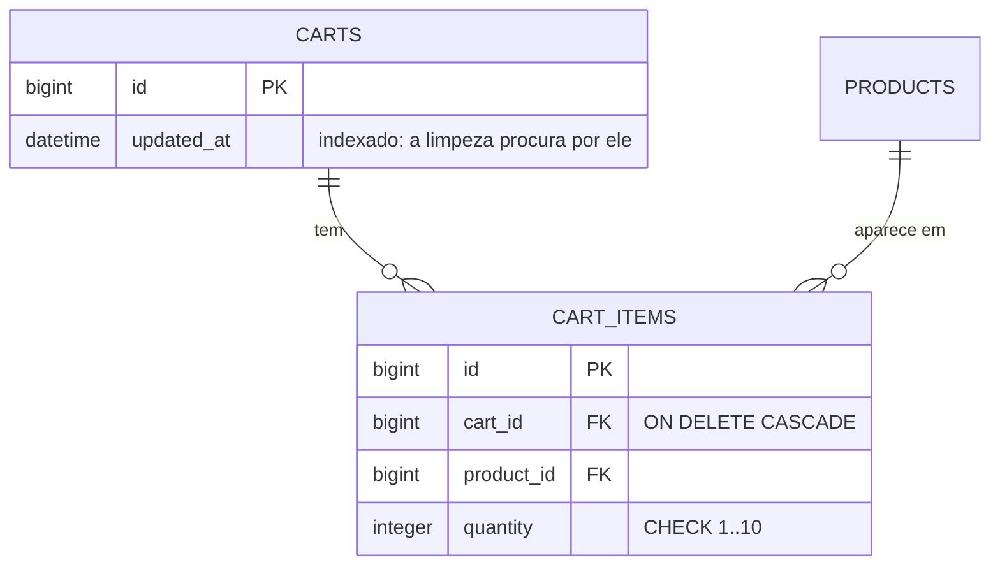
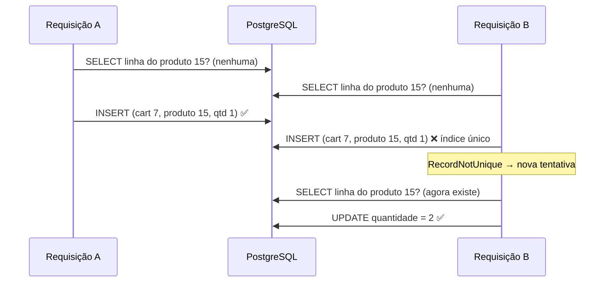
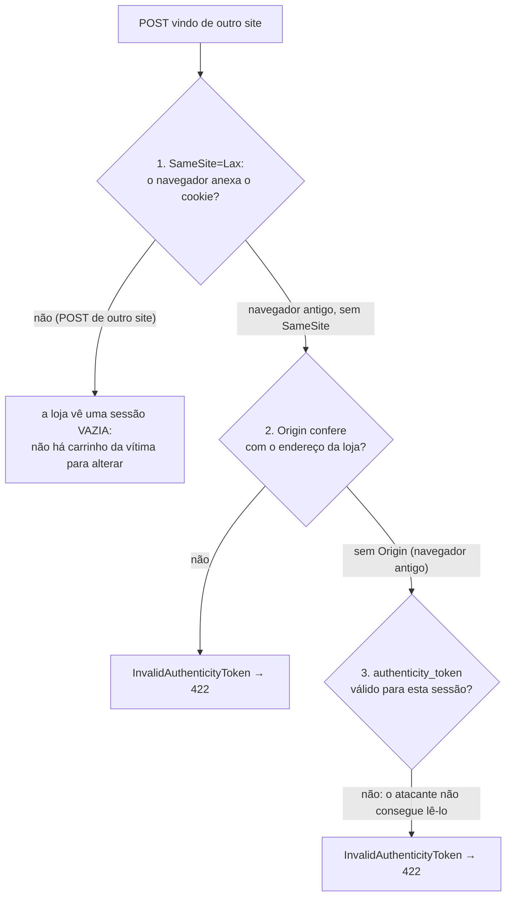
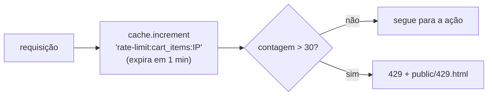
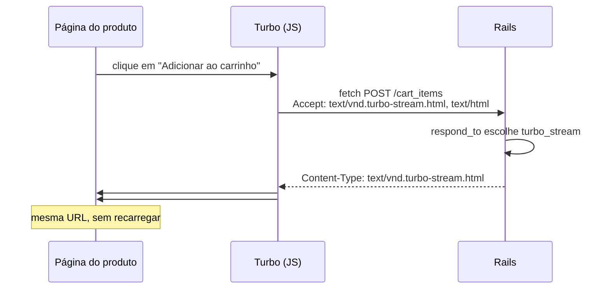

# MercadoLite — Fase 2: o carrinho

> **Objetivo:** permitir que um visitante (ainda sem login) monte um carrinho de compras que
> sobrevive entre páginas e visitas, sem nunca confiar no preço que vem do navegador, sem que
> uma pessoa consiga mexer no carrinho de outra e sem que um robô consiga abusar do sistema.
>
> **Pré-requisito:** [Fase 1 — o catálogo](fase-1-catalogo.md).

**O que você vai aprender:** HTTP sem estado, cookies e sessão · cookie cifrado com
AES-256-GCM · CSRF (e três defesas contra ele, demonstradas com um ataque de verdade) ·
IDOR e o "escopo do dono" · rate limiting · Turbo Streams · *concerns* · `params.expect` ·
índices compostos e o "prefixo à esquerda" · condições de corrida no índice único · jobs em
segundo plano com o Solid Queue · testes que precisam de relógio e de cache.


**Sumário**
1. [O que foi construído](#1-o-que-foi-construído)
2. [HTTP não tem memória: cookies e sessão](#2-http-não-tem-memória-cookies-e-sessão)
3. [Por dentro do cookie de sessão](#3-por-dentro-do-cookie-de-sessão)
4. [Por que o carrinho fica no banco](#4-por-que-o-carrinho-fica-no-banco)
5. [O banco: tabelas, cascata e o índice composto](#5-o-banco-tabelas-cascata-e-o-índice-composto)
6. [Os modelos `Cart` e `CartItem`](#6-os-modelos-cart-e-cartitem)
7. [`Quantity.parse`: uma função pura e estrita](#7-quantityparse-uma-função-pura-e-estrita)
8. [O concern `CurrentCart`](#8-o-concern-currentcart)
9. [Rotas: `resource` × `resources`](#9-rotas-resource--resources)
10. [O controller e o anti-IDOR](#10-o-controller-e-o-anti-idor)
11. [CSRF: o ataque e as três defesas](#11-csrf-o-ataque-e-as-três-defesas)
12. [Rate limiting](#12-rate-limiting)
13. [Turbo Streams: atualizar sem recarregar](#13-turbo-streams-atualizar-sem-recarregar)
14. [As views da fase](#14-as-views-da-fase)
15. [Jobs em segundo plano: a limpeza diária](#15-jobs-em-segundo-plano-a-limpeza-diária)
16. [Páginas de erro](#16-páginas-de-erro)
17. [Os testes da fase](#17-os-testes-da-fase)
18. [O que os testes e o navegador nos ensinaram](#18-o-que-os-testes-e-o-navegador-nos-ensinaram)
19. [Mão na massa](#19-mão-na-massa)
20. [Decisões de design (bom assunto para entrevista)](#20-decisões-de-design-bom-assunto-para-entrevista)
21. [Glossário](#21-glossário)
22. [Exercícios](#22-exercícios)
23. [Próxima fase](#23-próxima-fase)

---

## 1. O que foi construído

| Onde | O quê |
|---|---|
| Página do produto | seletor de quantidade (1 até o menor entre o estoque e 10) + "Adicionar ao carrinho" |
| Cabeçalho | link "Carrinho" com o total de unidades, atualizado na hora |
| `GET /cart` | as linhas, avisos de "indisponível" e "estoque baixo", subtotal só do que pode ser comprado |
| `POST /cart_items` | adiciona (ou soma à linha existente) |
| `PATCH /cart_items/:id` | muda a quantidade |
| `DELETE /cart_items/:id` | remove a linha |
| Todo dia às 4h | um job apaga carrinhos parados há 30 dias |



Os arquivos novos:

```
app/controllers/concerns/current_cart.rb   ← "qual é o carrinho desta sessão?"
app/controllers/carts_controller.rb        ← GET /cart
app/controllers/cart_items_controller.rb   ← POST/PATCH/DELETE, rate limit, anti-IDOR
app/models/cart.rb, cart_item.rb           ← regras do carrinho
app/jobs/purge_abandoned_carts_job.rb      ← limpeza diária
lib/quantity.rb                            ← função pura: texto → quantidade
config/initializers/session_store.rb       ← o cookie de sessão
app/views/carts/, cart_items/, shared/     ← telas, Turbo Stream, aviso e contador
public/429.html                            ← "muitas requisições"
```

---

## 2. HTTP não tem memória: cookies e sessão

O HTTP é **sem estado** (*stateless*): cada requisição chega sozinha, e o servidor não sabe,
por si só, que a requisição de agora vem da mesma pessoa de um minuto atrás. É como uma
função C sem variáveis `static` nem globais: tudo o que ela sabe está nos argumentos.

O **cookie** é o "argumento extra" que o navegador manda sozinho a cada requisição:



A **sessão** (`session[:chave]`) é um Hash que o Rails guarda **dentro** desse cookie, e que
persiste de uma requisição para a próxima. Medido num teste, depois de adicionar um produto:

```
chaves da sessão: ["session_id", "cart_id", "flash"]
```

(Em desenvolvimento e produção aparece também o `_csrf_token`, da seção 11. No ambiente de
teste, a proteção CSRF vem desligada.)

A configuração fica em `config/initializers/session_store.rb`:

```ruby
Rails.application.config.session_store :cookie_store,
  key: "_mercadolite_session",
  expire_after: 30.days,
  same_site: :lax,
  secure: Rails.env.production?
```

| Opção | Efeito |
|---|---|
| `expire_after: 30.days` | o cookie sobrevive ao fechamento do navegador (sem ela, é um *cookie de sessão*, que morre ao fechar) |
| `same_site: :lax` | o navegador **não** envia o cookie em POSTs que vêm de outros sites (seção 11) |
| `secure:` | em produção, o cookie só trafega por HTTPS |
| `HttpOnly` (padrão) | o JavaScript da página não consegue ler o cookie (`document.cookie` não o mostra): um XSS não rouba a sessão |

No Chromium, conferimos: `httpOnly=true`, `sameSite=Lax`, expira em 30 dias.

> **LGPD:** a sessão guarda só o id do carrinho e tokens técnicos, sem dado pessoal. É um
> cookie **estritamente necessário** para a funcionalidade pedida (o carrinho), por isso não
> depende de consentimento.

---

## 3. Por dentro do cookie de sessão

O cookie é **cifrado e autenticado** com **AES-256-GCM**, usando uma chave derivada da
`SECRET_KEY_BASE` (conferido no código do Rails:
`request.encrypted_cookie_cipher || "aes-256-gcm"`). Capturamos um cookie real com o `curl`:

```
cookie (início e fim): v2TyWdKfmx3WPQZN1qDJ%2FLUtcob823Qmo7xzUp...--TT8ttX4dTYa5EFYmGTM10g%3D%3D
tamanho: 418 caracteres
partes separadas por '--': 3
```

```
  v2TyWdKfmx3...Up...   --   <iv>   --   TT8ttX4dTYa5EFYmGTM10g==
  └─ dados cifrados ─┘       └ nonce ┘    └── tag de autenticação ──┘
     (Base64)                (IV do GCM)    (o "lacre" contra alterações)
```

- **Cifrar** (*confidencialidade*): quem vê o cookie não consegue ler o `cart_id`.
- **Autenticar** (*integridade*): o GCM calcula uma **tag** sobre os dados. Mudou um bit, a
  tag não confere e o Rails descarta o cookie inteiro. É o equivalente a um MAC
  (código de autenticação de mensagem) — pense num CRC, mas que ninguém consegue recalcular
  sem a chave.

Testamos com o `curl`, trocando **um único caractere** do cookie:

```
--- com o cookie original:
Caneca de cerâmica esmaltada
--- com 1 caractere trocado:
Seu carrinho está vazio
```

Nada de erro: o Rails simplesmente trata o cookie adulterado como inexistente e começa uma
sessão nova. Não existe como "forjar" um `cart_id` de outra pessoa.

**Limite de tamanho:** um cookie tem no máximo **4096 bytes**
(`ActionDispatch::Cookies::MAX_COOKIE_SIZE`). Por isso, a sessão guarda só o id, e não o
carrinho inteiro (próxima seção).

---

## 4. Por que o carrinho fica no banco

Havia duas opções:

| | Carrinho inteiro no cookie | **Só o id no cookie, itens no banco** (escolhida) |
|---|---|---|
| Tamanho | limitado a 4 KB | ilimitado |
| Regras | nenhuma garantia fora do Ruby | `CHECK`, índice único, chave estrangeira |
| Preço | tentação de guardar o preço junto | o preço nunca sai do banco |
| Checkout (fase 3) | precisaria recriar tudo | o carrinho já está lá, pronto para virar pedido |
| Custo | zero no banco | uma linha por carrinho; exige limpeza (seção 15) |

---

## 5. O banco: tabelas, cascata e o índice composto



**Repare no que NÃO está lá: preço.** O total da linha é sempre
`produto.price_cents × quantidade`, com o preço lido do banco na hora. Se o vendedor mudar o
preço, o carrinho mostra o novo (há teste para isso). Na fase 3, o pedido vai "congelar" o
preço no momento da compra, porque um pedido é um registro histórico.

```ruby
t.references :cart, null: false, foreign_key: { on_delete: :cascade }, index: false
t.references :product, null: false, foreign_key: true
t.integer :quantity, null: false
# ...
add_index :cart_items, [ :cart_id, :product_id ], unique: true
add_check_constraint :cart_items, "quantity BETWEEN 1 AND 10", name: "cart_items_quantity_range"
```

- **`on_delete: :cascade`**: apagar um carrinho apaga os itens dele **no próprio banco**. O
  job de limpeza apaga milhares de carrinhos com um único `DELETE`, sem carregar nada no Ruby.
- **Índice único `[cart_id, product_id]`**: uma linha por produto em cada carrinho.
  Adicionar o mesmo produto de novo **soma** na linha existente.
- **`index: false` no `cart_id`**: o gerador tinha criado dois índices começando por
  `cart_id` — o composto e um só de `cart_id`. O segundo é **redundante**.

### O "prefixo à esquerda"

Um índice B-tree sobre `(cart_id, product_id)` é como uma lista telefônica ordenada por
sobrenome e depois nome: dá para achar rápido todo mundo com um sobrenome, mesmo sem saber o
nome. Com a varredura sequencial desligada (para forçar o planejador a mostrar o que
*consegue* usar), o PostgreSQL confirma:

```
Bitmap Heap Scan on cart_items  (cost=4.20..13.67 rows=6 width=44)
  Recheck Cond: (cart_id = 7)
  ->  Bitmap Index Scan on index_cart_items_on_cart_id_and_product_id
        Index Cond: (cart_id = 7)
```

Uma busca só por `cart_id` usa o índice composto. O contrário não vale: uma busca só por
`product_id` **não** aproveita esse índice, e por isso `product_id` tem índice próprio. Cada
índice a mais custa espaço e tempo em **todo** INSERT/UPDATE/DELETE.

---

## 6. Os modelos `Cart` e `CartItem`

### `CartItem`

```ruby
class CartItem < ApplicationRecord
  MAX_QUANTITY = 10

  belongs_to :cart, touch: true
  belongs_to :product

  validates :quantity, numericality: {
    only_integer: true, greater_than_or_equal_to: 1, less_than_or_equal_to: MAX_QUANTITY
  }
  validate :product_must_be_purchasable, if: -> { new_record? || will_save_change_to_quantity? }

  def line_total_cents = product.price_cents * quantity
  def available? = product.active? && product.in_stock?
  def exceeds_stock? = available? && quantity > product.stock_quantity
  def purchasable? = available? && !exceeds_stock?
end
```

(No arquivo, os métodos estão escritos por extenso e comentados; aqui, resumidos.)

- **`touch: true`**: salvar ou apagar um item atualiza o `updated_at` do carrinho. É assim que
  o job sabe há quanto tempo ninguém mexe nele.
- **Por que `greater_than_or_equal_to`/`less_than_or_equal_to`, e não `in: 1..10`?** O
  resultado é o mesmo, mas a mensagem do `in:` saiu `"deve estar em 1..10"`. Com os limites
  explícitos, a gem rails-i18n dá `"deve ser menor ou igual a 10"`.
- **`if: -> { new_record? || will_save_change_to_quantity? }`**: a conferência do estoque só
  roda ao criar o item ou mudar a quantidade. `will_save_change_to_quantity?` é um dos
  métodos de *dirty tracking* que o Active Record gera para cada coluna.
- **Mensagem com plural**, em `config/locales/pt-BR.yml`:

  ```yaml
  exceeds_stock:
    one: "maior que o estoque (só resta %{count} unidade)"
    other: "maior que o estoque (só restam %{count} unidades)"
  ```

  O I18n escolhe `one` ou `other` pelo `count` informado.
- **É uma conferência, não uma reserva.** Colocar no carrinho não "segura" o estoque. Se o
  estoque baixar depois, a linha passa a mostrar "Só restam N unidades" e sai do subtotal. A
  garantia de verdade vem na fase 4, com a linha do estoque travada durante o pagamento.

### `Cart`

```ruby
class Cart < ApplicationRecord
  ABANDONED_AFTER = 30.days

  has_many :items, class_name: "CartItem", dependent: :delete_all

  scope :abandoned, -> { where(updated_at: ...ABANDONED_AFTER.ago) }

  def add(product, quantity, retried: false)
    item = items.find_or_initialize_by(product:)
    item.quantity = item.quantity.to_i + quantity
    item.save
    item
  rescue ActiveRecord::RecordNotUnique
    raise if retried

    add(product, quantity, retried: true)
  end
end
```

- **`class_name:`**: o nome da associação (`items`) difere do nome da classe (`CartItem`). A
  convenção seria `has_many :cart_items`; com `class_name`, lemos `cart.items`.
- **`...ABANDONED_AFTER.ago`**: um *Range* sem início. `where(updated_at: ...data)` vira
  `WHERE updated_at < data`.
- **`find_or_initialize_by`**: procura a linha do produto; se não existir, cria o objeto **em
  memória** (sem gravar). `item.quantity.to_i` transforma o `nil` de um item novo em 0.

### A corrida no índice único

Se a mesma pessoa clicar duas vezes muito rápido em "Adicionar", podem chegar duas
requisições **ao mesmo tempo**:



É a mesma condição de corrida *check-then-act* da unicidade do vendedor (fase 1). Aqui, o
índice único impede a linha duplicada, e o `rescue` transforma o erro numa nova tentativa, que
agora encontra a linha e soma. O `retried:` garante que isso acontece **uma vez só**: um
segundo erro é problema de verdade e sobe.

### `Product#stock_quantity`

```ruby
def stock_quantity
  inventory&.quantity.to_i
end
```

Foi criado por causa de um teste que falhou (seção 18). `&.` devolve `nil` se `inventory` for
`nil`, e `nil.to_i` é `0`.

---

## 7. `Quantity.parse`: uma função pura e estrita

A lição da fase 1 foi: **conversão de tipo não é validação** (`"12abc".to_i == 12`). A
quantidade enviada pelo formulário passa por um parser próprio, em `lib/quantity.rb`:

```ruby
module Quantity
  PATTERN = /\A\d{1,3}\z/

  def self.parse(text, max:)
    raise ArgumentError, "max deve ser positivo" unless max.positive?

    digits = text.to_s.strip
    return nil unless PATTERN.match?(digits)

    value = Integer(digits, 10)
    value.between?(1, max) ? value : nil
  end
end
```

| Entrada | Resultado |
|---|---|
| `"3"`, `" 3 "` | `3` |
| `"08"` | `8` (base 10 explícita; `Integer("08")` sem base daria erro de octal) |
| `"0"`, `"11"` (com `max: 10`) | `nil` |
| `"2abc"`, `"2.5"`, `"-1"`, `"+2"`, `"1e2"`, `"0x1"` | `nil` |
| `"１"` (dígito "de largura total", Unicode) | `nil`: no Ruby, `\d` casa só `0-9` ASCII |
| `"9999"` | `nil` (no máximo 3 dígitos, então nada de números gigantes) |

Todos esses casos estão em `spec/lib/quantity_spec.rb`.

---

## 8. O concern `CurrentCart`

Um **concern** é um módulo (mixin, Lição 01) no formato que o Rails gosta. O que está dentro
do bloco `included` roda **na classe** que faz `include CurrentCart`, como se tivesse sido
escrito nela:

```ruby
module CurrentCart
  extend ActiveSupport::Concern

  included do
    helper_method :current_cart      # também disponível nas views
  end

  private

  def current_cart
    return @current_cart if defined?(@current_cart)

    @current_cart = session[:cart_id] && Cart.find_by(id: session[:cart_id])
  end

  def current_cart!
    current_cart || Cart.create!.tap do |cart|
      session[:cart_id] = cart.id
      @current_cart = cart
    end
  end
end
```

- **Memoização com `defined?`**: o carrinho é buscado uma vez por requisição. Por que não o
  clássico `@current_cart ||= ...`? Porque, quando não há carrinho, o valor é `nil`, e o `||=`
  consultaria o banco de novo a cada chamada. O `defined?(@current_cart)` diz "já tentei",
  mesmo que o resultado tenha sido `nil`.
- **GET nunca cria carrinho.** `current_cart` só **procura**; `current_cart!` (com `!`: "este
  faz algo a mais") **cria**, e só é chamado nas ações que alteram. Se cada visita criasse
  um carrinho, todo robô de busca que passasse pela loja deixaria uma linha no banco. Há
  teste para isso: navegar pela vitrine não muda `Cart.count`.
- **`tap`** executa o bloco com o objeto e devolve o próprio objeto: cria, anota na sessão,
  memoriza e devolve o carrinho.
- `ApplicationController` faz `include CurrentCart`, então todo controller tem acesso a ele.

---

## 9. Rotas: `resource` × `resources`

```ruby
resource :cart, only: :show
resources :cart_items, only: %i[create update destroy]
```

```
    Prefix Verb   URI Pattern               Controller#Action
      cart GET    /cart(.:format)           carts#show
cart_items POST   /cart_items(.:format)     cart_items#create
 cart_item PATCH  /cart_items/:id(.:format) cart_items#update
           PUT    /cart_items/:id(.:format) cart_items#update
           DELETE /cart_items/:id(.:format) cart_items#destroy
```

- **`resource` (singular)**: um recurso do qual cada usuário tem **um só**, então não há id na
  URL (`/cart`, e não `/carts/7`). Quem decide qual carrinho mostrar é a sessão. Nem existe
  uma URL para "ver o carrinho 8".
- **`resources` (plural)**: coleção com ids (`/cart_items/42`). E é justamente por haver um id
  na URL que o controller precisa do cuidado anti-IDOR da próxima seção.

---

## 10. O controller e o anti-IDOR

```ruby
class CartItemsController < ApplicationController
  RATE_LIMIT = 30
  rate_limit to: RATE_LIMIT, within: 1.minute

  def create
    attrs = params.expect(cart_item: [ :product_id, :quantity ])
    product = Product.active.find(attrs[:product_id])
    quantity = Quantity.parse(attrs[:quantity], max: CartItem::MAX_QUANTITY)
    return reject(t(".invalid_quantity", max: CartItem::MAX_QUANTITY), product:) if quantity.nil?

    @item = current_cart!.add(product, quantity)
    # ... sucesso ou erro
  end

  private

  def find_item
    raise ActiveRecord::RecordNotFound if current_cart.nil?

    current_cart.items.find(params[:id])
  end
end
```

### `params.expect`: a forma do Rails 8 de receber parâmetros

`params.expect(cart_item: [ :product_id, :quantity ])` exige que venha um `cart_item` que seja
um Hash e permite só as duas chaves. Comparamos com a forma antiga diante de uma entrada
malformada (`cart_item=abc`, uma string em vez de um Hash):

```
expect         → ActionController::ParameterMissing        (o Rails responde 400)
require.permit → NoMethodError: undefined method 'permit' for an instance of String   (seria 500)
POST cart_item=abc → 400
```

Um 500 é "o servidor quebrou". Um 400 é "você mandou algo errado", que é a verdade. Além
disso, erros 500 poluem o monitoramento e podem vazar detalhes.

### A ordem é: autorizar, depois buscar

- `Product.active.find(...)`: produto inativo ou inexistente → 404, **antes** de criar o
  carrinho.
- O preço não aparece em lugar nenhum: o formulário manda produto e quantidade; qualquer outra
  chave (um `price_cents` forjado, por exemplo) é descartada pelo `expect`. Há um teste que
  envia `price_cents: 1` e confere que o carrinho mostra R$ 49,90.

### IDOR

**IDOR** (*Insecure Direct Object Reference*) é acessar o recurso de outra pessoa **trocando
o id** na requisição. Com `CartItem.find(params[:id])`, qualquer um poderia apagar os itens
do carrinho alheio só testando números. Com `current_cart.items.find(params[:id])`, a busca
acontece **dentro** do carrinho desta sessão:

```sql
SELECT "cart_items".* FROM "cart_items"
WHERE "cart_items"."cart_id" = 7 AND "cart_items"."id" = 42 LIMIT 1
```

O item de outra pessoa simplesmente "não existe" para esta sessão: 404, a mesma resposta de
um id inválido, sem revelar nada. **Fizemos o experimento**: trocando o escopo por
`CartItem.find(params[:id])`, **dois testes falham** — exatamente os dois de anti-IDOR. Todos
os outros continuam passando, porque a funcionalidade "funciona". Como no PwnCheck:
testes de funcionalidade não protegem propriedades de segurança.

### `flash` × `flash.now`

- `redirect_to cart_path, notice: "..."`: a mensagem vai para o **flash**, que sobrevive a
  **uma** requisição a mais (a do redirect) e depois some.
- `flash.now[:notice] = "..."`: a mensagem vale só para a resposta **atual**, sem redirect
  (usado na resposta Turbo Stream).

### `respond_to`: a ordem importa

```ruby
respond_to do |format|
  format.html { redirect_to cart_path, notice: message }
  format.turbo_stream { flash.now[:notice] = message }
end
```

O navegador diz o que aceita no cabeçalho `Accept`. O Turbo pede
`text/vnd.turbo-stream.html, text/html, ...` e recebe o stream. Um cliente que aceita
**qualquer coisa** (`*/*`, como o `curl`) recebe o **primeiro formato declarado**. Na primeira
versão o stream vinha primeiro, e o `curl` recebeu um Turbo Stream (status 200) em vez do
redirect: foi assim que descobrimos. Agora o HTML vem antes, e há um teste com `Accept: */*`.

---

## 11. CSRF: o ataque e as três defesas

**CSRF** (*Cross-Site Request Forgery*): um site malicioso faz o **seu navegador** enviar uma
requisição para a loja. Se o navegador anexar o seu cookie, a loja acha que foi você.

### Fizemos o ataque

Montamos uma página "de prêmio" num **outro site** (`localhost:4000`, enquanto a loja estava
em `127.0.0.1:3000`), com um formulário escondido que adiciona 5 canecas ao carrinho:

```html
<form action="http://127.0.0.1:3000/cart_items" method="post">
  <input type="hidden" name="cart_item[product_id]" value="1">
  <input type="hidden" name="cart_item[quantity]" value="5">
  <button type="submit">Resgatar prêmio</button>
</form>
```

No Chromium, a "vítima" primeiro pôs 1 caneca no carrinho da loja, depois visitou a página do
atacante e clicou no botão. Resultado real:

```
Carrinho da vítima antes: 1 unidade(s)
POST do atacante → status 422
  Origin enviado: http://localhost:4000
  Cookie de sessão foi junto? NÃO (SameSite=Lax)
Carrinho da vítima depois: 1 unidade(s)
```

E o log do servidor:

```
HTTP Origin header (http://localhost:4000) didn't match request.base_url (http://127.0.0.1:3000)
```

### As três defesas (qualquer uma sozinha já teria barrado)



1. **`SameSite=Lax`** (seção 2): o navegador não anexa o cookie da loja a um POST que parte
   de outro site.
2. **Checagem de origem** (`forgery_protection_origin_check = true`, padrão do Rails): o
   cabeçalho `Origin` precisa ser o próprio site.
3. **Token CSRF**: todo formulário gerado pelo Rails leva um campo oculto
   `authenticity_token`, ligado à sessão (e, com `per_form_csrf_tokens = true`, também à
   ação do formulário). O atacante não consegue ler esse valor da página da loja (a política
   de mesma origem do navegador impede), então não tem como incluí-lo.

Detalhe: o token que aparece no HTML é **mascarado** (misturado com bytes aleatórios a cada
página), então muda a cada carregamento. Conferido com o `curl`, na mesma sessão:
`8ptbQrn3RgQ_8ljw...` num carregamento e `1_HH62O2zbxuti9y...` no seguinte, os dois válidos.
Isso protege contra o ataque BREACH, que tenta adivinhar segredos pelo tamanho de respostas
comprimidas.

### E no teste?

No ambiente de teste, o Rails desliga a proteção CSRF
(`config.action_controller.allow_forgery_protection = false`), para que os testes não
precisem de tokens. Isso quer dizer que, sem cuidado, **nenhum teste prova** que a proteção
existe. Por isso há um grupo de testes que a liga de propósito:

```ruby
describe "proteção CSRF" do
  around do |example|
    ActionController::Base.allow_forgery_protection = true
    example.run
  ensure
    ActionController::Base.allow_forgery_protection = false
  end

  it "recusa POST sem o token do formulário (como faria um site atacante)" do
    expect { add_to_cart(product) }.not_to change(CartItem, :count)
    expect(response).to have_http_status(:unprocessable_content)
  end

  it "aceita o POST com o token que a própria página entregou" do
    get product_path(product)
    token = response.body[/name="authenticity_token" value="([^"]+)"/, 1]
    # ... POST com o token → redirect para o carrinho
  end
end
```

`around` embrulha cada exemplo (como um `try/finally` em volta do teste): liga antes, roda,
e o `ensure` desliga depois, mesmo se o teste falhar.

---

## 12. Rate limiting

Um robô pode disparar milhares de POSTs por minuto, criando carrinhos, enchendo o banco e
gastando CPU. O Rails 8 tem limitação de taxa embutida:

```ruby
rate_limit to: 30, within: 1.minute
```

### Como funciona por dentro (lido no código do Rails)

```ruby
cache_key = ["rate-limit", scope, name, by].compact.join(":")
count = store.increment(cache_key, 1, expires_in: within)
if count && count > to
  # ... TooManyRequests → 429
end
```

É uma **janela fixa com contador**: a cada requisição, incrementa um contador no cache com
validade de 1 minuto. Passou de 30, responde **429 Too Many Requests** (a página
`public/429.html`, em português). A chave real, medida num teste:

```
rate-limit:cart_items:127.0.0.1
```

`cart_items` é o controller, e `127.0.0.1` é o `request.remote_ip`, o padrão do `by:`.



- **O cache precisa ser compartilhado.** Em produção, o `Rails.cache` é o **Solid Cache**
  (tabela no PostgreSQL), e todos os processos Puma veem o mesmo contador.
- **Atrás do Caddy**, o `remote_ip` vem do cabeçalho `X-Forwarded-For`, e o Rails só confia
  nele quando a requisição chega de um IP de rede privada (como o do container do Caddy). A
  lista está em `ActionDispatch::RemoteIp::TRUSTED_PROXIES`: `127.0.0.0`, `::1`, `fc00::`,
  `10.0.0.0`, `172.16.0.0`, `192.168.0.0`, `169.254.0.0` e `fe80::` (com as máscaras de cada
  rede). Sem isso, todos os clientes teriam o IP do Caddy e dividiriam o mesmo limite.
- É **por IP**: várias pessoas atrás do mesmo NAT (uma empresa, uma universidade) dividem o
  limite. Por isso 30 por minuto, folgado para humanos. Na fase 3, com login, o limite de
  login será mais apertado.

### O detalhe que quase escapou: o cache dos testes

O ambiente de teste vem com `config.cache_store = :null_store`, um cache que **não guarda
nada**. `store.increment` devolve `nil` e o limite nunca dispara. **Fizemos o experimento**:
com o `:null_store`, o teste do 429 falha (recebe um 302 em vez do 429). Solução:

```ruby
# config/environments/test.rb
config.cache_store = :memory_store

# spec/rails_helper.rb
config.before { Rails.cache.clear }
```

E por que limpar antes de cada exemplo? **Experimento:** sem o `clear`, os contadores de um
teste "vazam" para o seguinte (todos usam o IP 127.0.0.1). Com três ordens diferentes
(`--seed 1`, `2` e `3`), a suíte teve 2, 1 e 1 falhas — um teste de anti-IDOR recebeu **429**
onde esperava 404. Falhas que mudam com a ordem são o sintoma clássico de **testes
dependentes entre si**, e é por isso que o RSpec roda em ordem aleatória.

### Testando a janela com o relógio

```ruby
it "volta a aceitar depois que a janela de 1 minuto passa" do
  CartItemsController::RATE_LIMIT.times { add_to_cart(product, quantity: "0") }

  travel 61.seconds do
    add_to_cart(product, quantity: 1)
  end

  expect(response).to redirect_to(cart_path)
end
```

`travel` (de `ActiveSupport::Testing::TimeHelpers`, incluído no `rails_helper.rb`) "adianta o
relógio" dentro do bloco: o `Time.now` fica simulado, e a entrada do cache expira sem que o
teste espere 1 minuto de verdade.

---

## 13. Turbo Streams: atualizar sem recarregar

Na fase 1, o **Turbo Drive** já trocava o `<body>` inteiro a cada navegação. O **Turbo Stream**
é mais fino: o servidor responde com **instruções** do tipo "atualize o elemento X com este
HTML". Resposta real do `POST /cart_items` (o SVG do ícone foi abreviado):

```html
<turbo-stream action="update" target="flash"><template>
  <p class="... text-emerald-800" role="status">Caneca foi adicionado ao carrinho.</p>
</template></turbo-stream>
<turbo-stream action="replace" target="cart_badge"><template>
  <a id="cart_badge" href="/cart"> <svg>…</svg> Carrinho <span ...>2</span> </a>
</template></turbo-stream>
```



Medido no Chromium: `POST /cart_items → 200 text/vnd.turbo-stream.html`, o contador foi de
0 para 2, a URL continuou a do produto e a página não recarregou.

- O template é `app/views/cart_items/create.turbo_stream.erb`: uma view com outra extensão.
- Em caso de erro (estoque insuficiente), o mesmo template responde com **422**, e o aviso
  vermelho aparece no mesmo lugar.
- **CSP:** um Turbo Stream é só HTML dentro de `<template>`, sem nenhum script inline, então
  a CSP estrita da fase 1 continua valendo (nenhuma violação no console).
- **Sem JavaScript, funciona do mesmo jeito**, só que com redirect: é o `format.html`.

---

## 14. As views da fase

- **`shared/_flash.html.erb`**: mostra `notice` (verde, `role="status"`) e `alert`
  (vermelho, `role="alert"`), para que leitores de tela anunciem a mensagem. Fica dentro de
  `<div id="flash">` no layout, o alvo do Turbo Stream.
- **`shared/_cart_badge.html.erb`**: o link do cabeçalho. O `aria-label` diz
  "2 itens no carrinho", porque só o número "2" não diz nada para quem ouve a página.
- **Formulário do produto**: `form_with scope: :cart_item, url: cart_items_path` gera os
  nomes `cart_item[product_id]` e `cart_item[quantity]` (o formato que o `params.expect`
  pede) e o campo oculto `authenticity_token`, sozinho.
- **`button_to "Remover", cart_item_path(line), method: :delete`**: formulários HTML só
  conhecem GET e POST. O Rails gera um POST com um campo oculto `_method=delete`, que o
  middleware `Rack::MethodOverride` transforma em DELETE. Por ser um formulário, o botão leva
  o token CSRF. (Um **link** `<a>` nunca deve apagar nada: links são GET, e GET precisa ser
  seguro, porque robôs e pré-carregadores seguem links.)
- **`carts/_line.html.erb`**: `render partial: "carts/line", collection: @lines, as: :line`.
  `as:` escolhe o nome da variável local de cada item.

---

## 15. Jobs em segundo plano: a limpeza diária

Cada carrinho criado é uma linha no banco. Carrinhos esquecidos (e os criados por robôs)
cresceriam para sempre. A solução é um **job**: código que roda fora do ciclo
requisição/resposta.

```ruby
class PurgeAbandonedCartsJob < ApplicationJob
  queue_as :default
  BATCH_SIZE = 1_000

  def perform
    Cart.abandoned.in_batches(of: BATCH_SIZE).delete_all
  end
end
```

- **Active Job** é a interface ("um job tem `perform`"); o **Solid Queue** é o motor, que
  guarda a fila numa tabela do PostgreSQL, sem Redis. Pense numa fila produtor/consumidor
  entre threads, mas persistida em disco e compartilhada entre processos.
- **`in_batches(of: 1_000).delete_all`** apaga em lotes: DELETEs pequenos não travam a tabela
  por muito tempo. Os itens vão pelo `ON DELETE CASCADE`, sem carregar nenhum objeto no Ruby.
  O valor devolvido é quantos carrinhos foram apagados (o teste confere).
- **Agendamento** em `config/recurring.yml`:

  ```yaml
  production:
    purge_abandoned_carts:
      class: PurgeAbandonedCartsJob
      queue: default
      schedule: every day at 4am
  ```

  O texto "every day at 4am" é interpretado pela gem Fugit (vira o cron `0 4 * * *`).
  **Verificamos** num banco de produção temporário: a tarefa é válida, e a próxima execução
  saiu **07:00 UTC** — ou seja, 4h **de Brasília**, porque o horário segue o
  `config.time_zone` da aplicação.
- **Em produção, alguém precisa rodar os workers.** O `config/puma.rb` já traz
  `plugin :solid_queue if ENV["SOLID_QUEUE_IN_PUMA"]`: com essa variável, o próprio Puma
  sobe o Solid Queue (é o mais simples para uma VM pequena). Ela entrou no `.env.example`.
- Nos testes, `described_class.perform_now` roda o job na hora, sem fila.

---

## 16. Páginas de erro

As páginas em `public/` (400, 404, 406, 422, 500) foram traduzidas, e a **429** é nova. Elas
usam `<style>` inline — e a CSP estrita da fase 1 não bloqueia isso? Não, porque na pilha de
middlewares o `ShowExceptions` (que devolve essas páginas) fica **por fora** do middleware da
CSP (`bin/rails middleware`: `ShowExceptions` na linha 14, `ContentSecurityPolicy::Middleware`
na 24). Quando uma exceção sobe, a resposta de erro nasce do lado de fora e não recebe o
cabeçalho CSP. Como o arquivo é estático e escrito por nós, sem nenhum dado do usuário, não há
risco.

---

## 17. Os testes da fase

| Arquivo | O que prova |
|---|---|
| `spec/lib/quantity_spec.rb` | o parser aceita só inteiros limpos de 1 a max (24 casos) |
| `spec/models/cart_item_spec.rb` | limites de quantidade (modelo + CHECK no banco), estoque, produto inativo, índice único, preço atual, `touch` |
| `spec/models/cart_spec.rb` | `add` soma na mesma linha, subtotal com preço atual e sem indisponíveis, `abandoned`, cascata |
| `spec/jobs/purge_abandoned_carts_job_spec.rb` | apaga só os abandonados, e os itens deles junto |
| `spec/requests/cart_spec.rb` | o fluxo HTTP inteiro: GET não cria carrinho, preço forjado ignorado, 404 de inativo, quantidades inválidas, Turbo Stream, **anti-IDOR**, **CSRF ligado**, **429 e a janela**, cookie `HttpOnly`/`SameSite`, ERB vazando no HTML |

Técnicas novas desta fase:

- **`around`** para ligar e desligar uma configuração em volta de cada exemplo (CSRF).
- **`travel`** para simular a passagem do tempo (a janela do rate limit).
- **Cache em memória limpo antes de cada exemplo**, e o experimento que mostrou por quê.
- **Teste de regressão que falha com o bug**: antes de confiar num teste novo, colocamos o bug
  de volta e vimos o teste falhar (`1 example, 1 failure`); com a correção,
  `1 example, 0 failures`. Um teste que nunca foi visto falhando pode estar testando nada.

Resultado final: `190 examples, 0 failures, 1 pending` (o `pending` é o da fase 1).

---

## 18. O que os testes e o navegador nos ensinaram

| Suposição | O que aconteceu de verdade | O que mudou |
|---|---|---|
| "`build(:cart_item)` cria um item válido" | `NoMethodError: undefined method 'quantity' for nil`: um produto só **construído** (não gravado) ainda não tem estoque — ele nasce no `create` | `Product#stock_quantity` (sem estoque = 0) e a fábrica com `strategy: :create` |
| "`numericality: { in: 1..10 }` dá uma mensagem boa" | a mensagem saiu `"deve estar em 1..10"` | limites explícitos: `"deve ser menor ou igual a 10"` |
| "Posso escrever qualquer texto num comentário ERB" | um comentário `<%# ... %>` termina no **primeiro** fecha-tag. Eu citei a tag de saída do ERB dentro dele, e o resto do texto apareceu na página (`. %>` antes de cada aviso). Os testes passavam; só o **navegador** mostrou | comentário corrigido e um teste que procura `%>` no HTML (e que falhava com o bug) |
| "Com o `:null_store`, o teste do 429 passaria sem testar nada" | ele **falha** (recebe 302); o que passaria sem provar nada é o teste da janela | comentário do `test.rb` corrigido |
| "Tanto faz a ordem no `respond_to`" | o `curl` (`Accept: */*`) recebeu um Turbo Stream em vez do redirect | HTML primeiro, e um teste com `Accept: */*` |
| "'Às 4h' é 4h UTC" | a próxima execução saiu 07:00 UTC, 4h **de Brasília** | registrado aqui e no comentário do job |
| "O índice só de `cart_id` ajuda" | é redundante: o composto `[cart_id, product_id]` já atende (o `EXPLAIN` mostrou) | `index: false` |
| "Declarar a `ruby-vips` no `Gemfile` não muda nada no boot" | o `Bundler.require` passou a carregá-la no boot, e o job `scan_js` (sem libvips) quebrou | `require: false` (seção abaixo) |
| "Se o CI do Dependabot ficar verde, a atualização é segura" | a `image_processing` 2.x tirou a `ruby-vips` do bundle, e nenhum teste gerava uma miniatura de verdade: o CI passaria e as imagens quebrariam só em produção | teste que processa a variante + `ruby-vips` declarada no `Gemfile` (seção abaixo) |

### O Dependabot e a versão *major*

Enquanto esta fase era feita, o Dependabot abriu um PR subindo a `image_processing` de 1.14
para **2.1**. Uma mudança de versão *major* (o primeiro número) avisa: "pode quebrar". O
changelog dizia que, a partir da 2.0, `ruby-vips` e `mini_magick` são dependências
**opcionais**, e o diff do PR confirmava: `ruby-vips` e `ffi` saíam do `Gemfile.lock`.

Isso quebraria duas coisas: as miniaturas (o Active Storage usa a libvips por meio da
`ruby-vips`) e os seeds, que fazem `require "vips"` direto — ou seja, usávamos uma dependência
**transitiva** (que vinha "de carona" com outra gem) como se fosse nossa.

Pior: **o CI passaria**, porque os testes da fase 1 só conferiam a URL da miniatura, sem
gerá-la. Reproduzimos o estado do PR e escrevemos o teste que faltava:

```ruby
it "gera a miniatura com a libvips" do
  product = create(:product, :with_image)

  variant = product.images.first.variant(:thumb).processed
  thumbnail = Vips::Image.new_from_buffer(variant.download, "")

  expect(variant.key).to be_present
  expect([ thumbnail.width, thumbnail.height ].max).to be <= 400
end
```

| Estado | Resultado do teste novo |
|---|---|
| 1.14, `ruby-vips` transitiva (antes) | passa |
| 2.1, sem `ruby-vips` (o PR do Dependabot) | **falha** (`NoMethodError` ao processar) |
| 2.1 + `gem "ruby-vips"` no `Gemfile` (a correção) | passa, e a suíte inteira também |

A atualização valia a pena: as versões 2.0.x fecharam falhas de execução remota de código
(quando nomes de operação vêm do usuário, o que não é o nosso caso) e passaram a bloquear
por padrão os *loaders* da libvips que nunca passaram por *fuzzing*. Isso importa na fase 5,
quando vendedores enviarem imagens. Por isso a atualização entrou neste PR, já com a
`ruby-vips` declarada, e o PR do Dependabot fica redundante.

**E o CI ainda pegou mais uma.** No push dessa correção, o job `scan_js` ficou vermelho:

```
Could not open library 'libvips.so.42': libvips.so.42: cannot open shared object file
  ... from ruby-vips-2.3.0/lib/vips.rb:48
  ... from config/application.rb:19   (Bundler.require)
```

Por padrão, o `Bundler.require` do boot carrega **toda** gem do `Gemfile`, e carregar a
`ruby-vips` abre na hora a biblioteca nativa libvips (via FFI, o `dlopen` do Ruby). O job
`scan_js` sobe a aplicação só para auditar os pacotes JavaScript e não instala a libvips (só o
job `test` instala). Antes, a `ruby-vips` era transitiva e só carregava quando uma miniatura era
gerada.

Reproduzimos localmente, tirando a libvips do lugar por um instante: o `bin/importmap audit`
falhou com o mesmo erro. A correção:

```ruby
gem "ruby-vips", "~> 2.3", require: false
```

`require: false` mantém a gem no bundle, mas não a carrega no boot: ela entra sob demanda, na
primeira miniatura (a `image_processing` faz o `require "vips"`), ou onde o código pede
explicitamente (os seeds e o teste). Conferimos três coisas: sem a libvips, o audit passou; as
13 miniaturas da vitrine foram regeradas no navegador sem erro; e a suíte continuou verde.

Três lições para levar:

1. **Declare no `Gemfile` toda gem que o seu código usa diretamente**, mesmo que ela já venha
   de carona com outra. É o equivalente a incluir o header que você usa, em vez de depender
   de um `#include` indireto que um dia pode sumir.
2. **CI verde prova só o que os testes testam.** Antes de aceitar uma atualização *major*,
   leia o changelog e pergunte: "algum teste exercita isto de verdade?"
3. **Gems com biblioteca nativa pedem `require: false`** quando não são usadas no boot. Senão,
   toda máquina que sobe a aplicação passa a precisar da biblioteca, até as que não a usam.

---

## 19. Mão na massa

No Ubuntu (WSL), dentro de `~/dev/mercadolite`:

```bash
git pull
bin/rails db:migrate          # cria carts e cart_items
bundle exec rspec             # esperado: 190 examples, 0 failures, 1 pending
bin/dev                       # http://localhost:3000
```

Depois, no navegador:

1. Abra um produto, escolha 2 unidades e clique em "Adicionar ao carrinho". Repare que a URL
   não muda e que o contador do cabeçalho atualiza.
2. Abra as **Ferramentas do desenvolvedor** (F12) → **Rede**, adicione de novo e clique na
   requisição `cart_items`: veja o `Content-Type: text/vnd.turbo-stream.html` e, em
   **Resposta**, as tags `<turbo-stream>`.
3. Em **Aplicativo → Cookies**, encontre `_mercadolite_session`: veja as colunas `HttpOnly`,
   `SameSite` e `Expira`. Mude um caractere do valor e recarregue o carrinho: ele aparece
   vazio.
4. No console do Rails (`bin/rails console`):

   ```ruby
   cart = Cart.last
   cart.items.map { |i| [ i.product.name, i.quantity, i.line_total_cents ] }
   cart.subtotal_cents
   Quantity.parse("2abc", max: 10)   # => nil
   PurgeAbandonedCartsJob.perform_now
   ```

---

## 20. Decisões de design (bom assunto para entrevista)

- **Id na sessão, itens no banco.** O cookie é pequeno, cifrado e autenticado; as regras
  (quantidade, unicidade, integridade) moram no banco.
- **Preço nunca vem do cliente, nem fica guardado no carrinho.** O carrinho mostra o preço
  atual; o pedido (fase 3) congelará o preço na hora da compra.
- **Escopo do dono em toda busca por id** (`current_cart.items.find`): o padrão anti-IDOR que
  vai virar `current_user.orders.find` na fase 3.
- **GET não grava nada.** Visitas e robôs não criam linhas no banco; só POST, que exige token
  CSRF e passa pelo rate limit.
- **Defesa em profundidade contra CSRF:** SameSite + Origin + token. Qualquer uma sozinha
  barrou o ataque de demonstração.
- **Rate limit simples por IP**, com o cache compartilhado do Solid Cache, e a limpeza diária
  para o que escapar dele.
- **Estoque só conferido, não reservado, no carrinho.** Reservar ao pôr no carrinho permitiria
  "sequestrar" o estoque inteiro de um produto com carrinhos que nunca fecham. A garantia vem
  no pagamento (fase 4).
- **Para refletir:** o limite de 30 alterações por minuto por IP é justo para quem está atrás
  de um NAT compartilhado? Que outra chave (`by:`) você usaria depois que houver login?

---

## 21. Glossário

| Termo | O que é |
|---|---|
| **stateless** | sem estado: cada requisição HTTP é independente das anteriores. |
| **cookie** | pequeno dado que o servidor pede ao navegador para guardar e reenviar a cada requisição. |
| **sessão** | Hash que o Rails guarda (aqui, dentro do cookie) e que persiste entre requisições. |
| **AES-256-GCM** | cifra simétrica que **cifra** (ninguém lê) e **autentica** (ninguém altera sem ser detectado). |
| **tag de autenticação / MAC** | "lacre" criptográfico calculado com a chave; qualquer alteração o invalida. |
| **HttpOnly** | cookie invisível para o JavaScript da página. |
| **SameSite (Lax/Strict/None)** | quando o navegador envia o cookie em requisições que partem de outros sites. |
| **Secure** | cookie enviado só por HTTPS. |
| **CSRF** | um site malicioso fazendo o navegador da vítima enviar uma requisição autenticada. |
| **token CSRF (authenticity_token)** | valor secreto por sessão/formulário que só páginas da própria loja conhecem. |
| **Origin** | cabeçalho com o site de onde a requisição partiu. |
| **IDOR** | acessar o objeto de outra pessoa trocando o id na requisição. |
| **rate limiting** | limitar quantas requisições um cliente pode fazer por janela de tempo. |
| **429 Too Many Requests** | status HTTP de "limite de requisições excedido". |
| **janela fixa** | algoritmo de rate limit: um contador por período, zerado quando o período acaba. |
| **concern** | módulo (mixin) no padrão do Rails, com `included do ... end`. |
| **memoização** | guardar o resultado de uma consulta para não repeti-la na mesma requisição. |
| **`params.expect`** | exige e filtra parâmetros de uma vez; entrada malformada vira 400. |
| **`resource` singular** | rota sem id, para algo de que cada usuário tem só um. |
| **Turbo Stream** | resposta com instruções "troque/atualize o elemento X" aplicadas pelo Turbo. |
| **`respond_to`** | escolhe a resposta conforme o formato que o cliente aceita (HTML, Turbo Stream...). |
| **flash / flash.now** | aviso para a próxima requisição / só para a atual. |
| **`_method`** | campo oculto que permite a um formulário (POST) representar PATCH/DELETE. |
| **job / Active Job / Solid Queue** | código fora da requisição / a interface / o motor de fila no banco. |
| **recurring task** | job agendado (como um cron) no `config/recurring.yml`. |
| **ON DELETE CASCADE** | apagar a linha "pai" apaga as "filhas" no próprio banco. |
| **índice composto / prefixo à esquerda** | índice de várias colunas; serve também para buscas só pelas primeiras. |
| **dirty tracking** | o Active Record sabe quais atributos mudaram (`will_save_change_to_x?`). |
| **teste dependente de ordem** | teste cujo resultado muda conforme os outros que rodaram antes. |

---

## 22. Exercícios

1. **Adultere o cookie.** Em Ferramentas do desenvolvedor → Aplicativo → Cookies, troque um
   caractere do `_mercadolite_session` e recarregue `/cart`. O que acontece, e por que não
   aparece erro nenhum?
2. **Tire o `touch: true`.** Em `CartItem`, troque `belongs_to :cart, touch: true` por
   `belongs_to :cart` e rode os testes. Qual falha? Que problema de verdade isso causaria em
   produção?
3. **Quebre o anti-IDOR.** Em `CartItemsController#find_item`, troque a busca por
   `CartItem.find(params[:id])` (e apague a linha do `raise`). Rode os testes: quantos falham,
   e quais? O que isso diz sobre testes de funcionalidade?
4. **Tire a limpeza do cache.** Comente o `config.before { Rails.cache.clear }` do
   `rails_helper.rb` e rode `bundle exec rspec --seed 1`, depois `--seed 2`. O que muda, e por
   quê?
5. **Esvaziar o carrinho.** Crie o botão "Esvaziar carrinho" (`DELETE /cart`). Garanta, com
   um teste, que ele apaga só os itens do carrinho da sessão.
6. **SameSite=Strict?** Qual seria a desvantagem de usar `same_site: :strict` numa loja? Pense
   em alguém que chega à loja por um link do Google.
7. **Por que não reservar?** Explique por que o carrinho confere o estoque mas não o
   reserva. Que ataque a reserva permitiria?
8. **Desafio: limite por carrinho.** Hoje, `MAX_QUANTITY = 10` limita cada linha. Como você
   limitaria o carrinho a no máximo 20 produtos **diferentes**? Onde a regra deveria morar?

<details>
<summary>Respostas</summary>

1. O carrinho aparece **vazio**, sem erro. O cookie é autenticado com AES-256-GCM: com um
   caractere trocado, a tag não confere, e o Rails trata o cookie como inexistente e começa
   uma sessão nova (conferido com o `curl`, seção 3). Não há o que "tratar": para o servidor,
   é só um visitante sem sessão.
2. Falha só `CartItem atualiza o updated_at do carrinho ao mudar (touch)` (conferido:
   `190 examples, 1 failure`). Em produção, o `updated_at` do carrinho pararia de mudar quando
   a pessoa mexesse nos itens, e o job apagaria, 30 dias depois da **criação**, um carrinho
   que ela usou ontem.
3. Falham **2**: `anti-IDOR não deixa uma sessão alterar nem apagar item do carrinho de outra`
   e `anti-IDOR sem carrinho na sessão, qualquer id dá 404` (conferido: `190 examples,
   2 failures`). Todo o resto passa, porque adicionar, alterar e remover "funcionam". Testes
   de funcionalidade não protegem propriedades de segurança: cada garantia precisa do próprio
   teste.
4. Aparecem falhas que **mudam com a ordem** (conferido: 2 falhas com `--seed 1`, 1 com
   `--seed 2` e 1 com `--seed 3`). Os contadores do rate limit ficam no cache, e todos os
   testes usam o IP 127.0.0.1. Depois de 30 alterações somando vários testes, um teste que não
   tem nada a ver com rate limit recebe **429**: com `--seed 1`, o de anti-IDOR esperava 404 e
   recebeu 429. É o clássico teste dependente de ordem.
5. Rota: `resource :cart, only: %i[show destroy]`. No `CartsController`:

   ```ruby
   # DELETE /cart
   def destroy
     current_cart&.items&.delete_all
     redirect_to cart_path, notice: "Carrinho esvaziado."
   end
   ```

   Na view: `button_to "Esvaziar carrinho", cart_path, method: :delete`. Teste (conferido,
   `2 examples, 0 failures`): crie um carrinho de "outra pessoa" com um item, adicione um
   produto pela requisição, faça `delete cart_path` e confira que `CartItem.count` caiu 1 e
   que o outro carrinho continua com o item. Como o carrinho é singular (sem id), o anti-IDOR
   vem de graça: só existe o da sessão. Atenção: `delete_all` pula callbacks, então o
   `touch` não roda. Se isso importar, use `destroy_all` (mais lento: carrega cada item).
6. Com `Strict`, o navegador não envia o cookie nem ao **seguir um link** vindo de outro site.
   Quem clicasse num link da loja no Google ou num e-mail veria o carrinho **vazio** na
   primeira página (a sessão só "voltaria" na navegação seguinte, dentro da loja). O `Lax`
   envia o cookie em navegações GET de primeiro nível e bloqueia os POSTs de outros sites: o
   equilíbrio certo para uma loja.
7. Se pôr no carrinho reservasse o estoque, um atacante (ou um concorrente) poderia criar
   carrinhos com todo o estoque de um produto e nunca finalizar: um **ataque de negação de
   serviço ao estoque**, e o produto apareceria esgotado para todo mundo. Por isso o carrinho
   só confere, e o estoque é garantido na confirmação do pagamento (fase 4).
8. Uma validação em `CartItem` (só ao criar, `on: :create`) que conta `cart.items.count` e
   recusa passar de 20, com uma constante `Cart::MAX_DISTINCT_ITEMS`. Para garantir também no
   banco, seria preciso um *trigger* (uma CHECK constraint não enxerga outras linhas), e isso
   é um bom debate: nem toda regra vale o custo de ser garantida no banco. Aqui, a validação no
   modelo mais o rate limit bastam.

</details>

---

## 23. Próxima fase

**Fase 3 — Login do comprador e checkout com Stripe (modo teste).** O carrinho anônimo ganha
um dono: cadastro e login com **Devise** (senha com bcrypt, `reset_session` no login para
evitar *session fixation*), autorização com **Pundit** e o carrinho da sessão passando para o
usuário. Depois, o checkout: criar um **pedido** que congela os preços, redirecionar para o
**Stripe Checkout** e receber o **webhook** de pagamento confirmado — com a **assinatura
verificada** (só o Stripe pode ter enviado) e **idempotência** (o mesmo evento, entregue duas
vezes, não confirma o pedido duas vezes).
