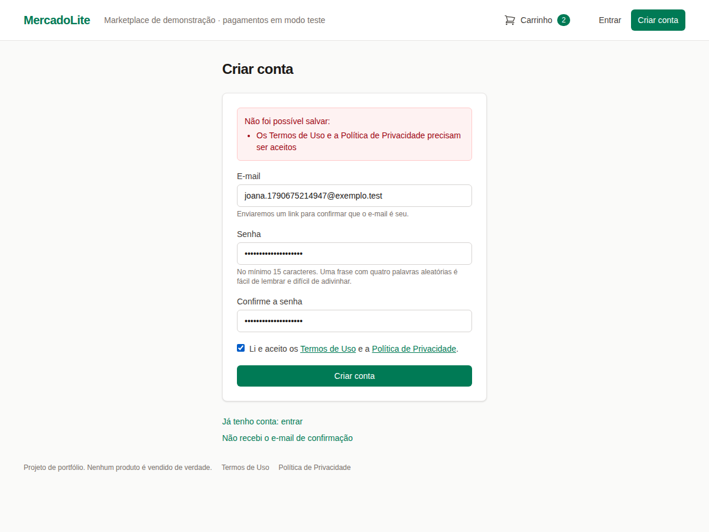
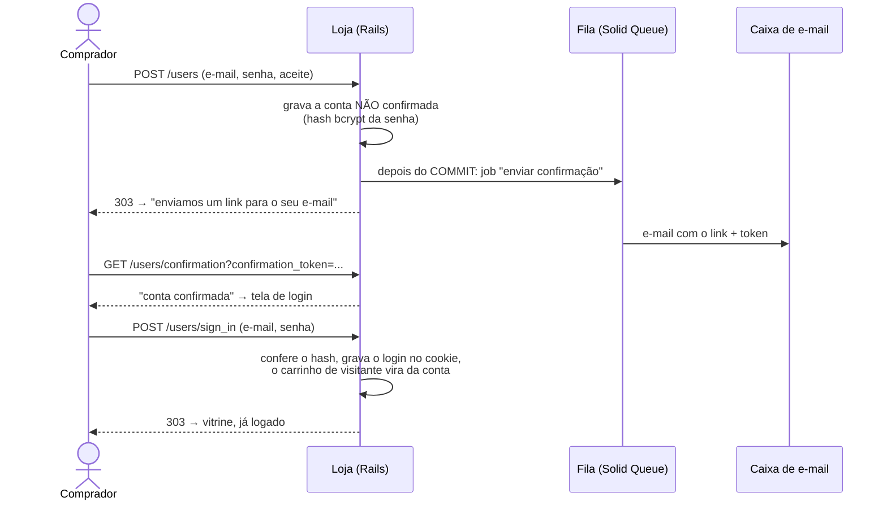
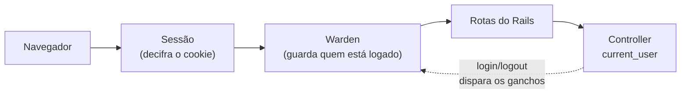
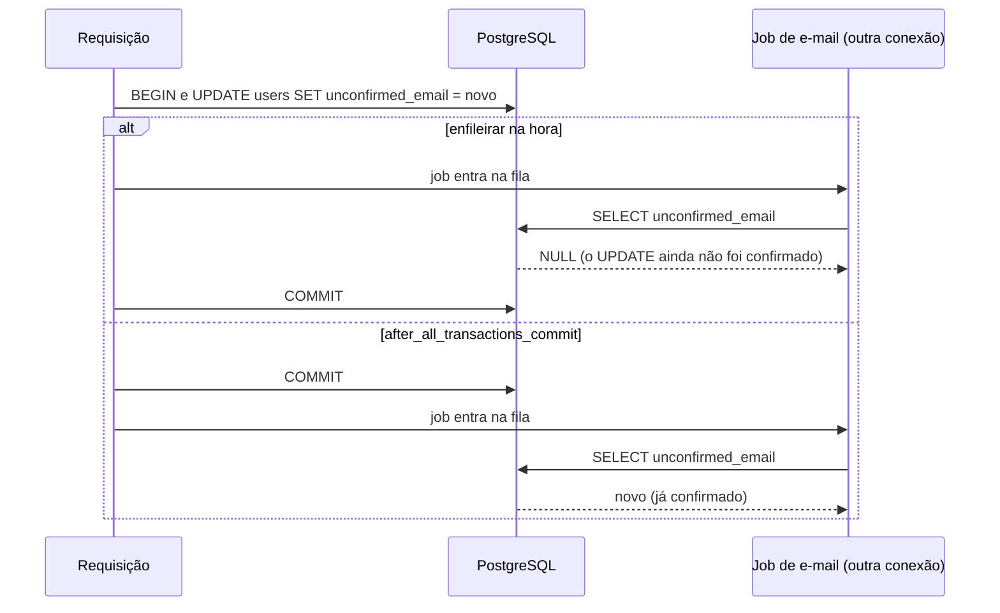
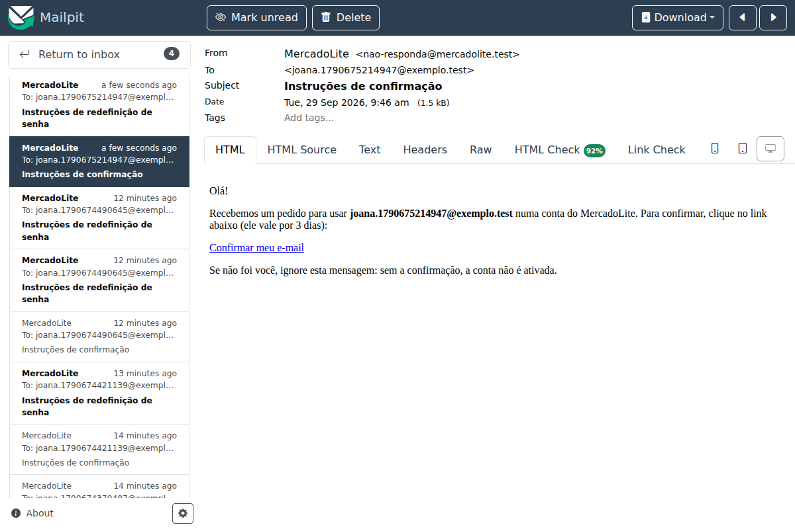
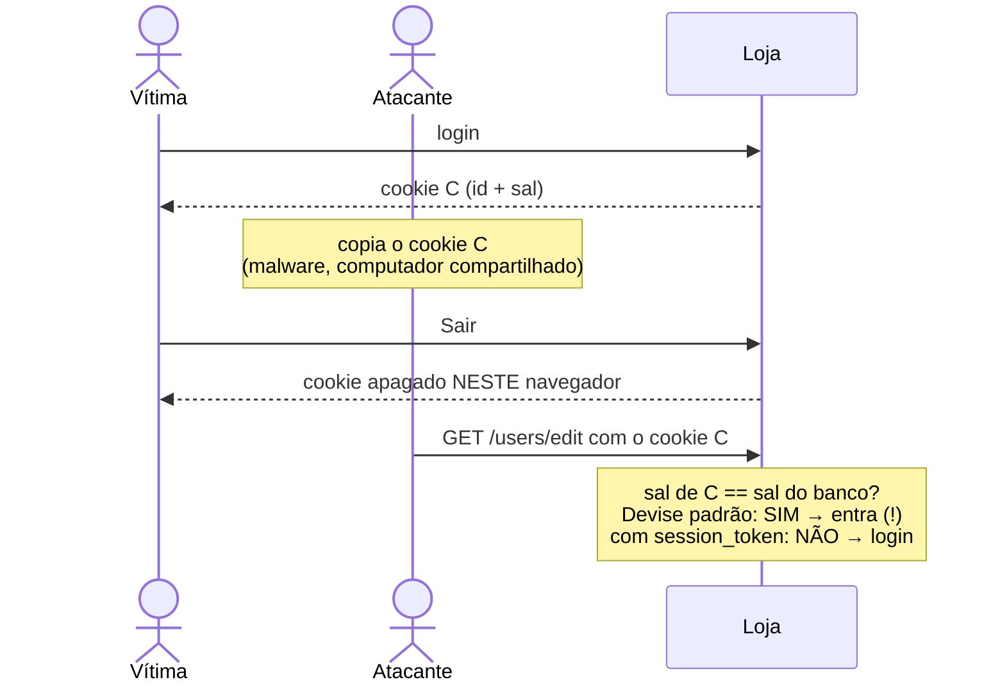
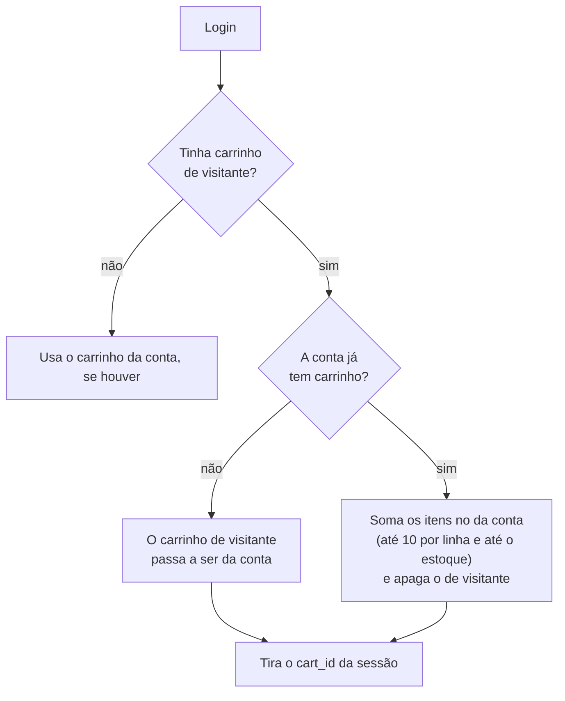
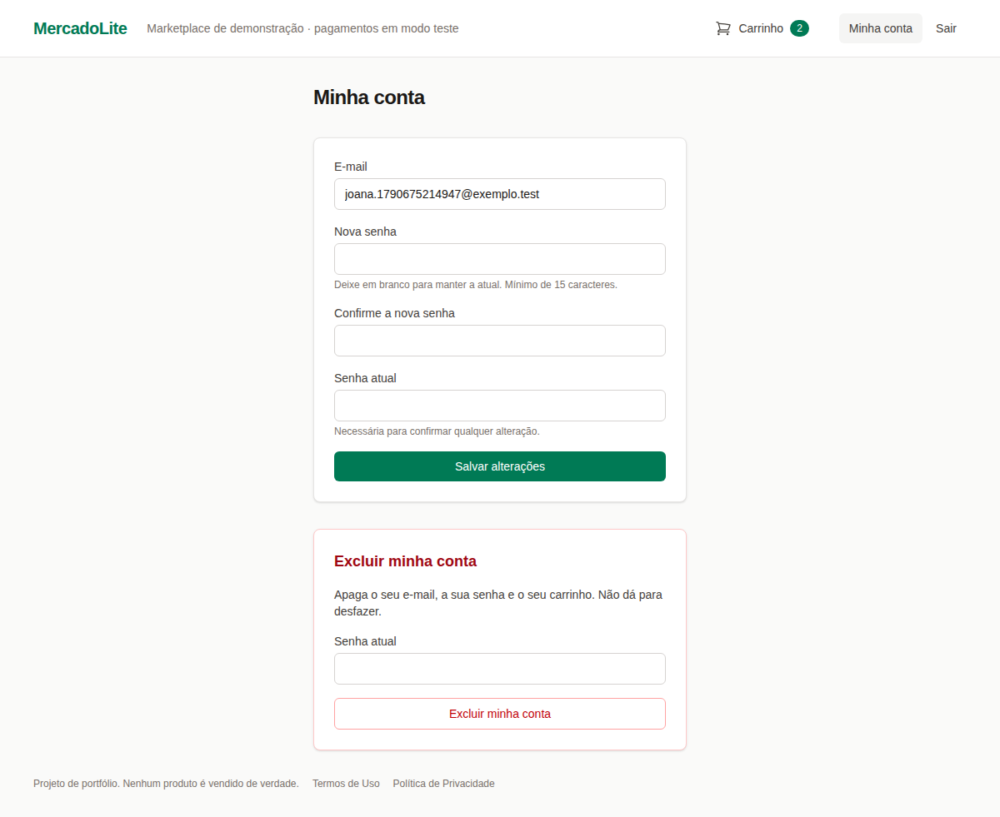

# MercadoLite — Fase 3a: o login do comprador

> **Objetivo:** dar dono ao carrinho. O comprador cria uma conta, confirma o e-mail, entra e
> sai, e o carrinho passa a ser dele, sem que ninguém consiga adivinhar senhas, descobrir
> quem tem conta, reaproveitar um cookie antigo ou ler tokens nos logs. Tudo dentro da LGPD.
>
> **Pré-requisito:** [Fase 2 — o carrinho](fase-2-carrinho.md).

**O que você vai aprender:** autenticação × autorização · hash de senha com bcrypt (sal,
custo e o limite de 72 bytes) · o Devise e o Warden por dentro (middleware, estratégias,
ganchos) · confirmação de e-mail e tokens de uso único · enumeração de usuários e ataques de
tempo · o que o login grava no cookie de sessão e como revogar sessões · rate limit por IP e
por e-mail · e-mail em desenvolvimento com o Mailpit · um token vazando no log (e a
correção) · LGPD na prática: termos, exclusão da conta e limpeza de contas abandonadas.



**Sumário**
1. [O que foi construído](#1-o-que-foi-construído)
2. [Autenticação × autorização](#2-autenticação--autorização)
3. [Senhas: hash, sal e custo](#3-senhas-hash-sal-e-custo)
4. [O Devise por dentro: Warden, estratégias e ganchos](#4-o-devise-por-dentro-warden-estratégias-e-ganchos)
5. [O modelo `User` e o banco](#5-o-modelo-user-e-o-banco)
6. [Confirmação de e-mail e tokens](#6-confirmação-de-e-mail-e-tokens)
7. [Enumeração de usuários e o modo paranoico](#7-enumeração-de-usuários-e-o-modo-paranoico)
8. [A sessão depois do login](#8-a-sessão-depois-do-login)
9. [O carrinho ganha dono](#9-o-carrinho-ganha-dono)
10. [Rate limit no login](#10-rate-limit-no-login)
11. [E-mail em desenvolvimento e o token no log](#11-e-mail-em-desenvolvimento-e-o-token-no-log)
12. [LGPD na prática](#12-lgpd-na-prática)
13. [As telas](#13-as-telas)
14. [Os testes da fase](#14-os-testes-da-fase)
15. [O que os testes e o navegador nos ensinaram](#15-o-que-os-testes-e-o-navegador-nos-ensinaram)
16. [Mão na massa](#16-mão-na-massa)
17. [Decisões de design (bom assunto para entrevista)](#17-decisões-de-design-bom-assunto-para-entrevista)
18. [Glossário](#18-glossário)
19. [Exercícios](#19-exercícios)
20. [Próxima fase](#20-próxima-fase)

---

## 1. O que foi construído

- **Cadastro** com e-mail, senha (mínimo de 15 caracteres) e aceite dos Termos de Uso e da
  Política de Privacidade. A conta nasce **não confirmada**.
- **Confirmação por e-mail**: um link com token, válido por 3 dias. Sem confirmar, não entra.
- **Login e logout**, com a sessão expirando depois de **2 horas sem uso**.
- **"Esqueci minha senha"**, com link válido por **1 hora**, de uso único.
- **"Minha conta"**: trocar e-mail (com nova confirmação) e senha, e **excluir a conta**.
- **Carrinho da conta**: no login, o carrinho de visitante passa a ser do usuário, ou é
  somado ao que ele já tinha.
- **Rate limit** no login, no cadastro, no "esqueci a senha" e no reenvio da confirmação.
- **Páginas** de Termos de Uso e de Política de Privacidade.
- **Job diário** que apaga contas nunca confirmadas depois de 7 dias.

O caminho de quem compra pela primeira vez:



---

## 2. Autenticação × autorização

Duas palavras parecidas para duas perguntas diferentes:

| | Pergunta | Nesta loja |
|---|---|---|
| **Autenticação** (*authn*) | **Quem** é você? | Devise: e-mail + senha → `current_user` |
| **Autorização** (*authz*) | **O que** você pode fazer? | escopos (`current_cart.items.find`) e, na fase 3b, Pundit |

Esta fase é quase toda **autenticação**. A autorização continua como na fase 2: toda busca
parte do escopo do dono. O **Pundit** (regras de autorização em classes, as *policies*) entra
na fase 3b, junto com os pedidos, que é quando existe algo para ele proteger: "o comprador vê
só os próprios pedidos". Instalar agora seria código sem uso.

---

## 3. Senhas: hash, sal e custo

### Hash não é criptografia

Criptografia é de **mão dupla**: quem tem a chave decifra. Um **hash** é de **mão única**:
transforma a senha num valor fixo e não existe operação inversa. Para conferir a senha no
login, o servidor calcula o hash do que foi digitado e **compara** com o guardado. Nem a loja
consegue saber a senha de ninguém. (A coluna do Devise se chama `encrypted_password` por
razões históricas; ela guarda um hash.)

Pense numa função de C `uint64_t h(const char *senha)` que é fácil de calcular e
impossível de inverter. Só que um CRC ou um SHA-256 são **rápidos demais**: um atacante com
o banco vazado testaria bilhões de senhas por segundo. Por isso senha usa uma função
**lenta de propósito**: o **bcrypt**.

### Anatomia de um hash bcrypt

Criamos uma conta no console e olhamos o que foi gravado:

```
$2a$12$8Sb9KNgHS4h/Rw6sdtypaOm2N1II9.0GEAVClmKl81cP35boLlXHG     (60 caracteres)
└┬┘└┬┘└──────────┬──────────┘└──────────────┬────────────────┘
 │  │            │                           └ o hash em si (31 caracteres)
 │  │            └ o SAL: 22 caracteres aleatórios, diferentes para cada senha
 │  └ o CUSTO: 12
 └ a versão do algoritmo (2a)
```

(Conferido com `BCrypt::Password.new(hash)`: `cost` → 12, `version` → "2a", `salt` → os 29
primeiros caracteres, `checksum` → 31 caracteres.)

- O **sal** faz duas contas com a mesma senha terem hashes diferentes. Sem ele, o atacante
  calcularia o hash de "123456" uma vez e acharia todo mundo que a usa (e tabelas prontas,
  as *rainbow tables*, funcionariam).
- O **custo** é o expoente de quantas voltas o algoritmo dá: 2^custo. Cada +1 **dobra** o
  tempo. Medido nesta máquina:

  | Custo | Tempo por hash |
  |---|---|
  | 10 | 62 ms |
  | 11 | 127 ms |
  | **12** (o nosso) | **250 ms** |
  | 13 | 505 ms |

  Para a pessoa, 250 ms no login passam despercebidos. Para o atacante, 1 bilhão de palpites
  a 250 ms cada dão **7,93 anos** de um núcleo de CPU. Nos testes, o custo cai para o mínimo
  (`config.stretches = Rails.env.test? ? 1 : 12`), senão a suíte levaria minutos.

### A armadilha dos 72 bytes

O bcrypt só usa os **primeiros 72 bytes** da senha e **ignora o resto em silêncio**. Testamos:

```ruby
hash = BCrypt::Password.create("a" * 72 + "X")
hash == "a" * 72 + "Y"   # => true  (!!)
```

Duas senhas diferentes "conferem" uma com a outra. O próprio código da gem confirma:
`secret.byteslice(0, MAX_SECRET_BYTESIZE)`, com `MAX_SECRET_BYTESIZE = 72`. O Devise, por
padrão, aceita senhas de até 128 **caracteres**, então o problema passaria despercebido.

E são **bytes**, não caracteres. Quem vem de C já conhece: em UTF-8, `strlen` conta bytes, e
uma letra com acento ocupa 2. Em Ruby, `length` conta caracteres e `bytesize` conta bytes:

```ruby
s = "ção é ávido " + "ç" * 30
s.length    # => 42
s.bytesize  # => 76   (passa de 72!)
```

Por isso o `User` tem duas regras: o Devise limita a **72 caracteres**, e uma validação
nossa limita a **72 bytes**:

```ruby
def password_fits_bcrypt
  return if password.bytesize <= MAX_PASSWORD_BYTES || password.length > MAX_PASSWORD_BYTES

  errors.add(:password, :too_many_bytes, count: MAX_PASSWORD_BYTES)
end
```

(A segunda condição evita duas mensagens repetidas: se já passou de 72 caracteres, o erro do
Devise basta.)

### Quanto de senha pedir

Seguimos o **NIST SP 800-63B-4** (a norma americana de autenticação, revisada em 2025):

- **mínimo de 15 caracteres** quando a senha é o único fator de autenticação, como aqui;
- **nada de regras de composição** ("uma maiúscula, um número e um símbolo"): elas levam a
  `Senha@123` e não a senhas fortes. Uma frase com quatro palavras aleatórias é melhor;
- **recusar senhas previsíveis**. O `PasswordPolicy.weakness` (em `lib/`, função pura com
  teste) recusa três casos:

```ruby
PasswordPolicy.weakness("abababababababab")    # => :repetitive  (menos de 5 caracteres diferentes)
PasswordPolicy.weakness("mercadolite-2026!")   # => :service_name
PasswordPolicy.weakness("joana.silva.1234", email: "joana.silva@x.com")  # => :email
PasswordPolicy.weakness("trem azul noturno 42")  # => nil (passa)
```

O NIST também pede comparar a senha com listas de senhas vazadas. Isso exige consultar um
serviço externo (como o *Pwned Passwords*) e ficou registrado como melhoria futura no
`SECURITY.md`.

---

## 4. O Devise por dentro: Warden, estratégias e ganchos

O **Devise** não reinventa tudo: ele é construído sobre o **Warden**, um **middleware Rack**.
Middleware é uma camada que a requisição atravessa antes de chegar ao controller, como uma
cadeia de filtros (o padrão *chain of responsibility*):



- O **Warden** sabe quem está logado em cada requisição, lendo o cookie de sessão. O
  `current_user` do controller pergunta a ele.
- Uma **estratégia** é um jeito de autenticar. O Devise registra a `database_authenticatable`:
  procura o e-mail no banco e confere a senha com o bcrypt.
- Os **ganchos** (*callbacks*) são blocos que o Warden chama em momentos fixos: depois de
  gravar o usuário na sessão (`after_set_user`), antes do logout (`before_logout`). Em C, seria
  uma lista de ponteiros de função registrada com algo como `atexit`.

### Módulos: um mixin para cada recurso

No `User`, cada símbolo liga um **módulo** do Devise (um *mixin*: métodos, validações,
rotas e telas prontos):

```ruby
devise :database_authenticatable, :registerable, :recoverable, :validatable,
       :confirmable, :timeoutable
```

| Módulo | O que traz |
|---|---|
| `database_authenticatable` | e-mail + senha com bcrypt |
| `registerable` | cadastro, edição e exclusão da própria conta |
| `recoverable` | "esqueci minha senha" |
| `validatable` | formato e unicidade do e-mail, tamanho e confirmação da senha |
| `confirmable` | confirmação por e-mail |
| `timeoutable` | a sessão expira por inatividade |

**Ficaram de fora, de propósito:** `trackable` (guardaria o IP e a data de cada login: dado
pessoal que não usamos), `rememberable` ("lembrar de mim": a sessão já dura o bastante) e
`lockable` (trava a conta depois de N senhas erradas; veja a seção 10).

### Controllers nossos, herdando os do Devise

As rotas vêm de `devise_for :users`, apontando para controllers nossos:

```ruby
module Users
  class SessionsController < Devise::SessionsController
    include EmailRateLimit

    rate_limit to: 10, within: 3.minutes, only: :create, name: "ip"
    rate_limit to: 5, within: 15.minutes, only: :create, name: "email", by: :email_rate_limit_key
  end
end
```

`Users::SessionsController < Devise::SessionsController` é **herança**, como derivar uma
classe em C++ e sobrescrever só o que interessa: toda a lógica de login continua na classe
base. Nos `RegistrationsController`, sobrescrevemos o `destroy` e chamamos `super` (o
`Base::destroy()` do C++) só quando a senha confere (seção 12).

As telas ficam em `app/views/users/`, e `config.scoped_views = true` faz o Devise
procurar lá antes das telas padrão que vêm dentro da gem. A gem **devise-i18n** traz as
mensagens em português ("E-mail ou senha inválidos.").

### Os nossos ganchos

Em `config/initializers/warden_hooks.rb` ficam dois ganchos. Eles rodam em **qualquer**
login ou logout, venha de onde vier (tela de login, redefinição de senha, expiração da
sessão), e por isso não ficam nos controllers:

```ruby
Warden::Manager.after_set_user except: :fetch, scope: :user do |user, warden, _options|
  next unless user.active_for_authentication?
  session = warden.request.session
  Cart.claim(Cart.guest.find_by(id: session.delete(:cart_id)), user)
end

Warden::Manager.before_logout scope: :user do |user, _warden, _options|
  user.end_all_sessions! if user&.persisted?
end
```

`except: :fetch`: o Warden também chama `after_set_user` quando só **lê** o usuário da sessão,
em toda requisição. Não queremos reivindicar carrinho a cada clique, só no login.

---

## 5. O modelo `User` e o banco

A migration gerada pelo Devise foi enxugada para só as colunas dos módulos em uso, com as
mesmas regras do modelo também no banco:

```ruby
t.string :email, null: false
t.string :encrypted_password, null: false
# ... tokens de redefinição e de confirmação ...
t.datetime :terms_accepted_at, null: false   # LGPD: quando aceitou os termos
t.string :session_token, null: false         # muda a cada "Sair" (seção 8)

add_index :users, :email, unique: true
add_check_constraint :users, "email = lower(btrim(email))", name: "users_email_normalized"
add_check_constraint :users, "char_length(email) BETWEEN 3 AND 254", name: "users_email_length"
```

- O Devise grava o e-mail em minúsculas e sem espaços (`case_insensitive_keys`,
  `strip_whitespace_keys`). O **CHECK** garante isso no banco: um `update_column` que tente
  gravar `Joana@Exemplo.com` é recusado. Com o e-mail sempre normalizado, o índice único simples
  basta para que `Joana@` e `joana@` sejam a mesma conta.
- **Coleta mínima:** e-mail e hash da senha. Nada de nome, CPF, telefone ou IP.
- `has_secure_token :session_token` gera um token aleatório (`SecureRandom`) na criação.

Atenção a um detalhe: o Devise calcula o hash bcrypt **na atribuição** da senha
(`user.password = "..."`), antes mesmo de validar. No log do servidor, um cadastro recusado
levou **~270 ms**: é o custo 12 trabalhando. Cada tentativa de cadastro, mesmo inválida,
custa CPU, e isso é mais um motivo para o rate limit.

---

## 6. Confirmação de e-mail e tokens

Sem confirmação, qualquer um cadastraria o e-mail de outra pessoa. O `confirmable` manda um
link com um **token** aleatório e só libera o login depois do clique.

Os tokens têm três propriedades:

- **Aleatórios e longos** (20 caracteres do `Devise.friendly_token`): impossível adivinhar.
- **Expiram**: confirmação em 3 dias (`confirm_within`), redefinição de senha em 1 hora
  (`reset_password_within`). Testado com `travel(1.hour + 1.minute)`: o link recusa.
- **Uso único** onde importa: o token de redefinição de senha é apagado depois de usado
  (conferido: a coluna vira `nil`, e o mesmo link não troca a senha de novo). O de
  confirmação continua na coluna, mas usá-lo outra vez só responde "E-mail já foi confirmado".

E uma diferença importante: o token de **redefinição de senha** é guardado no banco como
**HMAC** (um hash com chave), e não como está. Quem lesse o banco não conseguiria usar o
token. O teste confere: o token que vai no e-mail é diferente do que está na coluna. Já o de
confirmação o Devise guarda como está (o teste de confirmação usa o valor da coluna direto).
Vazar o de confirmação é bem menos grave: ele só confirma um e-mail, não troca senha.

### O e-mail sai por um job, depois do commit

```ruby
def send_devise_notification(notification, *args)
  message = devise_mailer.send(notification, self, *args)
  ActiveRecord.after_all_transactions_commit { message.deliver_later }
end
```

- `deliver_later` põe o envio numa **fila** (Solid Queue): a resposta não espera o servidor
  de e-mail, e o **tempo de resposta** não denuncia se a conta existe (seção 7).
- `after_all_transactions_commit` espera o **COMMIT**. O Devise chama este método de dentro de
  callbacks do `save`, com a transação ainda aberta. Se o job entrasse na fila antes, poderia
  rodar antes do commit e ler o registro antigo: um e-mail novo ainda não gravado, por
  exemplo. Conferimos o comportamento no console:

  ```ruby
  log = []
  ActiveRecord.after_all_transactions_commit { log << :fora_de_transacao }   # roda na hora
  ActiveRecord::Base.transaction do
    ActiveRecord.after_all_transactions_commit { log << :depois_do_commit }
    log << :dentro
  end
  log  # => [:fora_de_transacao, :dentro, :depois_do_commit]
  ```

  O Rails 8.1 **não** faz isso sozinho: `ActiveJob::Base.enqueue_after_transaction_commit`
  veio `false` (conferido).

Por que o job leria o valor antigo? O PostgreSQL usa o isolamento **read committed**: uma
conexão não enxerga o que outra ainda não confirmou. Conferido com duas conexões: dentro da
transação que grava `unconfirmed_email`, a outra conexão lê `nil`; depois do COMMIT, lê o
e-mail novo. E o job roda em **outra conexão** (outra thread, ou outro processo em produção):



Também ligamos dois avisos: quando o **e-mail** ou a **senha** mudam, o dono recebe uma
mensagem (no e-mail antigo). Se não foi ele, fica sabendo na hora.



---

## 7. Enumeração de usuários e o modo paranoico

**Enumeração** é descobrir quem tem conta. Parece inofensivo, mas dá ao atacante uma lista de
alvos para *phishing* e para testar senhas vazadas de outros sites (*credential stuffing*).
Ela acontece de dois jeitos:

1. **Pela mensagem:** "e-mail não encontrado" × "senha errada".
2. **Pelo tempo:** se o e-mail não existe, o servidor responde sem calcular o bcrypt, ou
   seja, ~250 ms mais rápido.

`config.paranoid = true` ataca os dois:

- O login responde **"E-mail ou senha inválidos."** nos dois casos, e o "esqueci minha senha"
  responde sempre "Se o seu email existir em nosso banco de dados, você receberá um email...".
  Sem o modo paranoico, o "esqueci a senha" responde **422 "E-mail não encontrado"**
  (conferido).
- No login com e-mail inexistente, o Devise **calcula um hash de mentira**
  (`mapping.to.new.password = password`), só para gastar o mesmo tempo.

Contamos as chamadas ao bcrypt num login que falha:

| | Senha errada | E-mail inexistente |
|---|---|---|
| `paranoid = true` | 2 hashes | **2 hashes** |
| `paranoid = false` | 2 hashes | **1 hash** (~250 ms mais rápido: denuncia) |

(Por que 2, e não 1? Quando o login falha, o Devise mostra a tela de novo montando um
`User.new` com o que foi digitado, e atribuir a senha calcula outro hash. O teste compara as
duas contagens em vez de fixar um número.)

**O que ainda enumera:** o cadastro. Tentar cadastrar um e-mail que já existe dá "E-mail já
está em uso". Esconder isso exige outro desenho (responder sempre "enviamos um e-mail" e
avisar o dono da conta existente), e ficou como exercício. Por ora, o rate limit de cadastro
(5 a cada 15 minutos por IP) torna a enumeração em massa lenta.

---

## 8. A sessão depois do login

### O que o login grava no cookie

Lemos a sessão (o cookie decifrado) num teste, antes e depois do login:

```ruby
# visitante com carrinho
{"session_id" => "f5564c8b...", "cart_id" => 484, "flash" => {...}, "_csrf_token" => "..."}

# depois do login
{"session_id" => "f5564c8b...",
 "flash" => {...},
 "warden.user.user.key" => [[1697], "$2a$04$k4wUNffcMLiD2jpsx/d.0OreiVU9YEDHU6EEaJqVqWHHUR"],
 "warden.user.user.session" => {"last_request_at" => 1790675287}}
```

- `warden.user.user.key` é o **id** do usuário mais um **"sal"**. A cada requisição, o Devise
  busca o usuário pelo id e só aceita se o sal ainda for igual ao do banco.
- `last_request_at` é o relógio do `timeoutable`: passou de 2 horas sem requisição, a sessão
  acaba.
- O `cart_id` **sumiu**: o carrinho agora é achado pela conta (seção 9).
- O cookie cresceu de 432 para 652 caracteres, bem abaixo do limite de 4096 bytes.

### *Session fixation*: por que o cookie em si nos protege

No ataque clássico de *session fixation*, o atacante planta na vítima um id de sessão que
**ele conhece**; a vítima faz login, e aquele id passa a estar logado no servidor. Com a
sessão **no cookie**, não existe "id logado no servidor": o login é gravado num cookie
**novo**, que só o navegador da vítima recebe. A cópia antiga, na mão do atacante, continua
sendo só uma sessão de visitante. Há um teste para isso.

### O furo que achamos: "Sair" não invalidava cópias do cookie

A outra face do cookie é que o servidor não tem como "apagar" um cookie que alguém copiou.
Por padrão, o sal do Devise é só o sal do bcrypt (os 29 primeiros caracteres do hash), que
muda quando a **senha** muda, e **não** quando a pessoa sai. Então:



Escrevemos o teste primeiro e ele **falhou**: o cookie copiado continuava logado depois do
"Sair". A correção põe um `session_token` no sal:

```ruby
def authenticatable_salt
  "#{super}#{session_token}"
end

def end_all_sessions!
  update_column(:session_token, self.class.generate_unique_secure_token)
end
```

E o gancho `before_logout` chama `end_all_sessions!` em **todo** logout, inclusive no
automático, por inatividade. Trocar o token muda o sal e derruba **todas** as cópias do
cookie, em todos os aparelhos. É a semântica "sair de todos os dispositivos". O
`super` chama o `authenticatable_salt` original do Devise, como `Base::metodo()` em C++.

Trocar a **senha** também derruba as outras sessões (o sal do bcrypt muda), e o Devise
mantém logado só quem fez a troca. Há teste para os três casos: sair, trocar a senha e
expirar.

### Mais duas proteções do Devise

- **Token CSRF novo no login** (`clean_up_csrf_token_on_authentication`): o Devise troca o
  token CSRF da sessão ao autenticar. Um token conhecido antes do login (plantado por um
  atacante, por exemplo) não serve depois. Conferido: o POST com o token de um formulário
  aberto antes do login recebe **422**, e com o token novo, passa. (Detalhe que atrapalhou o
  primeiro esboço desse teste: desde o Rails 5, **cada formulário tem o próprio token**, preso
  à ação dele. O token do botão "Sair" não serve para o formulário do carrinho.)
- **Login também tem CSRF**: sem o token, um site atacante poderia logar a vítima na conta
  **dele** (*login CSRF*) e ver o que ela fizesse depois. O teste liga a proteção e confere o
  422.

---

## 9. O carrinho ganha dono

A tabela `carts` ganhou `user_id` (opcional, com **índice único**: no máximo um carrinho por
conta; o PostgreSQL aceita vários `NULL` num índice único, então os carrinhos de visitante
não conflitam). O concern `CurrentCart` passou a escolher o carrinho assim:

```ruby
@current_cart =
  if user_signed_in?
    current_user.cart
  elsif session[:cart_id]
    Cart.guest.find_by(id: session[:cart_id])   # só carrinho SEM dono
  end
```

No login, o gancho chama `Cart.claim`:



- **`Cart.guest` é a peça de segurança.** A cópia antiga do cookie de visitante ainda
  carrega o `cart_id`, mas esse carrinho agora tem dono e sai do escopo `guest`. Ao tirar o
  `.guest` do `CurrentCart`, o teste "uma cópia do cookie de VISITANTE não alcança o carrinho
  depois do login" falha.
- **Sair tira o carrinho do navegador** (o Devise zera a sessão), e **entrar de novo o traz
  de volta**, porque ele está no banco, com dono.
- **Corridas:** dois logins simultâneos da mesma conta poderiam tentar dar um carrinho a ela
  ao mesmo tempo, e o índice único barra o segundo (`RecordNotUnique`). Como no `Cart#add` da
  fase 2, há uma nova tentativa, que soma os itens.

---

## 10. Rate limit no login

Três ataques contra senhas, e o que segura cada um:

| Ataque | Como é | Defesa |
|---|---|---|
| **Força bruta** | muitas senhas contra **uma** conta | limite **por e-mail**: 5 a cada 15 min |
| ***Password spraying*** | poucas senhas comuns contra **muitas** contas | limite **por IP**: 10 a cada 3 min |
| ***Credential stuffing*** | pares e-mail/senha vazados de outros sites | os dois limites + senha longa e única |

O limite por IP sozinho não segura um ataque distribuído: cada tentativa sai de uma máquina
diferente. O limite por **e-mail** segura, e o teste simula isso com 5 IPs diferentes contra
a mesma conta: a 6ª tentativa recebe **429**, até com a senha certa.

A chave do limite por e-mail é o **SHA-256** do e-mail normalizado. Olhando o cache depois de
um login:

```
rate-limit:cart_items:127.0.0.1
rate-limit:users/sessions:ip:127.0.0.1
rate-limit:users/sessions:email:fdac31e5f55bd0d805fcf1f9bb419726e17e2ee2d982341645fa27214129f569
```

O contador fica no Solid Cache (no banco), e não precisa guardar o e-mail em si (coleta
mínima). O `name:` separa os dois contadores da mesma ação.

**Por que não o `lockable`?** Ele trava a conta depois de N senhas erradas. Parece mais
forte, mas vira arma: qualquer um trava a conta de qualquer um, bastando errar a senha dela
de propósito. O limite por e-mail também "trava" as tentativas, mas só por 15 minutos e sem
gravar nada na conta. A contrapartida continua existindo (um atacante pode bloquear o login
de alguém por 15 minutos) e está registrada no `SECURITY.md`.

Os outros limites: cadastro (5 a cada 15 min por IP), "esqueci a senha" e reenvio da
confirmação (5 a cada 15 min por IP e **3 por hora por e-mail**, para ninguém usar a loja para
lotar a caixa de entrada de outra pessoa), e editar ou excluir a conta (5 a cada 15 min por
conta, porque as duas ações conferem a senha atual).

No navegador, o limite de cadastro apareceu sozinho: rodando o fluxo várias vezes, a 6ª
tentativa recebeu `429 Too Many Requests`.

---

## 11. E-mail em desenvolvimento e o token no log

### Mailpit

Em desenvolvimento, os e-mails vão para o **Mailpit**, um servidor SMTP "de mentira" que
guarda tudo e mostra numa página. Ele subiu no `docker-compose.yml`, ao lado do PostgreSQL:

```yaml
mail:
  image: axllent/mailpit:v1
  ports:
    - "127.0.0.1:1025:1025" # SMTP (a aplicação envia para cá)
    - "127.0.0.1:8025:8025" # página web: http://localhost:8025
```

Nenhum e-mail sai para a internet, então dá para testar com qualquer endereço, até inventado.
Em produção, as variáveis `SMTP_*`, `APP_HOST` e `MAILER_FROM` apontam para um provedor de
verdade (veja o `.env.example` e o `docs/DEPLOY.md`).

### O token que vazava no log

Depois do fluxo no navegador, procuramos o token no log do servidor e o achamos:

```
[ActiveJob] Enqueued ActionMailer::MailDeliveryJob (...) with arguments: "Devise::Mailer",
"reset_password_instructions", "deliver_now", {args: [#<GlobalID ... User/4>, "k_rxBxcqFT8WFbpTNg5f", {}]}
```

`"k_rxBxcqFT8WFbpTNg5f"` é o token do link de redefinição de senha. O **Active Job escreve no
log os argumentos de cada job**, e o token é um deles. Com isso, quem lesse os logs de
produção (e logs costumam ir para serviços de terceiros) poderia trocar a senha de qualquer
conta que pedisse redefinição. Os parâmetros da requisição já eram filtrados
(`confirmation_token=[FILTERED]`), mas os argumentos de job não passam por esse filtro.

A correção, em `config/initializers/action_mailer.rb`:

```ruby
ActiveSupport.on_load(:action_mailer) do
  ActionMailer::MailDeliveryJob.log_arguments = false
end
```

`on_load` espera o Action Mailer ser carregado (o Rails carrega tudo sob demanda) antes de
mexer nele. O teste captura o log, pede uma redefinição e confere que o token **não** aparece
(e, ao religar `log_arguments`, o teste falha).

Ainda em desenvolvimento, o log mostra o **corpo inteiro** de cada e-mail, com o link. Isso é
nível `debug`, que produção não usa (`info`, conferido no código do Action Mailer:
`debug { event.payload[:mail] }`). O `DEPLOY.md` avisa para manter assim.

---

## 12. LGPD na prática

### Aceite dos termos

O cadastro tem a caixa "Li e aceito os Termos de Uso e a Política de Privacidade", ligada a
um **atributo virtual** (não é coluna):

```ruby
validates :terms_of_service, acceptance: { allow_nil: false }, on: :create
before_create { self.terms_accepted_at = Time.current }
```

**A armadilha:** sem `allow_nil: false`, a validação `acceptance` é **pulada** quando o campo
nem é enviado. O formulário sempre envia (`"0"` ou `"1"`), mas um `curl` sem o campo criaria
a conta sem aceite. Ao tirar o `allow_nil: false`, dois testes falham. E a data do aceite
vai para `terms_accepted_at`, que é `NOT NULL` no banco.

### As páginas

`/terms` e `/privacy` explicam, em linguagem direta: quais dados (e-mail, hash da senha,
carrinho, IP nos logs e nos contadores), para quê, por quanto tempo, as bases legais
(execução de contrato, art. 7º, V; legítimo interesse, art. 7º, IX), o único cookie
(estritamente necessário), com quem compartilhamos e os direitos do titular (art. 18).

### Exclusão da conta, com senha

Em "Minha conta", a pessoa exclui a conta sozinha: o e-mail, o hash da senha e o carrinho
(pela chave estrangeira com `ON DELETE CASCADE`) somem na hora. O Devise, por padrão, não
pede senha para isso; o nosso controller pede:

```ruby
def destroy
  password = params.expect(user: [ :current_password ])[:current_password]
  return super if resource.valid_password?(password)

  redirect_to edit_user_registration_path, alert: t(".wrong_password"), status: :see_other
end
```

Numa sessão esquecida num computador compartilhado, outra pessoa não consegue apagar a conta.

### Contas nunca confirmadas

Uma conta não confirmada guarda o e-mail de alguém que talvez nunca tenha pedido cadastro. E,
sem limpeza, quem cadastrasse o e-mail de outra pessoa impediria o dono verdadeiro de criar a
conta dele. O `PurgeUnconfirmedUsersJob` roda todo dia às 4h10 e apaga as contas não
confirmadas criadas há mais de 7 dias.

---

## 13. As telas



- Telas em `app/views/users/`, em português, com `form_with model: resource, scope:
  resource_name` (o `form_with` gera sozinho o token CSRF).
- **`autocomplete`**: `current-password` no login (o gerenciador de senhas preenche) e
  `new-password` no cadastro (o navegador sugere uma senha forte).
- **"Sair" é um botão** (`button_to ..., method: :delete`), não um link: um GET que desloga
  poderia ser disparado por qualquer site, com uma ``.
- **Classes de formulário com `@apply`**: em vez de repetir a mesma lista de utilitários do
  Tailwind em cada campo, `app/assets/tailwind/application.css` define `.form-input`,
  `.form-label`, `.btn-primary` e outras dentro de `@layer components`.

---

## 14. Os testes da fase

`bundle exec rspec`: **263 examples, 0 failures, 1 pending** (o *pending* é o da fase 5).

- `spec/lib/password_policy_spec.rb`: a função pura de senhas previsíveis.
- `spec/models/user_spec.rb`: e-mail normalizado e único, os limites de 15 caracteres e de
  72 caracteres/bytes, o aceite dos termos, o sal da sessão, os e-mails por job, o token fora
  do log, as restrições do banco e a exclusão em cascata.
- `spec/models/cart_spec.rb`: `Cart.claim`, `merge_item` e o índice único por conta.
- `spec/jobs/purge_unconfirmed_users_job_spec.rb`.
- `spec/requests/auth_spec.rb`: cadastro, login, enumeração (mensagem **e** contagem de
  hashes), CSRF no login (e o token trocado ao entrar), cookie copiado depois do "Sair", troca de senha, expiração,
  carrinho no login, anti-IDOR entre contas, "esqueci a senha", rate limits e exclusão da conta.

**Cada teste de segurança foi visto falhando** com a proteção removida:

| Proteção removida | Testes que falham |
|---|---|
| `session_token` no sal | "sair invalida TODAS as cópias do cookie" e "end_all_sessions! troca o sal" |
| gancho `before_logout` | "sair invalida TODAS as cópias" e "expira depois de 2 horas... invalida as cópias" |
| `.guest` no `CurrentCart` | "uma cópia do cookie de VISITANTE não alcança o carrinho" |
| limpeza do CSRF no login (`clean_up_csrf_token_on_authentication = false`) | "o token CSRF de um formulário aberto antes do login deixa de valer" |
| `log_arguments = false` | "não escreve no log o token do link" |
| `allow_nil: false` no aceite | os dois do aceite dos termos |
| `paranoid = true` | a contagem de hashes e o "esqueci a senha" |
| limite por e-mail no login | "por e-mail: a 6ª tentativa na mesma conta recebe 429" |
| senha conferida no `destroy` | "exclusão exige a senha atual" |

Um contexto compartilhado liga a proteção CSRF nos testes que precisam dela:
`include_context "com proteção CSRF ligada"` (em `spec/support/forgery_protection.rb`, usado
também pelo teste do carrinho).

---

## 15. O que os testes e o navegador nos ensinaram

1. **O bcrypt corta em 72 bytes, em silêncio.** O Devise aceitaria 128 caracteres. Virou
   validação própria (seção 3).
2. **O token de redefinição ia para o log** pelos argumentos do job. Achado procurando o
   token no log depois do teste no navegador (seção 11).
3. **"Sair" não invalidava cópias do cookie.** O teste falhou primeiro; a correção foi o
   `session_token` (seção 8).
4. **Um item fantasma no carrinho.** O teste de `merge_item` achou uma linha recusada, não
   salva, pendurada em `cart.items` em memória: `items.find_or_initialize_by` **constrói pela
   associação**, e o objeto fica na lista mesmo sem ir para o banco. Se alguém salvasse esse
   carrinho depois, o Rails tentaria gravá-la. A correção monta o `CartItem` direto, pelo
   `cart_id`.
5. **Um teste que dependia da ordem.** O teste dos 72 bytes usa `BCrypt::Password` direto, e
   falhou com `uninitialized constant BCrypt` só na semente 11802: o Devise carrega a gem
   `bcrypt` **sob demanda**, no primeiro hash. Quando esse teste rodava primeiro, a constante
   ainda não existia. Correção: `require "bcrypt"` no topo do arquivo.
6. **Dois hashes por login que falha**, e não um. O primeiro esboço do teste esperava 1 e
   falhou (seção 7).
7. **O timeout do Devise redireciona duas vezes**: primeiro para a página pedida, com o
   aviso "sua sessão expirou", e só ela manda para o login.
8. **`localhost` e `127.0.0.1` são sites diferentes para o navegador.** O teste no Chromium
   navegava em `127.0.0.1`, e o link do e-mail apontava para `localhost`: cada um com seu
   cookie, e o carrinho "sumia". O link usa o `default_url_options` (fixo), e o teste passou a
   usar `localhost` em tudo.
9. **Dentro de um controller do Devise, `authenticate_user!` não faz nada**, a menos que
   receba `force: true`. Descoberto ao conferir a resposta do exercício 8.
10. **Cada formulário tem o próprio token CSRF.** O primeiro esboço do teste de "token trocado
    no login" pegou o primeiro token da página (o do botão "Sair") e o usou no formulário do
    carrinho: 422 até com o token novo. O teste passou a pegar o token do formulário certo.
11. **Conferir a lição também acha erro.** Ao rodar as afirmações deste texto, descobrimos que
    o token de confirmação **não** é apagado depois de usado (o de redefinição, sim): a primeira
    versão desta seção dizia o contrário.

---

## 16. Mão na massa

No Ubuntu (WSL), dentro de `~/dev/mercadolite`:

```bash
git pull
bundle install                # devise e devise-i18n
docker compose up -d          # agora sobe também o Mailpit
bin/rails db:migrate          # cria users e liga carts a users
bundle exec rspec             # esperado: 263 examples, 0 failures, 1 pending
bin/dev                       # http://localhost:3000
```

Depois, no navegador (sempre em `http://localhost:3000`, não em `127.0.0.1`):

1. Ponha um produto no carrinho **sem** estar logado.
2. Clique em **Criar conta**. Tente sem marcar os termos, depois com uma senha curta, depois
   `mercadolite-2026!`, e leia cada mensagem.
3. Abra **http://localhost:8025** (Mailpit), abra o e-mail e clique em "Confirmar meu e-mail".
4. Entre: o carrinho continua com o produto. Clique em **Sair**: o contador vai a 0. Entre de
   novo: o produto volta.
5. Em **F12 → Aplicativo → Cookies**, copie o valor de `_mercadolite_session` estando logado.
   Clique em Sair, cole o valor antigo de volta e recarregue: você **não** volta a estar logado.
6. No console (`bin/rails console`):

   ```ruby
   u = User.last
   u.encrypted_password                       # $2a$12$...
   BCrypt::Password.new(u.encrypted_password).cost   # => 12
   u.authenticatable_salt                     # sal do bcrypt + session_token
   PasswordPolicy.weakness("abababababababab") # => :repetitive
   User.expired_unconfirmed.count
   ```

---

## 17. Decisões de design (bom assunto para entrevista)

- **Devise com sessão em cookie, e não JWT.** A loja renderiza HTML no servidor: cookie
  `HttpOnly` + `SameSite` + CSRF é o padrão mais seguro. Um JWT guardado no navegador ficaria
  exposto a XSS sem trazer ganho (a exceção está justificada no `SECURITY.md`).
- **Revogação com `session_token`.** A sessão em cookie não vive no servidor; o token no sal
  dá ao servidor o poder de "desligar" todas as cópias, sem uma tabela de sessões.
- **"Sair" encerra todas as sessões da conta.** Mais simples e mais seguro que rastrear cada
  aparelho; o preço é deslogar também o celular quando se sai no computador.
- **Rate limit por e-mail no lugar do `lockable`.** Mesmo efeito contra força bruta, sem
  permitir travar a conta dos outros para sempre.
- **E-mails por job, depois do commit.** Resposta rápida, tempo constante e sem corrida com
  a transação.
- **Nenhum argumento de job de e-mail no log.** Logs vazam mais do que bancos.
- **Coleta mínima.** Nada de nome, CPF ou histórico de IPs; contas não confirmadas somem em
  7 dias.
- **Pundit só na fase 3b**, quando houver pedidos para autorizar.
- **Para refletir:** "Sair" derruba todos os aparelhos. Em que tipo de aplicação isso seria
  ruim, e como você guardaria uma sessão por aparelho?

---

## 18. Glossário

| Termo | O que é |
|---|---|
| **autenticação** | provar **quem** você é (login). |
| **autorização** | decidir **o que** você pode fazer (Pundit, escopos). |
| **hash** | função de mão única: fácil de calcular, impossível de inverter. |
| **sal** (*salt*) | valor aleatório misturado à senha antes do hash; iguala nada entre contas. |
| **bcrypt** | hash de senha lento de propósito, com sal e fator de custo. |
| **fator de custo** | expoente do trabalho do bcrypt: cada +1 dobra o tempo. |
| **HMAC** | hash com chave secreta; usado para guardar o token de redefinição. |
| **token de uso único** | valor aleatório, com validade, que vale para uma única ação. |
| **Devise** | gem de autenticação do Rails, organizada em módulos. |
| **Warden** | middleware Rack sobre o qual o Devise é construído. |
| **middleware Rack** | camada que toda requisição atravessa antes do controller. |
| **estratégia (Warden)** | um jeito de autenticar (por exemplo, e-mail + senha no banco). |
| **gancho / callback** | bloco chamado pelo framework num momento fixo (login, logout). |
| **mixin / módulo** | pacote de métodos incluído numa classe (`devise :confirmable`...). |
| **enumeração de usuários** | descobrir quem tem conta pela mensagem ou pelo tempo de resposta. |
| **ataque de tempo** (*timing attack*) | tirar informação do tempo que o servidor leva para responder. |
| **modo paranoico** | `config.paranoid`: mesma mensagem e mesmo trabalho, exista ou não a conta. |
| ***session fixation*** | plantar na vítima uma sessão conhecida, que fica logada depois do login dela. |
| **revogação de sessão** | invalidar sessões já emitidas (aqui, trocando o `session_token`). |
| **força bruta** | testar muitas senhas contra uma conta. |
| ***password spraying*** | testar poucas senhas comuns contra muitas contas. |
| ***credential stuffing*** | testar pares e-mail/senha vazados de outros sites. |
| ***login CSRF*** | um site atacante fazer a vítima entrar na conta do atacante. |
| **atributo virtual** | atributo do modelo que não é coluna (`terms_of_service`). |
| **`acceptance`** | validação de "caixa marcada"; pulada com `nil`, salvo `allow_nil: false`. |
| **`after_all_transactions_commit`** | roda um bloco depois do COMMIT (ou na hora, sem transação). |
| **`deliver_later`** | envia o e-mail por um job, fora da requisição. |
| **Mailpit** | servidor SMTP de desenvolvimento que guarda os e-mails e os mostra na web. |
| **SMTP** | o protocolo de envio de e-mail. |
| **SPF / DKIM** | registros de DNS que autorizam um servidor a enviar e-mail pelo seu domínio. |
| **LGPD** | Lei Geral de Proteção de Dados (Lei nº 13.709/2018). |
| **titular** | a pessoa a quem os dados se referem. |
| **base legal** | a justificativa da LGPD para tratar um dado (contrato, legítimo interesse...). |
| **coleta mínima** | tratar só os dados necessários para a finalidade. |

---

## 19. Exercícios

1. **Anatomia do hash.** No console, crie uma conta e use `BCrypt::Password.new(hash)` para
   descobrir o custo, a versão e o sal. Quantos caracteres tem cada parte? Crie outra conta
   com a **mesma** senha: os hashes são iguais?
2. **Tire o `allow_nil: false`.** Em `User`, troque `acceptance: { allow_nil: false }` por
   `acceptance: true` e rode a suíte. O que falha? Que ataque isso permitiria?
3. **Desligue o modo paranoico.** Troque `config.paranoid = true` por `false` e rode a suíte.
   Quais testes falham, e o que cada um estava protegendo?
4. **Tire o `session_token` do sal.** Troque o corpo de `authenticatable_salt` por só
   `super`. O que falha? Descreva uma situação real em que isso seria explorado.
5. **Faça a conta.** Um atacante com o banco vazado quer testar 1 bilhão de senhas contra um
   hash. Quanto tempo leva num núcleo com custo 12? E com custo 10? Por que não usar custo 20?
6. **Enumeração pelo cadastro.** O que o cadastro responde para um e-mail que já tem conta?
   Proponha um desenho que não revele isso.
7. **`lockable` ou rate limit?** Um colega sugere travar a conta depois de 5 senhas erradas.
   Qual o problema? Qual contrapartida o nosso limite por e-mail ainda tem?
8. **Desafio: "sair dos outros aparelhos".** Crie um botão, em "Minha conta", que encerra
   todas as **outras** sessões e mantém a atual. Escreva o teste.

<details>
<summary>Respostas</summary>

1. Conferido: `cost` → 12, `version` → "2a", `salt` → 29 caracteres (o prefixo `$2a$12$` mais
   22 aleatórios), `checksum` → 31 caracteres; 60 no total. Com a mesma senha, os hashes são
   **diferentes**, porque o sal é sorteado para cada conta. É exatamente para isso que o sal
   existe: sem ele, um único cálculo acharia todas as contas com a mesma senha.
2. Falham **2** (conferido: `263 examples, 2 failures`): `User aceite dos termos (LGPD) é
   obrigatório no cadastro, mesmo quando o campo nem é enviado` e `cadastro exige o aceite dos
   termos`. O formulário sempre envia o campo, mas quem manda a requisição à mão (um `curl` ou
   um robô) poderia omiti-lo, e a conta seria criada sem aceite: a loja não teria como provar
   o consentimento com os termos.
3. Falham **2** (conferido): `login calcula a mesma quantidade de hashes bcrypt exista ou não
   o e-mail` (sem o modo paranoico, o e-mail inexistente calcula 1 hash e a senha errada, 2:
   ~250 ms de diferença que denunciam quem tem conta) e `esqueci minha senha dá a mesma
   resposta exista ou não a conta` (sem ele, a resposta vira `422` com "E-mail não
   encontrado"). Repare que a **mensagem** do login continua igual nos dois casos: o vazamento
   é só pelo tempo, e só um teste de tempo o pega.
4. Falham **2** (conferido): `sessão sair invalida TODAS as cópias do cookie de sessão` e
   `sessões end_all_sessions! troca o sal da sessão`. Situação real: alguém usa a loja num
   computador de lan house (ou tem um malware que copia cookies), clica em "Sair" e vai embora
   tranquilo. Com a cópia do cookie, o atacante continua logado na conta.
5. Custo 12: 1 bilhão × 0,25 s = 2,5 × 10⁸ s ≈ **7,93 anos** por núcleo. Custo 10 (62 ms):
   ≈ **1,97 ano**. Custo 20 seria 2⁸ = 256 vezes o custo 12: cerca de **64 s por login** nesta
   máquina, e o próprio servidor viraria alvo fácil de negação de serviço (cada tentativa de
   login ocuparia a CPU por um minuto). O custo é um equilíbrio entre o atacante e o seu
   próprio servidor.
6. Responde `422` com **"E-mail já está em uso"** (conferido). Um desenho que não revela:
   aceitar o cadastro com a mesma mensagem de sempre ("enviamos um link para o seu e-mail") e,
   quando o e-mail já existe, mandar ao **dono** da conta uma mensagem "alguém tentou criar uma
   conta com o seu e-mail; se foi você, use 'esqueci minha senha'". Quem tentou não aprende
   nada, e o dono fica avisado. O preço é mais um tipo de e-mail e mais testes.
7. O `lockable` permite **negação de serviço contra qualquer conta**: basta errar a senha
   dela 5 vezes de propósito e o dono fica trancado para fora (até desbloquear por e-mail ou
   esperar). O nosso limite por e-mail tem a mesma contrapartida, só que **limitada**: um
   atacante consegue bloquear as tentativas de login de alguém por até 15 minutos, sem nada
   gravado na conta. Registramos isso no `SECURITY.md`.
8. Conferido com 2 testes (`2 examples, 0 failures`):

   ```ruby
   # config/routes.rb
   resource :other_sessions, only: :destroy     # DELETE /other_sessions

   # app/controllers/other_sessions_controller.rb
   class OtherSessionsController < ApplicationController
     before_action :authenticate_user!

     # DELETE /other_sessions
     def destroy
       current_user.end_all_sessions!
       bypass_sign_in(current_user) # regrava o cookie DESTE navegador com o sal novo
       redirect_to edit_user_registration_path, notice: "As outras sessões foram encerradas."
     end
   end
   ```

   Na view: `button_to "Sair dos outros aparelhos", other_sessions_path, method: :delete`.
   O teste faz login, guarda uma cópia do cookie (o "outro aparelho"), chama
   `delete other_sessions_path`, confere que **este** navegador continua entrando em
   `/users/edit` e que a cópia é mandada para o login. Sem o `bypass_sign_in`, o próprio
   navegador também cai (o teste falha: `302` em vez de `200`), porque o sal mudou para todo
   mundo. Dois cuidados: o controller é **próprio**, e não um `Users::SessionsController`,
   porque dentro de um controller do Devise o `authenticate_user!` não faz nada sem
   `force: true` (conferido: o primeiro esboço quebrou em `current_user.end_all_sessions!`, sem
   usuário nenhum); e a ação é DELETE, com token CSRF, como o "Sair".

</details>

---

## 20. Próxima fase

**Fase 3b — Checkout com Stripe (modo teste) e autorização com Pundit.** Com o comprador
logado, o carrinho vira **pedido**: um `Order` que congela os preços e o dono
(`current_user.orders`), com **Pundit** garantindo que cada um vê só os seus. O pagamento vai
para o **Stripe Checkout** (a página hospedada pelo Stripe: o cartão nunca passa pelo nosso
servidor), com uma **chave restrita** que só cria sessões de checkout. A confirmação chega por
**webhook**, com a **assinatura verificada** (só o Stripe pode ter enviado) e **idempotência**
(o mesmo evento, entregue duas vezes, não confirma o pedido duas vezes).
