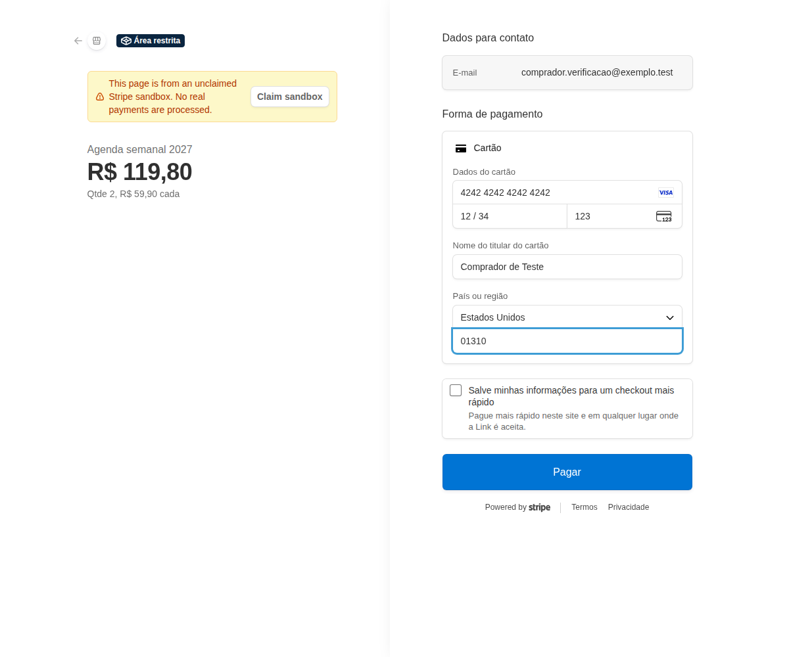
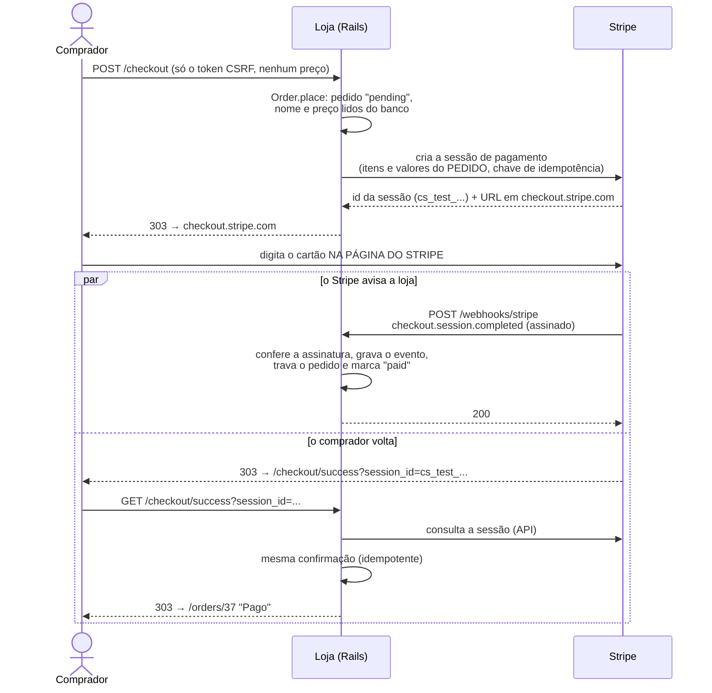
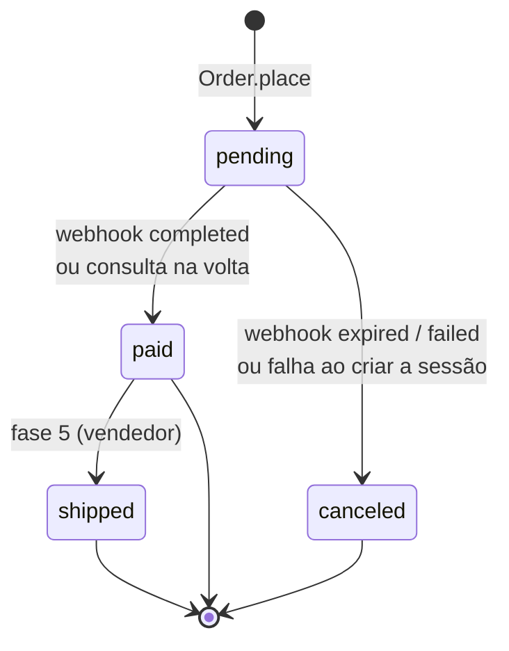
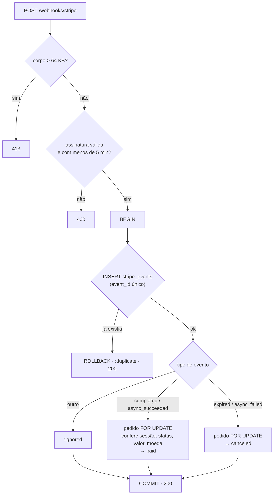
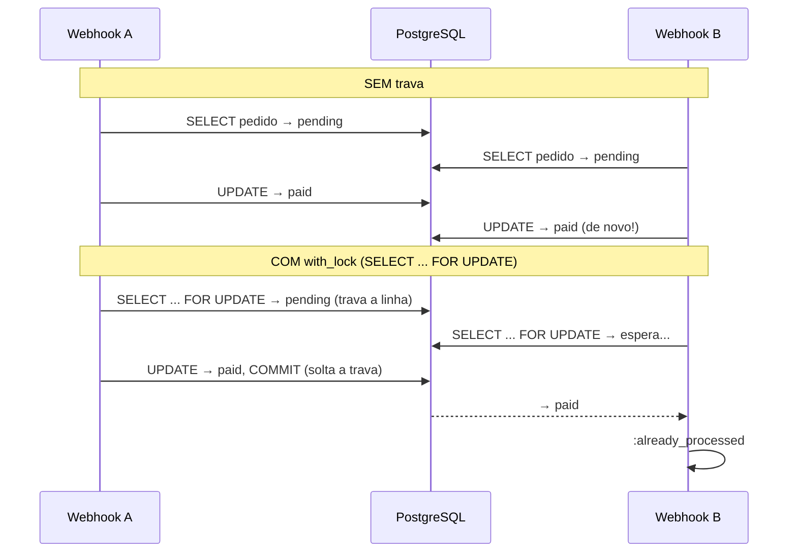
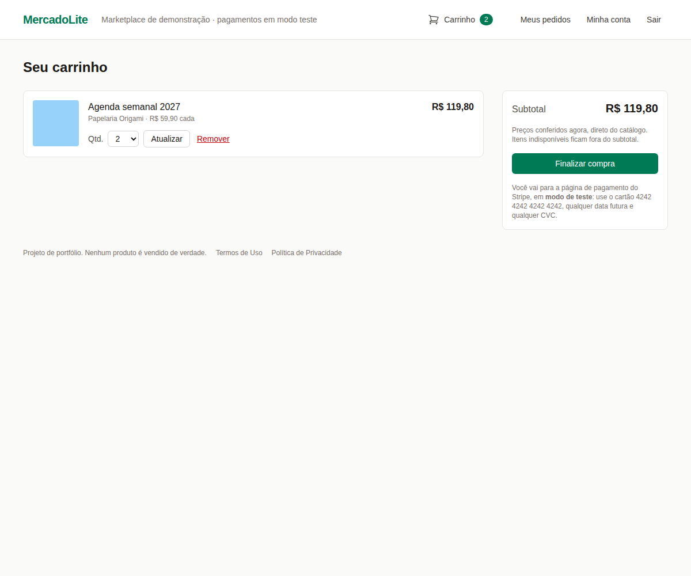

# MercadoLite — Fase 3b: o checkout com Stripe

> **Objetivo:** transformar o carrinho em **pedido** e receber o pagamento pelo **Stripe**, em
> modo de teste, de um jeito que ninguém consiga pagar menos, ver o pedido dos outros, forjar
> uma confirmação de pagamento ou fazer o mesmo pagamento valer duas vezes.
>
> **Pré-requisito:** [Fase 3a — o login do comprador](fase-3a-login.md).

**O que você vai aprender:** o pedido que "congela" o preço · autorização com o **Pundit**
(policies, escopos e as redes de segurança `verify_*`) · os tipos de chave do Stripe e por que
a loja recusa chaves de produção · o **Stripe Checkout** (a página de pagamento hospedada pelo
Stripe) · **chave de idempotência** · **webhooks** · assinatura **HMAC** e ataque de
**replay**, calculados à mão · **idempotência** em duas camadas (índice único + trava de
linha) · concorrência de verdade nos testes · a CSP e os redirecionamentos para fora do site ·
testes sem rede com o **WebMock** · um pagamento de ponta a ponta na sandbox do Stripe.



**Sumário**
1. [O que foi construído](#1-o-que-foi-construído)
2. [O caminho de um pagamento](#2-o-caminho-de-um-pagamento)
3. [O pedido: preço congelado e estados](#3-o-pedido-preço-congelado-e-estados)
4. [Autorização com o Pundit](#4-autorização-com-o-pundit)
5. [As chaves do Stripe](#5-as-chaves-do-stripe)
6. [O Stripe Checkout](#6-o-stripe-checkout)
7. [Webhooks: o Stripe avisa a loja](#7-webhooks-o-stripe-avisa-a-loja)
8. [A assinatura do webhook, por dentro](#8-a-assinatura-do-webhook-por-dentro)
9. [Idempotência em duas camadas](#9-idempotência-em-duas-camadas)
10. [Defesa em profundidade: o valor precisa bater](#10-defesa-em-profundidade-o-valor-precisa-bater)
11. [A volta do Stripe: consultar, não confiar](#11-a-volta-do-stripe-consultar-não-confiar)
12. [O navegador: CSP e Turbo](#12-o-navegador-csp-e-turbo)
13. [LGPD e logs](#13-lgpd-e-logs)
14. [Os testes da fase](#14-os-testes-da-fase)
15. [O teste de verdade, na sandbox do Stripe](#15-o-teste-de-verdade-na-sandbox-do-stripe)
16. [O que os testes e o navegador nos ensinaram](#16-o-que-os-testes-e-o-navegador-nos-ensinaram)
17. [Mão na massa](#17-mão-na-massa)
18. [Decisões de design (bom assunto para entrevista)](#18-decisões-de-design-bom-assunto-para-entrevista)
19. [Glossário](#19-glossário)
20. [Exercícios](#20-exercícios)
21. [Próxima fase](#21-próxima-fase)

---

## 1. O que foi construído

- **Pedido** (`Order` + `OrderItem`): nasce do carrinho, com dono, e **copia** o nome e o
  preço de cada produto. Mudar o produto depois não muda um pedido já feito.
- **"Meus pedidos"** (`/orders` e `/orders/:id`): cada comprador vê só os seus. O pedido de
  outra pessoa dá **404**, como se não existisse.
- **Pundit**: as regras de "quem pode ver o quê" ficam numa classe (`OrderPolicy`).
- **Checkout**: o botão "Finalizar compra" cria o pedido e manda o comprador para a página de
  pagamento **do Stripe** (`checkout.stripe.com`). O número do cartão nunca passa pela loja.
- **Webhook** (`POST /webhooks/stripe`): o Stripe avisa, servidor a servidor, que o pagamento
  foi feito (ou que a página de pagamento expirou). A loja confere a **assinatura** e processa
  cada aviso **uma vez só**.
- **Volta do Stripe** (`/checkout/success`): o comprador volta para a loja e vê o pedido pago,
  sem esperar o webhook. A loja **consulta** o Stripe; a URL em si não prova nada.
- **Só modo de teste**: a aplicação não sobe com uma chave de produção.

Arquivos novos:

| Arquivo | O que faz |
|---|---|
| `app/models/order.rb`, `order_item.rb` | O pedido, os itens e as transições de status (pagar, cancelar). |
| `app/models/stripe_checkout.rb` | A conversa com a API do Stripe: criar a página de pagamento e consultá-la. |
| `app/models/stripe_event.rb` | Processa um evento de webhook uma vez só. |
| `app/policies/application_policy.rb`, `order_policy.rb` | As regras de autorização (Pundit). |
| `app/controllers/checkouts_controller.rb` | `POST /checkout` e `GET /checkout/success`. |
| `app/controllers/orders_controller.rb` | "Meus pedidos". |
| `app/controllers/stripe_webhooks_controller.rb` | Recebe os webhooks. |
| `lib/stripe_keys.rb` | **Função pura**: a chave é de teste? O segredo do webhook tem o formato certo? |
| `config/initializers/stripe.rb` | Lê as chaves do ambiente, recusa chave de produção, define os tempos máximos. |
| `db/migrate/20260929120000..02` | Tabelas `orders`, `order_items` e `stripe_events`. |

Gems novas: `pundit` 2.5.2, `stripe` 19.6.2 (versão da API: `2026-08-26.dahlia`) e, só nos
testes, `webmock` 3.26.4.

---

## 2. O caminho de um pagamento



Repare que existem **dois caminhos** até o "Pago", e eles podem chegar juntos: o webhook e a
volta do comprador. A seção 9 mostra por que isso não paga o pedido duas vezes.

---

## 3. O pedido: preço congelado e estados

### Por que copiar o preço

O carrinho **não tem preço** (fase 2): ele lê o preço do produto na hora. Isso é certo para o
carrinho e errado para o pedido. Se o vendedor mudar o preço amanhã, o pedido de ontem tem de
continuar dizendo quanto foi cobrado. Por isso `order_items` guarda uma **foto** do produto:

```ruby
# app/models/order.rb (resumido)
def self.place(cart, user)
  order = new(user:)
  lines = cart ? cart.lines.to_a : []
  if lines.empty?
    order.errors.add(:base, :empty_cart)
  elsif lines.any? { |line| !line.purchasable? }   # inativo ou além do estoque
    order.errors.add(:base, :unavailable_items)
  else
    lines.each do |line|
      order.items.build(product: line.product, product_name: line.product.name,
                        unit_price_cents: line.product.price_cents, quantity: line.quantity)
    end
    order.total_cents = order.items.sum(&:line_total_cents)
    order.save
  end
  order
end
```

O navegador manda **só o token CSRF** para `POST /checkout`. Um teste manda
`total_cents=1`, `unit_amount=1` e `price_cents=1` de propósito e confere que o pedido sai com
R$ 99,80 e que o Stripe recebe `unit_amount=4990`: parâmetros que o controller não lê não
fazem nada.

Em C, seria a diferença entre guardar um **ponteiro** para o produto (o carrinho) e guardar
uma **cópia** da struct (o pedido): a cópia não muda quando o original muda.

### O banco

```ruby
# db/migrate/20260929120000_create_orders.rb (resumido)
t.references :user, foreign_key: { on_delete: :nullify }   # a conta some, o pedido fica
t.string  :status, null: false, default: "pending"
t.integer :total_cents, null: false
t.string  :currency, null: false, default: "brl"
t.string  :stripe_checkout_session_id                     # índice único
t.string  :stripe_payment_intent_id                       # índice único
t.datetime :paid_at
t.datetime :canceled_at

add_check_constraint :orders, "status IN ('pending', 'paid', 'shipped', 'canceled')"
add_check_constraint :orders, "total_cents > 0"
add_check_constraint :orders, "currency = 'brl'"
add_check_constraint :orders, "status NOT IN ('paid', 'shipped') OR paid_at IS NOT NULL"
```

E em `order_items`: preço entre 1 centavo e R$ 1 milhão, quantidade de 1 a 10, uma linha por
produto em cada pedido (índice único) e **chave estrangeira sem cascata para `products`**: o
banco não deixa apagar um produto que já foi vendido (desative-o).

A última restrição de `orders` é uma implicação lógica escrita em SQL. "Se está pago ou
enviado, então tem data de pagamento" (`A → B`) é o mesmo que `NOT A OR B`.

### Os estados



O status é um `enum` do Rails:

```ruby
STATUSES = %w[pending paid shipped canceled].freeze
enum :status, STATUSES.index_with(&:itself), default: "pending", validate: true
```

- `STATUSES.index_with(&:itself)` monta `{"pending" => "pending", "paid" => "paid", ...}`:
  o banco guarda o **texto**, e não um número (um `enum` de C guardaria 0, 1, 2...). Texto é
  legível no `psql` e não quebra se alguém reordenar a lista.
- O `enum` **gera métodos**: `order.pending?`, `order.paid!`, `Order.paid` (um escopo). É
  metaprogramação: o Rails escreve esses métodos quando a classe carrega.
- `validate: true`: um status fora da lista vira **erro de validação** (conferido:
  `"não está incluído na lista"`), e não uma exceção. E o `CHECK` do banco segura quem passar
  por fora do modelo.

Os nomes em português vêm do `config/locales/pt-BR.yml`, na chave
`activerecord.attributes.order/status`. O helper `order_status_badge` usa
`Order.human_attribute_name("status.paid")` → "Pago".

---

## 4. Autorização com o Pundit

### A pergunta que o Pundit responde

A fase 3a respondeu **quem** é você (autenticação). O Pundit responde **o que** você pode
fazer com **este** registro (autorização). Cada modelo que precisa de regra ganha uma
*policy*, uma classe Ruby comum com um método por ação:

```ruby
# app/policies/order_policy.rb
class OrderPolicy < ApplicationPolicy
  def index? = user.present?
  def show? = owner?
  def create? = owner?

  class Scope < ApplicationPolicy::Scope
    def resolve
      user ? scope.where(user:) : scope.none
    end
  end

  private

  def owner?
    user.present? && record.user_id == user.id
  end
end
```

`def show? = owner?` é um **método de uma linha** (Ruby 3+), igual a
`def show?; owner?; end`. O `?` no nome é convenção de Ruby para métodos que respondem
sim/não.

A `ApplicationPolicy` (a base) responde **`false` para tudo**: o que a policy não liberar
explicitamente fica proibido. Por isso ninguém edita nem apaga pedido (um teste confere).
É o mesmo princípio de um firewall bem configurado: **negar por padrão**.

### Duas ferramentas: `policy_scope` e `authorize`

| | Pergunta | Uso |
|---|---|---|
| `policy_scope(Order)` | **Quais** pedidos este usuário enxerga? | listagens e buscas por id |
| `authorize order` | Este usuário pode fazer **esta ação** com **este** pedido? | depois de achar o registro |

O escopo vira SQL (conferido):

```sql
-- logado (usuário 2742)
SELECT "orders".* FROM "orders" WHERE "orders"."user_id" = 2742
-- sem login
SELECT "orders".* FROM "orders" WHERE (1=0)
```

`WHERE (1=0)` é o jeito do Active Record dizer "nenhuma linha" (`scope.none`) sem erro.

No controller:

```ruby
# app/controllers/orders_controller.rb
before_action :authenticate_user!
after_action :verify_policy_scoped, only: :index
after_action :verify_authorized, only: :show

def show
  @order = policy_scope(Order).find(params[:id])  # o pedido de outro nem é encontrado → 404
  authorize @order                                 # e, se fosse, a policy negaria → 404
  @items = @order.items.order(:id)
end
```

**Defesa em profundidade, medida.** Tiramos cada camada separadamente e rodamos os testes:

- sem o `policy_scope` (um `Order.find` direto): **nenhum** teste falha, porque o
  `authorize` ainda nega;
- sem o `authorize` (e sem o `verify_authorized`): **nenhum** teste de segurança falha, porque
  o escopo ainda esconde;
- sem **os dois**: falha "o pedido de outra pessoa dá 404, como se não existisse".

Cada camada sozinha segura o ataque. As duas juntas seguram o **esquecimento**: quem mexer
no código e tirar uma delas sem querer ainda está protegido.

### As redes de segurança `verify_*`

`after_action :verify_authorized` roda **depois** da ação e levanta
`Pundit::AuthorizationNotPerformedError` se ninguém chamou `authorize`. Tiramos o
`authorize order` do `CheckoutsController#create` e os testes quebraram com essa exceção.
É como um `assert` no fim de toda função de C que exige que a checagem tenha rodado: não
impede o erro no código, mas faz o teste gritar.

### Negar com 404, e não 403

```ruby
# app/controllers/application_controller.rb
rescue_from Pundit::NotAuthorizedError do
  render file: Rails.public_path.join("404.html"), status: :not_found, layout: false
end
```

Um 403 ("proibido") diria ao curioso que **o pedido 38 existe**. O 404 é a mesma resposta de
um id que não existe: quem tenta adivinhar ids não aprende nada.

---

## 5. As chaves do Stripe

### Os tipos de chave

| Prefixo | Nome | Onde fica | O que pode |
|---|---|---|---|
| `pk_test_` / `pk_live_` | publicável | no navegador (pública) | quase nada (não usamos) |
| `sk_test_` / `sk_live_` | secreta | só no servidor | **tudo** na conta |
| `rk_test_` / `rk_live_` | **restrita** | só no servidor | só as permissões escolhidas |
| `whsec_` | segredo de assinatura | só no servidor | conferir os webhooks |

`_test_` é a **sandbox**: pagamentos de mentira, cartões de teste, nenhum dinheiro real.
`_live_` é produção. A sandbox do autor é a "Área restrita de MercadoLite".

**Por que a chave restrita.** A chave secreta é a chave-mestra da conta: com ela, dá para
estornar pagamentos, ler clientes, criar cobranças. A loja só precisa **criar e consultar
sessões de checkout**. Uma chave restrita com só essa permissão (`Checkout Sessions: Write`)
limita o estrago se ela vazar: é o princípio do **menor privilégio**, o mesmo de rodar um
programa sem `root`.

### Só chaves de teste: a função pura e o initializer

```ruby
# lib/stripe_keys.rb
TEST_KEY = /\A(sk|rk)[a-z]*_test_[0-9A-Za-z]+\z/
WEBHOOK_SECRET = /\Awhsec_[0-9A-Za-z]+\z/
```

- `\A` e `\z` prendem o começo e o fim do **texto inteiro**. `^` e `$` prenderiam o começo e
  o fim de uma **linha**, e `"sk_test_x\nsk_live_y"` passaria (há teste para isso).
- `[a-z]*` depois de `sk`/`rk` existe por causa de uma surpresa real: a sandbox criada pela
  Stripe CLI entregou uma chave restrita com o prefixo **`rkcs_test_`**. A primeira versão da
  regex (`\A(sk|rk)_test_`) a recusava.

```ruby
# config/initializers/stripe.rb (resumido)
stripe.secret_key = ENV["STRIPE_SECRET_KEY"].presence
Rails.application.config.after_initialize do
  if stripe.secret_key && !StripeKeys.test_key?(stripe.secret_key)
    raise "STRIPE_SECRET_KEY precisa ser uma chave de TESTE ..."
  end
end
```

Com uma chave `sk_live_` no `.env`, o servidor **nem sobe**. É melhor falhar no boot, na
cara de quem configurou, do que cobrar alguém de verdade numa loja de demonstração.

O `after_initialize` existe porque o que está em `lib/` é carregado pelo *autoload*
(Zeitwerk), que ainda não funciona enquanto os initializers rodam. Citar `StripeKeys` direto
num initializer dá `uninitialized constant StripeKeys (NameError)` (conferido); dentro do
`after_initialize`, que roda no fim do boot, funciona.

**Sem chave, a loja funciona:** o botão "Finalizar compra" avisa "O pagamento não está
configurado neste servidor". Assim, quem clona o projeto roda os testes e a vitrine sem conta
no Stripe. Nos testes, o initializer usa valores fixos (`sk_test_mercadolite`), e o seu
`.env` não interfere.

**Tempos máximos.** O padrão da gem espera 30 s para conectar e 80 s para ler. Uma API lenta
prenderia uma thread do servidor por mais de um minuto. Usamos 5 s e 20 s, com 2 novas
tentativas automáticas.

---

## 6. O Stripe Checkout

### Por que a página hospedada pelo Stripe

Existem dois jeitos de cobrar com cartão:

1. **Formulário próprio**: o cartão é digitado na loja e passa pelo servidor da loja. A loja
   entra no escopo pesado do **PCI DSS** (o padrão de segurança da indústria de cartões):
   auditorias, varreduras, segmentação de rede.
2. **Página hospedada** (Stripe Checkout): a loja manda o comprador para `checkout.stripe.com`,
   e o cartão é digitado **lá**. A loja nunca vê o número.

A segunda opção tira da loja o dado mais perigoso que ela poderia guardar. É a escolha óbvia
para quem não é banco.

### A conversa com a API

A classe `StripeCheckout` não é um modelo do banco. É um **PORO** (*plain old Ruby object*):
uma classe comum, em `app/models/` por ser lógica de negócio.

```ruby
# app/models/stripe_checkout.rb (resumido)
def start(order, success_url:, cancel_url:)
  session = @client.v1.checkout.sessions.create(
    session_params(order, success_url:, cancel_url:),
    { idempotency_key: "mercadolite-order-#{order.id}-checkout" }
  )
  url = session.url.to_s
  raise UnexpectedResponse, "URL de pagamento fora do Stripe" unless URI(url).host == CHECKOUT_HOST

  order.update!(stripe_checkout_session_id: session.id)
  url
end
```

Os parâmetros da sessão:

| Parâmetro | Valor | Por quê |
|---|---|---|
| `mode` | `"payment"` | pagamento único (não assinatura) |
| `payment_method_types` | `["card"]` | cartão confirma na hora; boleto e Pix confirmariam dias depois |
| `line_items` | nome, preço unitário e quantidade **do pedido** | o valor sai do banco, nunca do navegador |
| `client_reference_id`, `metadata[order_id]` | o id do pedido | liga a sessão ao pedido (aparece no painel do Stripe) |
| `customer_email` | o e-mail da conta | o Stripe manda o recibo |
| `locale` | `"pt-BR"` | a página de pagamento em português |
| `expires_at` | agora + 30 min | o mínimo que o Stripe aceita (o padrão é 24 h) |
| `success_url`, `cancel_url` | a volta para a loja | seção 11 |

A chamada injeta o cliente pelo construtor (`initialize(client = Stripe::StripeClient.new(...))`).
Em C seria passar um ponteiro de função: os testes poderiam trocar o cliente por um falso. Na
prática, usamos o WebMock (seção 14), que intercepta o HTTP e deixa o código de produção
inteiro em teste.

### Chave de idempotência

Um clique duplo, uma nova tentativa depois de um *timeout*: a mesma chamada pode chegar duas
vezes ao Stripe. A **chave de idempotência** é um rótulo que o cliente manda no cabeçalho
`Idempotency-Key`: se o Stripe já viu aquela chave, ele devolve a **mesma resposta** em vez
de executar de novo (comportamento documentado pelo Stripe).

A nossa chave é uma por pedido: `mercadolite-order-37-checkout`. Conferimos com o WebMock o
que a gem faz quando a primeira tentativa falha (um 500 com `Stripe-Should-Retry: true`):

```
tentativas: 2
chaves: ["mercadolite-order-1889-checkout", "mercadolite-order-1889-checkout"]
```

A nova tentativa automática leva **a mesma chave**, então repetir não cria uma segunda sessão.

### A URL de pagamento precisa ser do Stripe

```ruby
redirect_to start_payment(order), allow_other_host: true, status: :see_other
```

Na configuração padrão do Rails 8.1 (`action_on_open_redirect = :raise`), um `redirect_to`
para outro domínio levanta erro, a menos que se passe `allow_other_host: true` (conferido:
sem ele, o teste do checkout quebra com `ActionController::Redirecting::OpenRedirectError`).
Isso protege contra **open redirect** (um link da loja que manda a vítima para um site
falso). Liberamos o redirecionamento, mas só depois de conferir que a URL
é de `checkout.stripe.com`. Um teste faz a "API" devolver `https://site-do-atacante.example/pagar`
e confere que o comprador volta ao carrinho, com o pedido cancelado.

O Brakeman (análise estática) aponta esse `redirect_to` como "possível redirecionamento
desprotegido": ele não sabe que a URL vem da API e foi conferida. Registramos o falso
positivo em `config/brakeman.ignore`, **com a justificativa e o nome do teste** que cobre o
caso. Ignorar um aviso sem explicar seria esconder o problema.

O `status: :see_other` (303) diz ao navegador para seguir o redirecionamento com **GET**.

### O marcador `{CHECKOUT_SESSION_ID}`

O Stripe troca o texto literal `{CHECKOUT_SESSION_ID}` da `success_url` pelo id da sessão. Só
que o helper de URL do Rails **escapa** as chaves (conferido):

```ruby
success_checkout_url(session_id: "{CHECKOUT_SESSION_ID}")
# => ".../checkout/success?session_id=%7BCHECKOUT_SESSION_ID%7D"
```

`%7B` é `{` codificado. O Stripe não reconheceria o marcador, e o comprador voltaria com o
texto literal na URL (um 404). Por isso a URL é montada à mão:

```ruby
success_url: "#{success_checkout_url}?session_id={CHECKOUT_SESSION_ID}"
```

Trocando pela versão com o helper, falha o teste "manda ao Stripe os valores do BANCO, e o
marcador da sessão sem escapar".

### Se o Stripe falhar

```ruby
rescue Stripe::StripeError, StripeCheckout::UnexpectedResponse => e
  order&.update_columns(status: "canceled", canceled_at: Time.current) if order&.persisted?
  Rails.logger.error("[checkout] falha ao criar a sessão do pedido #{order&.id}: #{e.class}")
  redirect_to cart_path, alert: t(".unavailable")
```

O pedido nunca foi para pagamento, então fica cancelado; o carrinho continua intacto; e o log
leva só o id do pedido e a classe do erro, sem e-mail. Com a API fora do ar, o log real foi:
`[checkout] falha ao criar a sessão do pedido 3: Stripe::APIConnectionError`.

O `&.` é o **operador de navegação segura**: `order&.id` é `nil` se `order` for `nil`, em vez
de erro. Em C, seria `order ? order->id : NULL`.

---

## 7. Webhooks: o Stripe avisa a loja

### O que é um webhook

Um **webhook** é uma requisição HTTP que **outro servidor** faz para o seu quando algo
acontece lá. Em vez de a loja perguntar ao Stripe a cada segundo "já pagou?" (*polling*), o
Stripe chama a loja: "a sessão cs_test_... foi paga". É como uma interrupção de hardware no
lugar de um laço de espera ocupada.



### Um controller de API

```ruby
class StripeWebhooksController < ActionController::API
```

Quem chama é o servidor do Stripe, e não um navegador: não há cookie, sessão nem token CSRF.
O `ApplicationController` tem proteção CSRF, e um POST sem token dá **422**. Tiramos a prova:
com a base trocada para `ApplicationController`, falha o teste "funciona sem token CSRF e com o
User-Agent do Stripe, e não cria sessão".

Não é uma brecha: a autenticidade vem da **assinatura** (seção 8), que é **mais forte** que o
token CSRF. O token prova que o formulário saiu da loja; a assinatura prova **quem** mandou
**e** que o corpo não mudou em nenhum byte.

### O corpo cru e o limite de tamanho

```ruby
payload = request.body.read(MAX_PAYLOAD_BYTES + 1).to_s
return head(:content_too_large) if payload.bytesize > MAX_PAYLOAD_BYTES
```

- A assinatura é calculada sobre os **bytes exatos** do corpo. Se o JSON passasse por um
  parser e fosse reescrito (outra ordem de chaves, outros espaços), a assinatura não bateria.
  Por isso lemos o corpo cru.
- Lemos no máximo 64 KB + 1 byte: se veio mais que isso, o corpo é grande demais (**413**)
  e nem calculamos o HMAC. Um evento de checkout real tem poucos KB. É o mesmo cuidado de um
  `fgets(buf, sizeof buf, f)` em C: nunca ler sem limite o que vem de fora.

### Sempre 200 para o que foi verificado

Segundo a documentação do Stripe, ele **reenvia** o evento, com intervalos crescentes, até
receber uma resposta 2xx (em produção, por até três dias). Então:

- evento de um tipo que não usamos → **200** (senão, reenvio inútil por dias);
- evento duplicado → **200**;
- valor divergente → **200**, mas **não confirma** e registra `error` no log. Reenviar o
  mesmo evento não mudaria o valor; o problema é para um humano investigar.
- assinatura inválida → **400**, sem detalhes na resposta: quem forjou não aprende nada.

---

## 8. A assinatura do webhook, por dentro

### HMAC

Qualquer um na internet pode mandar um `POST /webhooks/stripe` com
`{"type": "checkout.session.completed", ...}`. Sem verificação, isso marcaria pedidos como
pagos de graça. A defesa é a **assinatura**: o Stripe e a loja dividem um segredo
(`whsec_...`), e cada evento vem com um **HMAC-SHA256** do corpo feito com esse segredo.

HMAC é um hash **com chave**. Sem a chave, não dá para calcular o HMAC certo de um corpo
novo, nem ajustar o corpo para caber num HMAC antigo. Diferente da criptografia, ele não
esconde nada (o corpo vai em texto claro, dentro do HTTPS); ele prova **autoria e
integridade**.

### O cabeçalho

```
Stripe-Signature: t=1790000000,v1=258aab9ede1a4674d91fdccf5760b9c6643c61851d5c2ba1f4acaa518c4c706c
```

- `t`: o momento da assinatura (segundos desde 1970, o *Unix time*; 1790000000 é
  21/09/2026, 11h13 de Brasília).
- `v1`: o HMAC-SHA256, em hexadecimal, da string **`"<t>.<corpo>"`**, com o `whsec_...`
  inteiro como chave.

### Calculando à mão

Dá para conferir o algoritmo com o `openssl`, no terminal do Ubuntu:

```bash
corpo='{"id":"evt_exemplo","type":"checkout.session.completed"}'
printf '%s' "1790000000.$corpo" | openssl dgst -sha256 -hmac whsec_exemplo
# SHA2-256(stdin)= 258aab9ede1a4674d91fdccf5760b9c6643c61851d5c2ba1f4acaa518c4c706c
```

E no `bin/rails console`, com a gem do Stripe:

```ruby
corpo = '{"id":"evt_exemplo","type":"checkout.session.completed"}'
Stripe::Webhook::Signature.compute_signature(Time.at(1790000000), corpo, "whsec_exemplo")
# => "258aab9ede1a4674d91fdccf5760b9c6643c61851d5c2ba1f4acaa518c4c706c"
```

Os dois dão o mesmo valor (conferido). Não há mágica: a gem faz exatamente isso.

### A verificação

```ruby
event = Stripe::Webhook.construct_event(
  payload, request.headers["Stripe-Signature"].to_s, Rails.configuration.x.stripe.webhook_secret
)
```

`construct_event` recalcula o HMAC e compara com o `v1` do cabeçalho em **tempo constante**
(`secure_compare`). Um `strcmp` comum para no primeiro byte diferente: medindo o tempo da
resposta, um atacante descobriria quantos bytes acertou e montaria a assinatura byte a byte
(**ataque de tempo**, o mesmo da fase 3a). A comparação em tempo constante percorre sempre
todos os bytes.

Se a assinatura bate, a gem faz o parse do JSON e devolve um `Stripe::Event`. Com a
assinatura certa e um JSON quebrado, ela levanta `JSON::ParserError` (conferido), que também
tratamos com 400.

Um detalhe: o cabeçalho pode ter **mais de um `v1`**, e basta um bater (conferido). É para a
troca de segredo: durante a transição, o Stripe assina com o velho e o novo.

### *Replay* e a tolerância de 5 minutos

Um atacante que **capture** um webhook legítimo (de um log, de um proxy mal configurado) tem
um corpo e uma assinatura válidos. Ele pode reenviá-los depois: é o ataque de ***replay***.
Por isso o `t` entra no HMAC (não dá para trocá-lo sem invalidar a assinatura) e a gem recusa
eventos assinados há mais de **300 segundos**. Os testes conferem: 4 minutos atrás, aceito; 6
minutos atrás, **400**.

E o reenvio dentro dos 5 minutos? Aí entra a idempotência: o mesmo evento não produz efeito
duas vezes (seção 9).

### O que cada teste de assinatura cobre

| Teste | O ataque |
|---|---|
| "recusa (400) sem o cabeçalho Stripe-Signature" | POST forjado, sem assinatura |
| "recusa (400) corpo alterado depois de assinado" | trocar `amount_total` num evento real |
| "recusa (400) assinatura feita com outro segredo" | atacante assina com um segredo dele |
| "recusa (400) evento assinado há mais de 5 minutos" | *replay* |

Trocando o `construct_event` por um `JSON.parse` sem conferir nada, **os quatro** falham.

---

## 9. Idempotência em duas camadas

**Idempotente** é a operação que, repetida, dá o mesmo resultado que feita uma vez. O Stripe
pode entregar o **mesmo** evento duas vezes (um reenvio porque a resposta demorou) e pode
mandar **eventos diferentes** sobre o mesmo pagamento. E a volta do comprador (seção 11) é um
terceiro caminho. Nenhum deles pode pagar o pedido duas vezes.

### Camada 1: cada evento, uma vez

```ruby
# app/models/stripe_event.rb
def self.process(event)
  transaction do
    create!(event_id: event.id, event_type: event.type)   # índice ÚNICO em event_id
    apply(event)
  end
rescue ActiveRecord::RecordNotUnique
  :duplicate
end
```

O índice único é a trava: o segundo `INSERT` do mesmo `evt_...` é recusado **pelo banco**, e
não por um `if exists?` no Ruby (que teria uma janela entre o "confere" e o "grava").

**Por que na mesma transação que o efeito.** Se o registro do evento fosse gravado antes, em
separado, e o processamento falhasse no meio (o banco caiu, um bug), o evento ficaria marcado
como processado **sem ter feito nada**, e o reenvio do Stripe seria descartado como
duplicado: pagamento perdido. Na mesma transação, a falha desfaz os dois (há teste: "se o
processamento falhar, o evento não fica marcado como processado").

O log real do servidor, no teste com o Stripe, mostra as duas situações:

```
-- checkout.session.expired (novo)
BEGIN
INSERT INTO "stripe_events" ("event_id", ...) VALUES ('evt_1UL2aR...', ...)
SELECT "orders".* FROM "orders" WHERE "orders"."stripe_checkout_session_id" = 'cs_test_...' LIMIT 1
SELECT "orders".* FROM "orders" WHERE "orders"."id" = 36 LIMIT 1 FOR UPDATE
UPDATE "orders" SET "status" = 'canceled', "canceled_at" = ... WHERE "orders"."id" = 36
COMMIT
[stripe] checkout.session.expired evt_1UL2aR...: canceled

-- checkout.session.completed reenviado (stripe events resend)
BEGIN
INSERT INTO "stripe_events" ("event_id", ...) VALUES ('evt_1UL2V0...', ...)
ROLLBACK
[stripe] checkout.session.completed evt_1UL2V0...: duplicate
```

### Camada 2: a trava da linha do pedido

Eventos **diferentes** passam pela camada 1 (ids diferentes). Se `checkout.session.completed`
e `checkout.session.async_payment_succeeded` chegassem juntos, cada um num processo, os dois
poderiam ler o pedido como `pending` antes de qualquer um gravar:



É uma **condição de corrida** do tipo *check-then-act*, a mesma de duas threads de C que
fazem `if (!flag) { flag = 1; ... }` sem mutex. O `with_lock` do Active Record é o mutex,
só que no banco:

```ruby
def confirm_payment!(session)
  result = nil
  with_lock do                  # SELECT ... FOR UPDATE, e relê o pedido
    result = if !pending?
      :already_processed
    else
      payment_problem(session) || :paid
    end
    update!(status: "paid", paid_at: Time.current, stripe_payment_intent_id: session.payment_intent) if result == :paid
  end
  remove_purchased_items_from_cart if result == :paid
  result
end
```

Conferido no log dos testes: `with_lock` gera
`SELECT "orders".* FROM "orders" WHERE "orders"."id" = $1 LIMIT $2 FOR UPDATE`.

### Testando concorrência de verdade

Um teste comum roda dentro de uma transação que é desfeita no fim (é assim que cada teste
começa com o banco limpo). Só que uma transação aberta **esconde** os dados das outras
conexões, e a trava não teria contra quem valer. O `spec/models/order_concurrency_spec.rb`
desliga isso (`self.use_transactional_tests = false`), apaga o que criou no fim, e faz:

1. uma **segunda conexão**, numa thread, trava a linha do pedido, grava "pago" e só faz o
   COMMIT depois de 0,3 s;
2. enquanto isso, a thread principal (com o pedido lido **antes** do commit, ainda
   `pending` na memória) chama `confirm_payment!` ou `cancel_checkout!`.

| Versão do código | `confirm_payment!` | `cancel_checkout!` |
|---|---|---|
| com `with_lock` | `:already_processed` (esperou a trava) | `:already_processed` |
| `with_lock` trocado por `transaction` | **`:paid`** (pagou de novo) | **`:canceled`** (cancelou um pedido PAGO) |
| `reload` sem trava, no lugar do `with_lock` | **`:paid`** | — |

A última linha é importante: **reler** não basta. A outra conexão ainda não fez o COMMIT,
então o `reload` enxerga `pending` (no PostgreSQL, leitura comum não espera ninguém). Só o
`FOR UPDATE` faz esperar.

O teste é determinístico no sentido que importa: com a trava, ele passa sempre (a thread
principal ou espera o COMMIT ou chega depois dele, e nos dois casos lê `paid`).

Antes desses testes, fizemos o experimento com duas threads disparando ao mesmo tempo, com
dados reais: o mesmo evento em paralelo deu `[:duplicate, :paid]`; dois eventos diferentes,
`[:already_processed, :paid]`; e, sem o `with_lock` (com uma pausa entre conferir e gravar),
`[:paid, :paid]`.

---

## 10. Defesa em profundidade: o valor precisa bater

Mesmo com a assinatura válida, a confirmação confere o pagamento contra o pedido (o método de
`app/models/order.rb`, em forma compacta):

```ruby
def payment_problem(session)
  if session.id != stripe_checkout_session_id then :session_mismatch
  elsif session.payment_status != "paid"      then :not_paid
  elsif session.amount_total != total_cents   then :amount_mismatch
  elsif session.currency != CURRENCY          then :currency_mismatch
  end
end
```

Se a assinatura é forte, por que conferir? Porque a assinatura prova que **o Stripe** mandou,
não que o pagamento está certo **para este pedido**. Um bug nosso (itens enviados errado ao
Stripe), um cupom mal configurado no painel ou um segredo vazado virariam um pedido "pago"
por menos. A conferência transforma isso num `error` no log e num pedido que continua
pendente. Tirando a conferência do valor, falham 2 testes (o do modelo e o do webhook).

`if condição then valor` numa linha é Ruby válido. Em Ruby, o `if` é uma **expressão** (como o
operador `?:` de C): o método devolve o valor do ramo que casou, ou `nil` se nenhum casou
(conferido). O `|| :paid` do `confirm_payment!` aproveita isso: `nil || :paid` é `:paid`.

---

## 11. A volta do Stripe: consultar, não confiar

Depois de pagar, o Stripe manda o comprador para
`/checkout/success?session_id=cs_test_...`. A tentação é marcar o pedido como pago ali mesmo:
"o Stripe só manda para lá quem pagou". Errado: **qualquer um pode digitar essa URL**. O
comprador vê o id da sessão na barra de endereços da página de pagamento; bastaria abrir a
página, desistir e colar a URL de volta.

```ruby
def success
  order = policy_scope(Order).find_by!(stripe_checkout_session_id: params.expect(:session_id))
  authorize order, :show?
  StripeCheckout.new.sync(order) if order.pending?    # CONSULTA a API
  redirect_to order_path(order), status: :see_other
end
```

- O `session_id` só serve para **achar** o pedido, e só entre os do usuário: o de outra
  pessoa dá 404 **sem consultar o Stripe** (há teste).
- A confirmação vem da **resposta da API** (`sessions.retrieve`), com a mesma
  `confirm_payment!` idempotente do webhook. O que chegar primeiro vale; o outro recebe
  `:already_processed`.
- Se a API estiver fora do ar, o comprador vê "Aguardando a confirmação do pagamento", e o
  webhook confirma depois.

Um teste cobre exatamente o ataque acima: a API responde `payment_status: "unpaid"` e o
pedido continua pendente.

---

## 12. O navegador: CSP e Turbo

O teste no Chromium achou dois bloqueios que nenhum teste de request pegaria, porque são
regras **do navegador**.

### `form-action` vale também para o redirecionamento

A CSP da fase 1 tem `form-action 'self'`: formulários só enviam para o próprio site. O botão
"Finalizar compra" envia para `/checkout`, que é da loja... e responde com um redirecionamento
para `checkout.stripe.com`. O Chromium aplica o `form-action` **ao destino do
redirecionamento** também, e bloqueou:

```
Refused to send form data to 'http://localhost:3000/checkout' because it violates the
following Content Security Policy directive: "form-action 'self'".
```

A mensagem cita a URL da **loja** (o navegador não revela o destino do redirecionamento na
mensagem), o que confunde. A correção é liberar só o Stripe:

```ruby
policy.form_action :self, "https://checkout.stripe.com"
```

### O Turbo segue o redirecionamento com `fetch`

O Turbo (Hotwire) envia formulários com `fetch()` para trocar a página sem recarregar. O
`fetch` tentou seguir o redirecionamento para o Stripe, e a CSP (`connect-src 'self'`, que
controla o `fetch`) barrou:

```
Refused to connect to 'https://checkout.stripe.com/c/pay/cs_test_…' because it violates the
following Content Security Policy directive: "connect-src 'self'".
```

O comprador ficava parado no carrinho, sem mensagem nenhuma. A correção **não** é abrir o
`connect-src` para o Stripe (um script injetado poderia mandar dados para lá), e sim fazer
esse formulário ser um envio **normal** do navegador:

```erb
<%= button_to "Finalizar compra", checkout_path, method: :post,
      form: { data: { turbo: false } } %>
```

Tiramos a prova ao contrário: com as duas correções, o navegador chega ao Stripe sem nenhum
aviso no console.

---

## 13. LGPD e logs

### O pedido fica, a pessoa sai

Excluir a conta (fase 3a) **não** apaga os pedidos: eles são o registro da venda. Mas eles
deixam de apontar para a pessoa:

```ruby
has_many :orders, dependent: :nullify         # app/models/user.rb
t.references :user, foreign_key: { on_delete: :nullify }   # e o banco faz o mesmo
```

O pedido sem dono não tem nenhum dado pessoal (o e-mail estava na conta, não no pedido). Por
isso `belongs_to :user, optional: true`, com a presença do dono exigida só **na criação**.

A Política de Privacidade ganhou a linha "Pedidos" e diz o que vai para o Stripe: o e-mail
(para o recibo) e os itens e valores. O cartão é digitado na página do Stripe.

`stripe_events` guarda só o **id** e o **tipo** do evento, e não o conteúdo.

### O corpo do webhook ia para o log

O teste com o Stripe de verdade mostrou, no log do servidor, a linha que o Rails escreve para
toda requisição:

```
Parameters: {"id" => "evt_...", ..., "customer_details" => {"address" => {"country" => "US",
"postal_code" => "01310", ...}, "email" => "[FILTERED]", "name" => "Comprador de Teste", ...}
```

O e-mail saiu filtrado (o `filter_parameters` já tinha `:email`), mas **nome e CEP** não. O
Rails faz o *parse* do JSON do webhook para montar os `params` (mesmo que o nosso controller
leia o corpo cru) e escreve tudo no log em nível **`info`**, que é o nível de produção
(conferido no código do `ActionController::LogSubscriber`).

Primeiro escrevemos o teste (o log não pode conter o nome, o e-mail nem o CEP do comprador) e
o vimos falhar. Depois, a correção em `config/initializers/filter_parameter_logging.rb`:

```ruby
Rails.application.config.filter_parameters += [
  :passw, :email, ..., :cvc,
  /\Adata\z/     # o conteúdo dos eventos do Stripe
]
```

Filtros em texto (`:email`) casam com **parte** do nome: `:data` filtraria também `metadata`
e `price_data`. A expressão regular `/\Adata\z/` casa só com a chave `data` exata. O log
agora mostra `"data" => "[FILTERED]"`, com o id e o tipo do evento visíveis (que é o que
interessa para investigar).

---

## 14. Os testes da fase

`bundle exec rspec`: **345 examples, 0 failures, 1 pending** (o *pending* é o da fase 5).
São 82 testes novos:

- `spec/lib/stripe_keys_spec.rb`: a função pura (chaves de teste, de produção, publicáveis,
  com quebra de linha, `rkcs_test_`).
- `spec/models/order_spec.rb`: `Order.place` (preço copiado e congelado, carrinho vazio ou
  indisponível), a confirmação (idempotente, cada tipo de recusa, carrinho), o cancelamento,
  as restrições do banco e a exclusão da conta.
- `spec/models/order_concurrency_spec.rb`: a trava, com duas conexões (seção 9).
- `spec/models/stripe_event_spec.rb`: um evento uma vez só, rollback na falha, tipos ignorados.
- `spec/policies/order_policy_spec.rb`: dono, outra pessoa, sem login, o escopo e o "negar
  por padrão".
- `spec/requests/checkout_spec.rb`: o que vai para o Stripe, preço forjado, CSRF, rate limit,
  URL que não é do Stripe, falha da API, a volta (IDOR, "ainda não pago", já pago).
- `spec/requests/orders_spec.rb`: listagem e detalhe só do dono.
- `spec/requests/stripe_webhooks_spec.rb`: assinatura, *replay*, idempotência, valor
  divergente, 413, tipos ignorados, sem CSRF e sem sessão, e nada de dado pessoal no log.

### Sem rede: o WebMock

```ruby
# spec/rails_helper.rb
require "webmock/rspec"
WebMock.disable_net_connect!(allow_localhost: true)
```

O WebMock intercepta **toda** requisição HTTP que sai dos testes. Uma chamada que o teste não
previu vira erro, e não uma ida à internet. O CI não tem chave nenhuma do Stripe e não
precisa de uma. Cada teste diz o que a "API" responde e confere o que foi enviado:

```ruby
stub_request(:post, "https://api.stripe.com/v1/checkout/sessions")
  .to_return(status: 200, body: { id: "cs_test_a1B2c3", url: "https://checkout.stripe.com/c/pay/cs_test_a1B2c3" }.to_json)
```

Dois detalhes que custaram um teste falhando:

- **O corpo vai como formulário**, e não como JSON: `line_items[0][price_data][unit_amount]=4990`.
  Com `Rack::Utils.parse_nested_query`, os arrays viram **hashes com chaves "0", "1"...**:
  `payment_method_types` chega como `{ "0" => "card" }`, e não `["card"]`.
- **O dublê tem de ser realista.** A primeira versão respondia sempre o mesmo id de sessão, e
  o teste de rate limit (6 checkouts seguidos) quebrou no **índice único** de
  `stripe_checkout_session_id`. O Stripe real dá um id por sessão; o dublê passou a gerar ids
  novos.

Os webhooks dos testes são **assinados de verdade**, com o segredo de teste:
`spec/support/stripe_helpers.rb` monta o corpo do evento e o cabeçalho `Stripe-Signature` com
as mesmas funções da gem.

### Cada teste de segurança foi visto falhando

| Proteção removida | Testes que falham |
|---|---|
| verificação da assinatura (`construct_event` → `JSON.parse`) | os 4 da tabela da seção 8 |
| tolerância de 5 minutos (`tolerance: nil`) | "evento assinado há mais de 5 minutos" |
| registro do evento em `stripe_events` | "o mesmo evento entregue duas vezes..." e "processa cada evento uma vez só" |
| `with_lock` no `confirm_payment!` | "confirm_payment! espera a outra confirmação terminar..." |
| `with_lock` no `cancel_checkout!` | "cancel_checkout! que chega junto com o pagamento não cancela o pedido pago" |
| conferência da sessão no `cancel_checkout!` | "não cancela com a sessão de outro pedido" |
| conferência do valor | "recusa valor diferente do pedido..." (modelo) e "valor diferente do pedido..." (webhook) |
| `policy_scope` **e** `authorize` no `show` | "o pedido de outra pessoa dá 404, como se não existisse" |
| escopo **e** `authorize` na volta do Stripe | "o session_id de um pedido de outra pessoa dá 404, sem consultar o Stripe" |
| conferência do host da URL | "recusa redirecionar para uma URL que não é do Stripe" |
| base `ActionController::API` | "funciona sem token CSRF e com o User-Agent do Stripe..." |
| limite de 64 KB | "recusa (413) corpo maior que 64 KB..." |
| rate limit do checkout | "limita a 5 checkouts por minuto por conta" |
| filtro `/\Adata\z/` do log | "não escreve no log os dados do comprador que vêm no evento" |
| marcador montado à mão (helper de URL no lugar) | "manda ao Stripe os valores do BANCO, e o marcador da sessão sem escapar" |
| "tirar do carrinho só os comprados" (esvaziar tudo) | "tira do carrinho só os produtos comprados" |

Três desses testes nasceram **ao escrever esta lição**: ao montar a tabela, vimos que a
trava do `with_lock` só tinha sido provada num script avulso, que a conferência da sessão no
`cancel_checkout!` não tinha teste, e que o teste "tira do carrinho só os produtos
comprados" não conferia o "só" (o carrinho inteiro estava no pedido). Os três foram escritos,
vistos falhando com a proteção removida e passando com ela.

---

## 15. O teste de verdade, na sandbox do Stripe

Os testes automáticos usam um Stripe **de mentira** (o WebMock). Para saber se a integração
funciona de verdade, fizemos um pagamento completo numa sandbox do Stripe, com o Chromium
controlado por um script (Playwright):



1. Login, 2 × "Agenda semanal 2027" (R$ 59,90) no carrinho: **R$ 119,80**.
2. "Finalizar compra" → o navegador chegou a **`checkout.stripe.com`**, com o total
   **R$ 119,80** e "Qtde 2, R$ 59,90 cada" (a imagem do topo desta lição; a faixa amarela é o
   aviso de sandbox do Stripe).
3. Cartão de teste `4242 4242 4242 4242`, validade 12/34, CVC 123 → "Pagar".
4. De volta à loja: **"Pedido nº 37 — Pago"**, e o carrinho com **0 itens**.
5. O webhook `checkout.session.completed` chegou pela Stripe CLI (`stripe listen`) e foi
   respondido com **200**.
6. Nenhum erro de CSP, de JavaScript ou de HTTP na loja.


Depois, os casos que não aparecem num caminho feliz:

- **Sessão expirada:** expiramos pela API a sessão de um pedido aberto (o nº 36). O webhook
  `checkout.session.expired` chegou e o pedido foi **cancelado** (o log da seção 9).
- **Evento reenviado:** `stripe events resend` do `checkout.session.completed` do pedido 37 →
  `:duplicate`, `paid_at` igual, um só registro em `stripe_events`.
- **API fora do alcance:** o pedido foi cancelado, o comprador voltou ao carrinho com o
  aviso, e o log teve só o id do pedido e a classe do erro.
- **Sem cada uma das correções da seção 12**, os bloqueios de CSP apareceram no console.

---

## 16. O que os testes e o navegador nos ensinaram

1. **A chave da sandbox da CLI começa com `rkcs_test_`**, e não `rk_test_`. A primeira regex
   de `StripeKeys` a recusava; o teste de verdade achou, e a regex e os testes mudaram.
2. **O `StripeClient` da gem ignora o `Stripe.api_base` global.** Para apontar a gem para um
   servidor falso (no nosso experimento local), foi preciso passar `api_base:` ao próprio
   cliente. A configuração global não chegava.
3. **A gem confia só na lista de certificados dela** (`lib/data/ca-certificates.crt`, dentro
   da gem), e não na do sistema. Numa rede com proxy que troca certificados, a conexão com
   `api.stripe.com` falha com "self-signed certificate". Nunca desligue a verificação: aponte
   `Stripe.ca_bundle_path` para a lista certa, se precisar.
4. **`form-action` vale também para o destino do redirecionamento**, e a mensagem de erro cita
   a URL de origem (seção 12).
5. **O Turbo segue redirecionamentos com `fetch`**, e o `connect-src` barra (seção 12).
6. **O helper de URL escapa as chaves** do `{CHECKOUT_SESSION_ID}` (seção 6).
7. **O Rails escreve no log o corpo JSON de toda requisição**, inclusive em produção. O
   webhook levava nome e CEP do comprador para o log (seção 13).
8. **`human_attribute_name("status.paid")`** procura a tradução em
   `activerecord.attributes.order/status.paid` (com barra). A primeira tentativa, com as
   chaves aninhadas de outro jeito, devolvia "Paid".
9. **Uma violação de `CHECK` aborta a transação inteira do PostgreSQL.** O primeiro teste das
   restrições tentava várias violações em sequência; da segunda em diante, o erro era
   `current transaction is aborted`. Um teste por violação.
10. **Os rate limits também valem para você**, testando no navegador: 5 checkouts por minuto
    e 5 logins a cada 15 minutos por e-mail. Os contadores do servidor de desenvolvimento
    ficam na memória: reiniciar o `bin/dev` zera.
11. **Escrever a lição acha lacunas.** Três testes novos (seção 14) e uma afirmação errada:
    um comentário do código dizia que o `allow_browser` bloquearia o Stripe no
    `ApplicationController`. O teste mostrou 200; o que bloqueia é o CSRF (422).

---

## 17. Mão na massa

No Ubuntu (WSL), dentro de `~/dev/mercadolite`:

```bash
git pull
bundle install                # pundit, stripe e webmock
bin/rails db:migrate          # orders, order_items e stripe_events
bundle exec rspec             # esperado: 345 examples, 0 failures, 1 pending
```

### 1) A chave restrita (no navegador do Windows)

1. Entre no painel do Stripe, na sandbox **"Área restrita de MercadoLite"** (confira o nome no
   canto superior esquerdo: nada de modo de produção).
2. **Desenvolvedores → Chaves de API → Criar chave restrita.**
3. Dê um nome ("MercadoLite local") e marque **uma** permissão: **Checkout Sessions →
   Gravação** (*Write*). Deixe todo o resto em "Nenhum".
4. Copie a chave (`rk_test_...`) **direto para o `.env`**, nunca para o chat, um print ou o
   Git:

   ```bash
   nano .env      # acrescente a linha abaixo, com a SUA chave
   # STRIPE_SECRET_KEY=rk_test_...
   ```

Se o Stripe recusar alguma chamada por falta de permissão, a mensagem (no terminal do
`bin/dev`) diz qual permissão acrescentar.

### 2) A Stripe CLI (no Ubuntu)

Instalação pelo repositório `apt` oficial do Stripe (conferida num Ubuntu 24.04):

```bash
curl -s https://packages.stripe.dev/api/security/keypair/stripe-cli-gpg/public | gpg --dearmor | sudo tee /usr/share/keyrings/stripe.gpg > /dev/null
echo "deb [signed-by=/usr/share/keyrings/stripe.gpg] https://packages.stripe.dev/stripe-cli-debian-local stable main" | sudo tee -a /etc/apt/sources.list.d/stripe.list
sudo apt update
sudo apt install stripe
stripe version
```

Depois, `stripe login`: o comando mostra um código e um link. Abra o link no navegador do
Windows, confira que o código é o mesmo e autorize **a sandbox do MercadoLite**.

### 3) Receber os webhooks no seu PC

O Stripe não alcança o `localhost` do seu notebook. A CLI resolve: ela abre uma conexão de
saída com o Stripe e repassa os eventos para a loja. Num **segundo terminal** do Ubuntu:

```bash
stripe listen \
  --events checkout.session.completed,checkout.session.async_payment_succeeded,checkout.session.expired,checkout.session.async_payment_failed \
  --forward-to localhost:3000/webhooks/stripe
# Ready! Your webhook signing secret is whsec_... (^C to quit)
```

O `--events` limita aos 4 tipos que a loja usa: menos ruído e menos dados do comprador
trafegando. Copie o `whsec_...` para o `.env` (`STRIPE_WEBHOOK_SECRET=whsec_...`) e reinicie
o `bin/dev` (o `.env` é lido no boot). A cada `stripe listen`, confira se o segredo mostrado é
o mesmo do `.env`: se não for, todo webhook dará 400.

### 4) Comprar

No primeiro terminal, `bin/dev`, e no navegador (em `http://localhost:3000`):

1. Entre, ponha 2 unidades de um produto no carrinho, clique em **Finalizar compra**.
2. Na página do Stripe: `4242 4242 4242 4242`, qualquer data futura, qualquer CVC. Pague.
3. Você volta para o pedido **"Pago"**. No terminal do `stripe listen`, aparecem o
   `checkout.session.completed` e o `[200] POST http://localhost:3000/webhooks/stripe`. No
   do `bin/dev`, a linha `[stripe] checkout.session.completed evt_...: paid` (ou
   `already_processed`, se a volta do comprador chegou antes).
4. Repita e, na página do Stripe, clique na seta de voltar: o carrinho continua cheio e o
   pedido fica "Aguardando pagamento" até a sessão expirar (30 min), quando o webhook o
   cancela.
5. Reenvie um evento e leia o log: `stripe events resend evt_...` (o id está no terminal do
   `stripe listen`) → `duplicate`.
6. No console (`bin/rails console`):

   ```ruby
   o = Order.last
   o.status                           # "paid"
   o.items.pluck(:product_name, :unit_price_cents, :quantity)
   StripeEvent.last(3).pluck(:event_type)
   OrderPolicy::Scope.new(o.user, Order).resolve.to_sql
   ```

---

## 18. Decisões de design (bom assunto para entrevista)

- **Stripe Checkout hospedado, e não formulário próprio.** O cartão nunca toca o servidor;
  a loja fica fora do escopo pesado do PCI DSS.
- **Preço congelado no pedido.** O pedido é um registro histórico; o carrinho é um estado
  atual. Um lê o produto, o outro copia.
- **Quem confirma o pagamento é só o Stripe** (webhook assinado ou resposta da API). A URL de
  retorno não prova nada.
- **Idempotência no banco, e não no Ruby.** Índice único e `FOR UPDATE` não têm a janela de
  um `if exists?`.
- **Registro do evento na mesma transação do efeito.** Falhou, desfaz tudo, e o reenvio do
  Stripe tenta de novo.
- **200 para o que foi verificado, mesmo quando não fazemos nada.** O código de status é uma
  conversa com a fila de reenvios do Stripe, e não uma mensagem de erro.
- **Só cartão.** Boleto e Pix confirmam depois (eventos `async_*`, que já tratamos), mas o
  pedido ficaria dias "processando", e a fase 4 (estoque) ficaria mais complexa.
- **Um pedido novo a cada checkout.** Mais simples que reaproveitar o pedido pendente; o
  preço é o do momento. O custo é um pedido pendente a mais quando o comprador desiste, que o
  webhook de expiração cancela.
- **Chave restrita e recusa de chave de produção no boot.** Menor privilégio e "falhar
  cedo".
- **Pundit com negação por padrão, 404 em vez de 403** e as redes `verify_*`.
- **Para refletir:** o pedido guarda `stripe_payment_intent_id`, mas nada o usa ainda. Para
  que ele serviria num estorno? E por que ele tem um índice único?

---

## 19. Glossário

| Termo | O que é |
|---|---|
| **checkout** | a etapa de finalizar a compra e pagar. |
| **Stripe Checkout** | a página de pagamento hospedada pelo Stripe (`checkout.stripe.com`). |
| **sessão de checkout** | o objeto do Stripe que representa uma página de pagamento (`cs_test_...`). |
| **PaymentIntent** | o objeto do Stripe que representa o pagamento em si (`pi_...`). |
| **sandbox / modo de teste** | ambiente do Stripe com dinheiro de mentira e cartões de teste. |
| **chave secreta / restrita / publicável** | `sk_` (tudo), `rk_` (só o permitido), `pk_` (pública, no navegador). |
| **menor privilégio** | dar a cada peça só o acesso de que ela precisa. |
| **PCI DSS** | padrão de segurança obrigatório para quem processa dados de cartão. |
| **webhook** | requisição HTTP que outro servidor faz para o seu quando algo acontece lá. |
| **HMAC** | hash com chave secreta: prova quem gerou e que o conteúdo não mudou. |
| **assinatura do webhook** | o HMAC-SHA256 de `"<t>.<corpo>"`, no cabeçalho `Stripe-Signature`. |
| **replay** | reenviar uma mensagem legítima capturada para repetir o efeito dela. |
| **tolerância** | a idade máxima de um evento aceito (300 s). |
| **comparação em tempo constante** | comparar sem parar no primeiro byte diferente (contra ataque de tempo). |
| **idempotência** | repetir a operação dá o mesmo resultado que fazê-la uma vez. |
| **chave de idempotência** | rótulo que faz o Stripe devolver a mesma resposta para a mesma chamada repetida. |
| **condição de corrida** | resultado que depende da ordem em que processos concorrentes rodam. |
| ***check-then-act*** | conferir e depois agir, com uma janela entre os dois passos. |
| **`SELECT ... FOR UPDATE`** | leitura que trava a linha até o fim da transação. |
| **`with_lock`** | o método do Active Record que abre a transação e faz o `FOR UPDATE`. |
| **Pundit** | gem de autorização: uma *policy* (classe) por modelo. |
| **policy** | classe com um método por ação (`show?`, `create?`) que responde sim/não. |
| **policy scope** | a parte da policy que diz **quais** registros o usuário enxerga. |
| **`verify_authorized`** | rede de segurança: quebra a ação que esquecer de chamar `authorize`. |
| **IDOR** | acessar o recurso de outra pessoa trocando um id na requisição. |
| **open redirect** | um link do seu site que manda a vítima para um site qualquer. |
| **PORO** | *plain old Ruby object*: uma classe Ruby comum, sem banco. |
| **WebMock** | gem que intercepta o HTTP dos testes. |
| **dublê de teste** (*stub*) | a resposta falsa que ocupa o lugar de um serviço real no teste. |
| **Stripe CLI** | ferramenta de linha de comando do Stripe (`stripe listen`, `stripe events resend`). |
| **Unix time** | segundos desde 01/01/1970 UTC. |
| **operador de navegação segura** | `a&.b`: `nil` se `a` for `nil`, em vez de erro. |

---

## 20. Exercícios

1. **A assinatura à mão.** Com o `openssl`, calcule o HMAC de
   `{"id":"evt_meu","type":"checkout.session.completed"}` no instante `1800000000`, com o
   segredo `whsec_exercicio`. Confira no console com `compute_signature`. Depois troque **um**
   caractere do corpo: o que acontece com o HMAC?
2. **Tire a trava do cancelamento.** Em `Order#cancel_checkout!`, troque `with_lock do` por
   `transaction do` e rode `bundle exec rspec spec/models/order_concurrency_spec.rb`. O que
   falha? Descreva o que isso faria com um comprador de verdade.
3. **Tire uma camada do Pundit.** No `OrdersController#show`, troque
   `policy_scope(Order).find` por `Order.find` e rode a suíte. O que falha? E se você tirar
   também o `authorize` e o `verify_authorized`? Por que manter as duas camadas?
4. **Um evento do futuro.** A gem recusa eventos assinados há mais de 5 minutos. E um evento
   assinado **daqui a uma hora**? Descubra no console. Isso é um problema de segurança?
5. **A volta que "confirma".** Um colega propõe: "na `success`, se o `session_id` é de um
   pedido do usuário, marca como pago; o Stripe só manda para lá quem pagou". Descreva o
   ataque, passo a passo, e diga qual teste o pegaria.
6. **Por que 200?** O webhook responde 200 para um evento cujo valor não bate com o pedido.
   Não seria melhor responder 500? O que aconteceria?
7. **O filtro do log.** Por que `/\Adata\z/` e não `:data`? Descubra no console o que cada
   um faz com `{"metadata" => {"order_id" => "1"}, "data" => {"object" => {}}}`.
8. **Desafio: pedidos pendentes esquecidos.** Se o webhook se perder, um pedido pode ficar
   "Aguardando pagamento" para sempre. Um colega propõe um job que **cancela** pedidos
   pendentes com mais de 1 hora. Por que isso pode cancelar um pedido que foi **pago**? O que
   o job deveria fazer no lugar?

<details>
<summary>Respostas</summary>

1. Conferido:

   ```bash
   corpo='{"id":"evt_meu","type":"checkout.session.completed"}'
   printf '%s' "1800000000.$corpo" | openssl dgst -sha256 -hmac whsec_exercicio
   # SHA2-256(stdin)= 8a3d77fbc6e4117b9653bd2c31867251ae783995e08ef5eb209d01761249d1a0
   ```

   `Stripe::Webhook::Signature.compute_signature(Time.at(1800000000), corpo, "whsec_exercicio")`
   devolve o mesmo `8a3d77fb...`. Trocando só o último `d` de `completed` por `D`, o HMAC vira
   `628ce492fc5e097ee45d7c396b55efac84f8fa88689edcf5a5b6f1d4d9fe4179`: muda **por completo**, e
   não só um pedaço. É o **efeito avalanche** das funções de hash. Por isso não dá para "ajustar" um corpo
   alterado até a assinatura bater.
2. Falha **1** teste (conferido): `cancel_checkout! que chega junto com o pagamento não
   cancela o pedido pago`, com `expected: :already_processed, got: :canceled`. Na vida real:
   o comprador paga no último segundo antes da página expirar, e o `completed` e o `expired`
   chegam juntos. Sem a trava, o `expired` lê o pedido ainda pendente e o cancela **depois**
   de ele ter sido pago: o comprador pagou e vê "Cancelado", e a loja não entrega.
3. Só com `Order.find`: **nenhum** teste falha (conferido), porque o `authorize` nega o
   pedido de outra pessoa e o `rescue_from` responde 404. Tirando também o `authorize` e o
   `verify_authorized`, falha `o pedido de outra pessoa dá 404, como se não existisse`
   (conferido). As duas camadas se cobrem: um esquecimento numa delas, num refactor, não abre
   o buraco.
4. É **aceito** (conferido: `evento assinado daqui a 1 h: ACEITO`). A gem só confere se o
   evento é **velho demais**. Não é um problema na prática: para assinar um evento, com
   qualquer data, é preciso o segredo `whsec_`. Quem tem o segredo já pode assinar eventos
   novos a qualquer momento, e a data futura não dá poder extra. O problema real seria o
   segredo vazar, e a resposta a isso é trocá-lo no painel do Stripe (a troca é o motivo de
   o cabeçalho aceitar mais de um `v1`).
5. O ataque: (a) o atacante, logado, põe produtos no carrinho e clica em "Finalizar compra";
   (b) na página do Stripe, copia o `cs_test_...` da barra de endereços e **não paga**; (c)
   abre `/checkout/success?session_id=cs_test_...` na loja. O pedido é dele (passa pelo
   escopo), e a proposta o marcaria como pago sem pagamento nenhum. O teste que pega é
   `não confirma se o Stripe diz que ainda não foi pago` (a API responde
   `payment_status: "unpaid"` e o pedido continua pendente). Com a proposta, o pedido
   viraria "paid" sem consultar nada, e o teste falharia.
6. Com 500, o Stripe **reenviaria** o mesmo evento, com intervalos cada vez maiores, por dias
   (em produção). Cada reenvio traria o mesmo valor errado: nada mudaria, e o log se encheria
   da mesma falha. O certo é aceitar (200), **não** confirmar, e deixar a divergência num log
   de nível `error` para um humano investigar (há teste que confere as três coisas).
7. Conferido com `ActiveSupport::ParameterFilter.new(Rails.application.config.filter_parameters)`:
   com `/\Adata\z/`, o resultado é
   `{"metadata" => {"order_id" => "1"}, "data" => "[FILTERED]"}`. Com `:data`, os filtros em
   texto casam com **parte** do nome, então `metadata` também viraria `[FILTERED]` (e
   `price_data`, e qualquer campo futuro com "data" no nome). Filtrar demais não vaza nada,
   mas esconde do log o que ajudaria a investigar um problema; a expressão exata filtra só o
   que precisa.
8. O pedido pode ter sido pago e o webhook estar só **atrasado** (o Stripe reenvia por
   dias). Se o job cancela o pedido às 1h, o `checkout.session.completed` que chega às 3h
   encontra um pedido que não está mais `pending` e recebe `:already_processed` (é o
   comportamento testado de `confirm_payment!`): o dinheiro entrou e o pedido fica
   "Cancelado". O job deveria **perguntar ao Stripe** antes de decidir: consultar a sessão
   (`sessions.retrieve`, como a volta do comprador já faz com `StripeCheckout#sync`) e
   **confirmar** se ela foi paga, **cancelar** se ela expirou, e não fazer nada se ainda
   estiver aberta. É a "conciliação" listada como limitação no `SECURITY.md`, prevista para a
   fase 4.

</details>

---

## 21. Próxima fase

**Fase 4 — Pedidos + estoque.** Hoje o checkout **confere** o estoque, mas o pagamento não
**dá baixa**: dois compradores podem pagar pela última unidade. Na fase 4, a confirmação do
pagamento desconta o estoque dentro da mesma transação, com `SELECT ... FOR UPDATE` na linha
do estoque (a mesma trava desta fase, agora em outra tabela), e decide o que fazer quando o
estoque acabou entre o carrinho e o pagamento (o estorno pelo `stripe_payment_intent_id`).
Entra também a conciliação dos pedidos pendentes do exercício 8.
