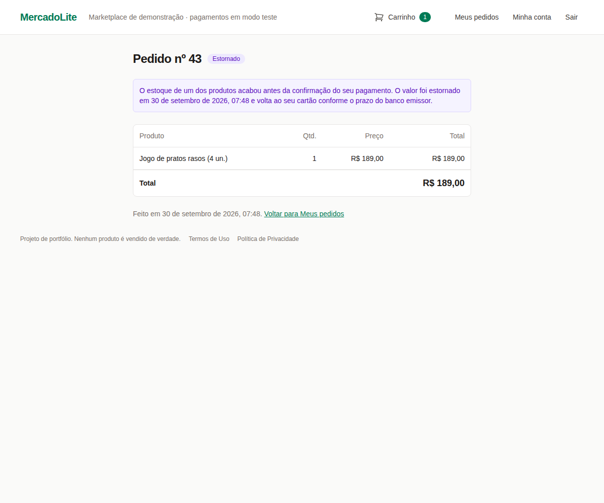
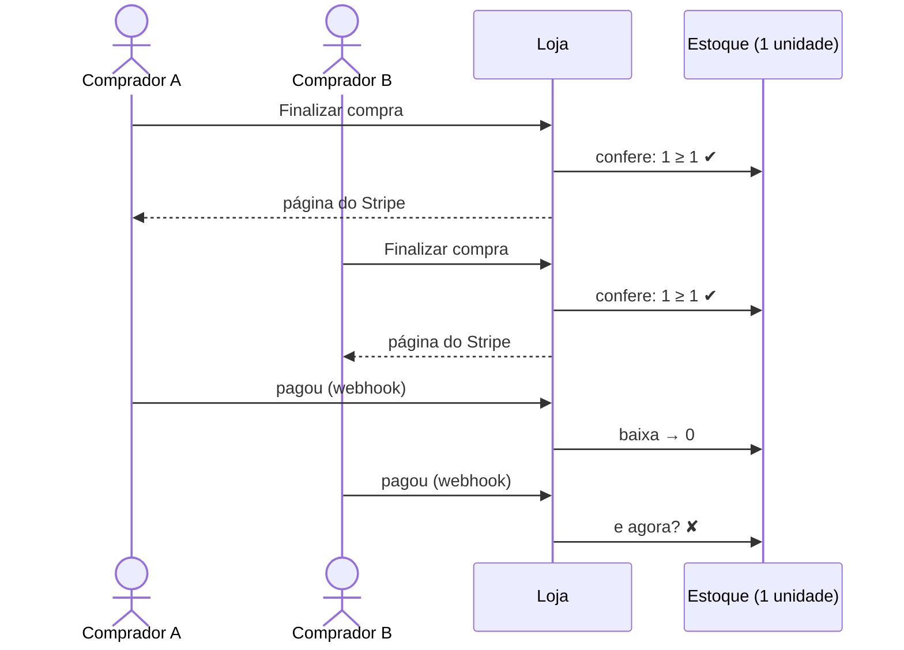
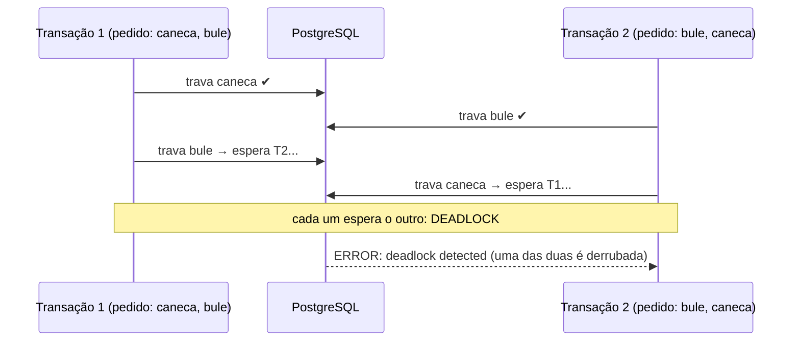
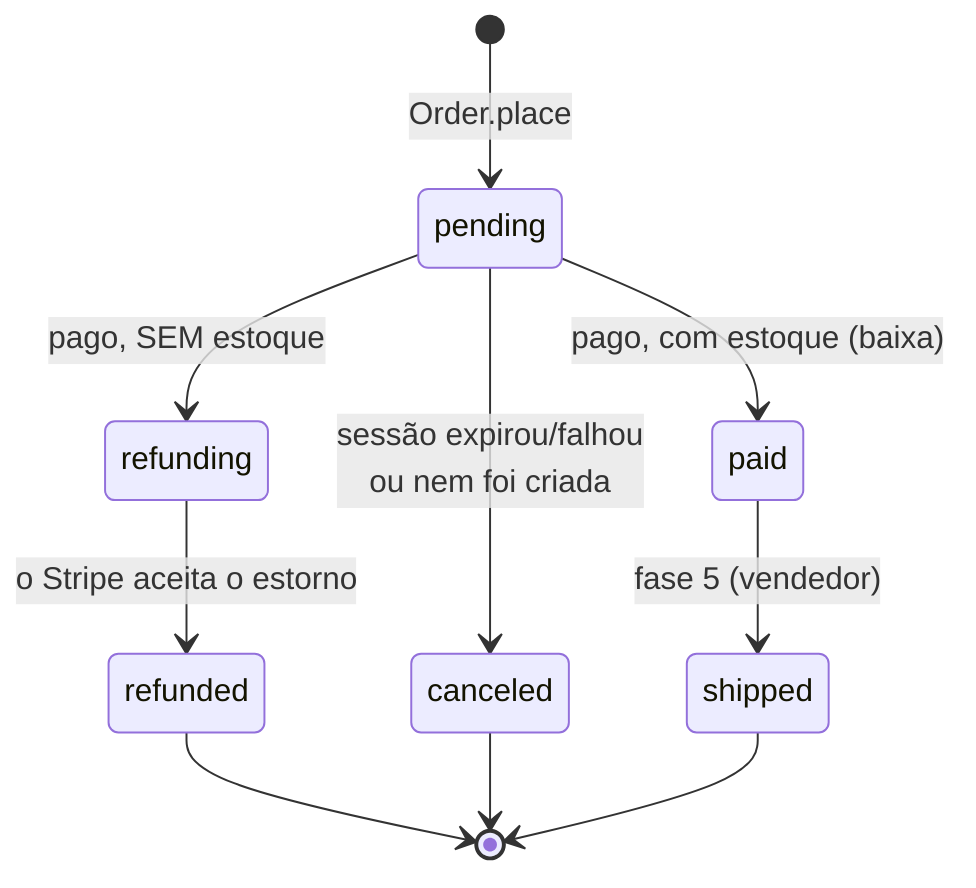
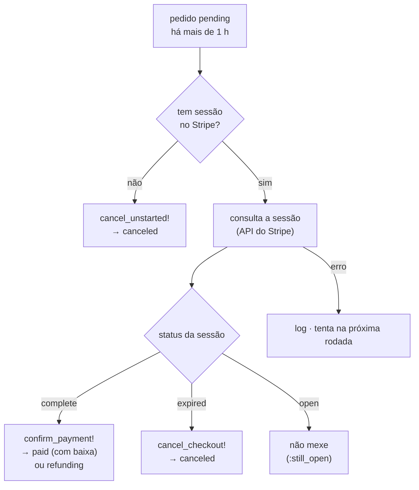
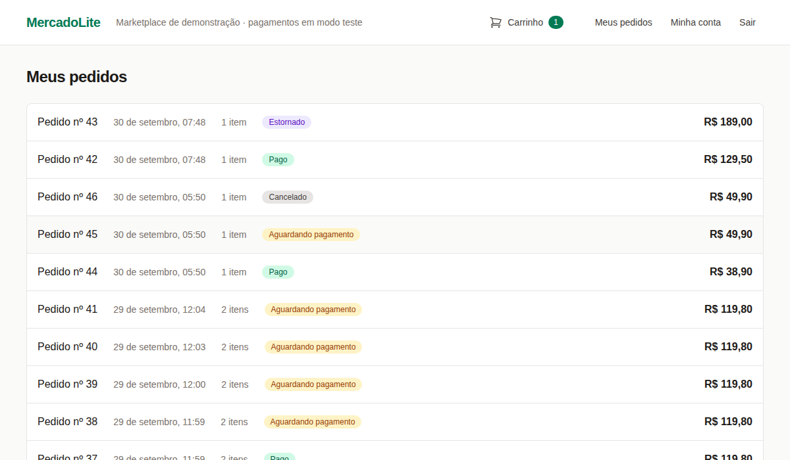

# MercadoLite — Fase 4: pedidos e estoque

> **Objetivo:** dar baixa no estoque quando o pagamento é confirmado, sem nunca vender a
> mesma unidade duas vezes; devolver o dinheiro automaticamente quando o estoque acabou entre
> o carrinho e o pagamento; e não deixar nenhum pedido esquecido quando um webhook se perde.
>
> **Pré-requisito:** [Fase 3b — o checkout com Stripe](fase-3b-checkout.md).

**O que você vai aprender:** condição de corrida no estoque (*check-then-act* e
**atualização perdida**, medidas) · `SELECT ... FOR UPDATE` em várias linhas · **deadlock** e
a ordem das travas (o mesmo problema dos mutexes em C) · "tudo ou nada" numa transação e a
armadilha do `ActiveRecord::Rollback` aninhado · o `UPDATE` condicional como alternativa ·
**estorno** com chave de idempotência · jobs: fila, depois do COMMIT, novas tentativas com
espera crescente · **conciliação**: consultar antes de agir · *head-of-line blocking*, achado
no teste real · teste de concorrência com duas conexões · a fase inteira conferida numa
sandbox do Stripe.



**Sumário**
1. [O que foi construído](#1-o-que-foi-construído)
2. [Por que conferir no carrinho não basta](#2-por-que-conferir-no-carrinho-não-basta)
3. [A atualização perdida, medida](#3-a-atualização-perdida-medida)
4. [`SELECT ... FOR UPDATE` no estoque](#4-select--for-update-no-estoque)
5. [Deadlock e a ordem das travas](#5-deadlock-e-a-ordem-das-travas)
6. [Alternativa: o `UPDATE` condicional](#6-alternativa-o-update-condicional)
7. [A confirmação agora dá baixa](#7-a-confirmação-agora-dá-baixa)
8. [Sem estoque: o estorno automático](#8-sem-estoque-o-estorno-automático)
9. [Jobs: fora da requisição, depois do COMMIT, com novas tentativas](#9-jobs-fora-da-requisição-depois-do-commit-com-novas-tentativas)
10. [A conciliação: consultar antes de agir](#10-a-conciliação-consultar-antes-de-agir)
11. [O pedido órfão](#11-o-pedido-órfão)
12. [Os testes da fase](#12-os-testes-da-fase)
13. [O teste de verdade, na sandbox do Stripe](#13-o-teste-de-verdade-na-sandbox-do-stripe)
14. [O que os testes e o navegador nos ensinaram](#14-o-que-os-testes-e-o-navegador-nos-ensinaram)
15. [Mão na massa](#15-mão-na-massa)
16. [Decisões de design (bom assunto para entrevista)](#16-decisões-de-design-bom-assunto-para-entrevista)
17. [Glossário](#17-glossário)
18. [Exercícios](#18-exercícios)
19. [Próxima fase](#19-próxima-fase)

---

## 1. O que foi construído

- **Baixa de estoque na confirmação do pagamento**, na mesma transação que marca o pedido
  como pago, com as linhas de estoque travadas (`SELECT ... FOR UPDATE`) sempre na mesma
  ordem. "Tudo ou nada": faltou um produto, nenhum é baixado.
- **Dois status novos:** `refunding` ("Estorno em andamento") e `refunded` ("Estornado"). Se o
  estoque acabou entre o checkout e o pagamento, o pedido não é atendido e o dinheiro volta.
- **Estorno automático** (`RefundOrderJob` + `StripeRefunds`): pela API de estornos do Stripe,
  com chave de idempotência e novas tentativas com espera crescente.
- **Conciliação** (`ReconcileOrdersJob`, a cada 15 minutos): confere com o Stripe os pedidos
  que ficaram pendentes (webhook perdido) e os estornos que ficaram parados.
- **Correção:** sem a chave do Stripe configurada, cada clique em "Finalizar compra" criava
  um pedido pendente que nunca ia a lugar nenhum.

Arquivos novos ou mudados:

| Arquivo | O que faz |
|---|---|
| `app/models/inventory.rb` | `Inventory.withdraw`: a baixa "tudo ou nada", com as travas ordenadas. |
| `app/models/order.rb` | `confirm_payment!` dá baixa (ou vai para estorno); `apply_checkout_session!`, `cancel_unstarted!`, `record_refund!`. |
| `app/models/stripe_refunds.rb` | A chamada à API de estornos (PORO, como o `StripeCheckout`). |
| `app/jobs/refund_order_job.rb` | O estorno, fora da requisição, com novas tentativas. |
| `app/jobs/reconcile_orders_job.rb` | A conciliação. |
| `config/recurring.yml` | Agenda a conciliação a cada 15 minutos (produção). |
| `db/migrate/20260930120000_add_refunds_to_orders.rb` | Status novos, `refunded_at`, `stripe_refund_id` e as restrições. |

---

## 2. Por que conferir no carrinho não basta

O carrinho e o checkout **conferem** o estoque (fases 2 e 3b), mas conferir não é garantir.
Entre a conferência e o pagamento passam minutos, e outro comprador pode levar a última
unidade nesse meio tempo:



É o problema clássico do **TOCTOU** (*time of check to time of use*): em C, é como fazer
`if (access(path, W_OK) == 0)` e só depois `open(path, O_WRONLY)`. Entre as duas chamadas, o
mundo pode mudar. A resposta certa não é "conferir melhor", e sim fazer a **decisão final** num
lugar onde ninguém mais mexe ao mesmo tempo: a transação da confirmação do pagamento, com o
estoque travado.

**Reservar no checkout, ou baixar no pagamento?** São os dois desenhos comuns:

| | Reservar no checkout | Baixar no pagamento (o nosso) |
|---|---|---|
| Quando desconta | ao abrir a página de pagamento | quando o Stripe confirma |
| Se o comprador desiste | devolve a reserva quando a sessão expira | nada a devolver |
| Corrida pela última unidade | não acontece | acontece, e vira **estorno** |
| Abuso | alguém abre 100 checkouts e "sequestra" o estoque por 30 min | nenhum |

Escolhemos baixar no pagamento (a decisão já estava no plano desde a fase 2). O preço é o
estorno ocasional, que precisa ser automático, idempotente e visível para o comprador. As
seções 7 a 10 cuidam disso.

---

## 3. A atualização perdida, medida

A primeira ideia ingênua: ler o estoque, conferir e gravar o novo valor, sem trava. Fizemos o
experimento com duas conexões reais, as duas vendendo a mesma última unidade:

```ruby
# conexão 1 (uma thread)                       # conexão 2
inv = Inventory.find_by!(product_id: a.id)     # lê 1
                                               inv = Inventory.find_by!(product_id: a.id)  # também lê 1
inv.update!(quantity: inv.quantity - 1)        # grava 0
                                               inv.update!(quantity: inv.quantity - 1)    # grava 0 de novo
```

Resultado (conferido): `[:vendeu, :vendeu, 0]`. **Duas vendas e o estoque em 0**, e não em
-1. Cada conexão calculou `1 − 1 = 0` a partir da leitura antiga e gravou esse valor. A
segunda gravação apagou a primeira: é a **atualização perdida** (*lost update*).

Repare que o `CHECK (quantity >= 0)` da fase 1 **não pegou nada**: o valor gravado nunca foi
negativo. Restrições de integridade protegem cada linha, mas não enxergam que duas transações
decidiram a mesma coisa com base no mesmo dado velho.

No PostgreSQL (nível de isolamento padrão, *READ COMMITTED*), uma leitura comum **não espera**
ninguém: ela vê a última versão já confirmada da linha. Por isso as duas leram 1.

---

## 4. `SELECT ... FOR UPDATE` no estoque

```ruby
# app/models/inventory.rb
def self.withdraw(quantities)
  transaction do
    stock = where(product_id: quantities.keys).order(:product_id).lock.to_a
    enough = stock.size == quantities.size &&
             stock.all? { |inventory| inventory.quantity >= quantities.fetch(inventory.product_id) }
    stock.each { |inventory| inventory.update!(quantity: inventory.quantity - quantities.fetch(inventory.product_id)) } if enough
    enough
  end
end
```

O SQL gerado (conferido):

```sql
SELECT "inventories".* FROM "inventories"
WHERE "inventories"."product_id" IN ($1, $2)
ORDER BY "inventories"."product_id" ASC
FOR UPDATE
```

- `.lock` acrescenta o `FOR UPDATE`: a leitura **trava** as linhas até o fim da transação.
  Outra transação que tente travar as mesmas linhas **espera**, e quando continua, lê o valor
  já atualizado. É um mutex, só que no banco e por linha.
- **Tudo ou nada:** primeiro confere **todos** os produtos, depois baixa. Faltou um, a função
  devolve `false` sem ter tocado em nada.
- `stock.size == quantities.size`: um produto sem linha de estoque conta como "sem estoque",
  e não como "passou sem conferir".
- O `transaction do` dentro do método garante que a trava vale mesmo se alguém chamar
  `withdraw` fora de uma transação. Sem transação, o `FOR UPDATE` trava e solta na mesma hora.

Com a trava, repetimos o experimento da seção 3 com os pedidos de verdade, no teste
`"a última unidade"` (seção 12): um comprador leva a unidade, o outro vai para estorno, e o
estoque termina em 0. **Sem o `.lock`, o mesmo teste dá `[:paid, :paid]`**: duas vendas da
mesma unidade.

---

## 5. Deadlock e a ordem das travas

Um pedido pode ter vários produtos. Imagine dois pedidos com os mesmos dois produtos, cada um
travando numa ordem:



Fizemos esse experimento de propósito (duas conexões travando `a` e `b` em ordem oposta): o
PostgreSQL percebeu o ciclo e derrubou uma das transações com `ActiveRecord::Deadlocked`; a
outra terminou normalmente (conferido: `[ActiveRecord::Deadlocked, :ok]`).

É exatamente o problema de dois mutexes em C:

```c
/* thread 1 */                    /* thread 2 */
pthread_mutex_lock(&caneca);      pthread_mutex_lock(&bule);
pthread_mutex_lock(&bule);        pthread_mutex_lock(&caneca);   /* deadlock */
```

E a solução é a mesma que se ensina em sistemas operacionais: **todo mundo trava na mesma
ordem global**. Com `ORDER BY product_id`, as duas transações tentam primeiro a caneca (a de
menor id); a segunda espera a primeira terminar, e o ciclo não se forma.

O teste `"trava as linhas com FOR UPDATE, em ordem de product_id"` confere o SQL. Sem o
`.order(:product_id)`, é o único teste da suíte que falha (conferido): um deadlock depende de
tempo e da ordem dos produtos, e um teste de comportamento dificilmente o provocaria de forma
confiável. Por isso o teste confere a **causa** (a ordem), e não o sintoma.

---

## 6. Alternativa: o `UPDATE` condicional

Outro jeito de evitar a atualização perdida é deixar o próprio `UPDATE` conferir:

```ruby
Inventory.where(product_id: a.id).where("quantity >= ?", 1).update_all("quantity = quantity - 1")
# => 1   (uma linha alterada: vendeu)
Inventory.where(product_id: a.id).where("quantity >= ?", 1).update_all("quantity = quantity - 1")
# => 0   (nenhuma linha: não havia estoque)
```

Conferido: `1`, depois `0`, com o estoque em 0. O `quantity = quantity - 1` é calculado **pelo
banco**, no momento do `UPDATE`, e o `WHERE quantity >= 1` é reavaliado depois de esperar a
trava da linha. Não há leitura velha no Ruby.

Por que não usamos? Para vários produtos, o "tudo ou nada" fica mais delicado (exercício 6):
se o segundo `UPDATE` não alterar nada, é preciso desfazer o primeiro. Com `FOR UPDATE`, a
função confere tudo antes de mudar qualquer coisa, e o código fica mais fácil de ler. As duas
formas são corretas; a clareza decidiu.

---

## 7. A confirmação agora dá baixa

```ruby
# app/models/order.rb (resumido)
def confirm_payment!(session)
  result = nil
  with_lock do
    result = if !pending?
      :already_processed
    else
      payment_problem(session) || settle_payment(session)
    end
  end

  case result
  when :paid then remove_purchased_items_from_cart
  when :out_of_stock
    ActiveRecord.after_all_transactions_commit { RefundOrderJob.perform_later(self) }
  end
  result
end

def settle_payment(session)
  in_stock = Inventory.withdraw(items.to_h { |item| [ item.product_id, item.quantity ] })
  update!(status: in_stock ? "paid" : "refunding", paid_at: Time.current,
          stripe_payment_intent_id: session.payment_intent)
  in_stock ? :paid : :out_of_stock
end
```

- A baixa acontece **dentro** do `with_lock` do pedido, na mesma transação que muda o status.
  Então a idempotência da fase 3b protege o estoque também: a segunda confirmação do mesmo
  pedido encontra `paid` e devolve `:already_processed` **antes** de chegar à baixa. O teste
  "é idempotente: a segunda confirmação não muda nada (nem baixa o estoque de novo)" confere.
- `items.to_h { |item| [chave, valor] }` monta um `Hash` a partir de uma lista, como um laço
  que preenche um `std::map` em C++.
- Sem estoque, o pedido **foi pago** (`paid_at` e o id do pagamento ficam gravados), mas vai
  para `refunding`. O carrinho não é mexido.
- `webhook` com `:out_of_stock` é registrado com nível `warn` no log: o estorno é automático,
  mas é bom saber que aconteceu.

O ciclo de vida completo:



No banco, as regras acompanham (migration `AddRefundsToOrders`):

```ruby
add_check_constraint :orders, "status IN ('pending', 'paid', 'shipped', 'canceled', 'refunding', 'refunded')"
add_check_constraint :orders, "status NOT IN ('paid', 'shipped', 'refunding', 'refunded') OR paid_at IS NOT NULL"
add_check_constraint :orders, "status <> 'refunded' OR (refunded_at IS NOT NULL AND stripe_refund_id IS NOT NULL)"
```

"Todo pedido que chegou a ser pago tem data de pagamento" e "todo estornado tem data e id do
estorno": nenhum código, nem um `update_column` distraído, cria um estado impossível. A
migration foi conferida nos dois sentidos (`db:migrate` e `db:rollback`).

---

## 8. Sem estoque: o estorno automático

### A chamada à API

```ruby
# app/models/stripe_refunds.rb
def refund_in_full(order)
  @client.v1.refunds.create(
    { payment_intent: order.stripe_payment_intent_id, metadata: { order_id: order.id.to_s } },
    { idempotency_key: "mercadolite-order-#{order.id}-refund" }
  )
end
```

- `payment_intent`: o pagamento a estornar (o `pi_...` gravado na confirmação, fase 3b).
- **Sem `amount`**: o Stripe estorna o valor inteiro que foi pago. Menos um número para errar.
- **Chave de idempotência por pedido**, como na criação da sessão: se o estorno for pedido
  duas vezes (uma nova tentativa do job, a conciliação), o Stripe devolve o **mesmo** estorno,
  e não um segundo (comportamento documentado pelo Stripe). Um teste confere que a chave vai
  no cabeçalho `Idempotency-Key`; tirando a chave, ele falha.

### Registrar o estorno

```ruby
REFUND_ACCEPTED = %w[pending succeeded].freeze

def record_refund!(refund)
  return :refund_not_accepted unless REFUND_ACCEPTED.include?(refund.status)

  result = :already_processed
  with_lock do
    if refunding?
      update!(status: "refunded", refunded_at: Time.current, stripe_refund_id: refund.id)
      result = :refunded
    end
  end
  result
end
```

Segundo a documentação do Stripe, um estorno tem status `pending` (o dinheiro está a caminho
do cartão), `succeeded`, `failed`, `canceled` ou `requires_action`. No teste real, o estorno
do cartão de teste voltou `succeeded` na hora. Só os dois primeiros devolveram (ou estão
devolvendo) o dinheiro. Nos outros, o pedido **continua** em `refunding`, o log recebe um
`error`, e a conciliação tenta de novo. Nunca mostramos "Estornado" para um estorno que não
aconteceu.

### A permissão da chave restrita

A chave restrita (fase 3b) agora precisa de mais uma permissão: **Refunds = Gravação
(Write)**, além de **Checkout Sessions = Gravação**. Sem ela, o Stripe responde 403, a gem
levanta `Stripe::PermissionError` (conferido num teste) e o job falha sem novas tentativas:
permissão não se resolve esperando.

---

## 9. Jobs: fora da requisição, depois do COMMIT, com novas tentativas

### Por que um job

O estorno é uma chamada de rede a um serviço externo. Se ela rodasse dentro do webhook:
- a transação do pedido (com as travas do estoque!) ficaria aberta esperando o Stripe;
- uma falha de rede faria o webhook responder erro e o Stripe reenviar o evento inteiro.

Por isso a confirmação só **enfileira** o `RefundOrderJob`, e ele roda depois, fora da
requisição. É o **Active Job**: uma interface única para filas, com um "adaptador" diferente
por ambiente (conferido):

| Ambiente | Adaptador | O que acontece |
|---|---|---|
| teste | `TestAdapter` | o job só é **registrado**; o teste confere com `have_enqueued_job` |
| desenvolvimento | `AsyncAdapter` | roda numa thread do próprio servidor |
| produção | Solid Queue | fica numa tabela do banco `queue` e um *worker* executa |

### Depois do COMMIT

```ruby
ActiveRecord.after_all_transactions_commit { RefundOrderJob.perform_later(self) }
```

Em produção, a fila fica em **outro banco** (`config.solid_queue.connects_to = { database: {
writing: :queue } }`), fora da transação do pedido. Se o job fosse enfileirado na hora, um
worker poderia pegá-lo **antes** do COMMIT, ler o pedido ainda `pending` e não fazer nada. E
se a transação fosse desfeita, o estorno seria pedido para um pagamento que o sistema nem
registrou.

O teste "não pede o estorno se a transação for desfeita" confirma a confirmação dentro de uma
transação que termina em `ActiveRecord::Rollback`: nenhum job e o pedido de volta a `pending`.
Trocando por `RefundOrderJob.perform_later(self)` direto, esse teste falha (conferido). É a
mesma lição dos e-mails da fase 3a.

### Novas tentativas com espera crescente

```ruby
retry_on Stripe::APIConnectionError, Stripe::RateLimitError, Stripe::APIError,
         wait: :polynomially_longer, attempts: 5
```

- **Quais erros:** só os **passageiros** (rede, limite de requisições, instabilidade do
  Stripe). Os outros (sem permissão, pagamento já estornado) não mudam esperando: o job falha
  e o erro vai para o log.
- **Quantas vezes:** `attempts: 5` conta a primeira execução. Conferido com o Stripe sempre
  respondendo 500: **5 chamadas** à API, e o pedido continua em `refunding`.
- **Quanto esperar:** `:polynomially_longer` espera `n⁴ + 2` segundos (mais um acaso, o
  *jitter*). Sem o acaso, conferido: **3 s, 18 s, 83 s e 258 s**, cerca de 6 minutos no total.
  Esperar cada vez mais dá tempo para o serviço voltar e não martela quem já está com
  problema (*exponential backoff*, na versão polinomial).
- Repetir é seguro por causa da chave de idempotência: a 5ª tentativa recebe o mesmo estorno
  da 1ª, se a 1ª tiver chegado ao Stripe e só a resposta tiver se perdido.

E se as 5 falharem? A conciliação (próxima seção) pede o estorno de novo a cada 15 minutos,
para todo pedido em `refunding` há mais de 1 hora. Dinheiro de comprador não fica esquecido.

---

## 10. A conciliação: consultar antes de agir

### O problema

O webhook pode não chegar: em desenvolvimento, basta o `stripe listen` estar desligado; em
produção, uma queda do servidor na hora errada. E o comprador pode fechar a aba antes de
voltar à loja. O pedido fica "Aguardando pagamento" com o dinheiro **já cobrado**. Foi o que
fizemos no teste real (seção 13, caso C).

### A tentação

"Um job que cancela todo pedido pendente há mais de 1 hora." É **errado**, e perigoso: um
pedido pago cujo webhook atrasou seria cancelado. Quando o webhook finalmente chegasse,
encontraria o pedido fora de `pending` e devolveria `:already_processed`. O comprador pagou e
vê "Cancelado".

Implementamos essa versão ingênua de propósito e rodamos os testes: falham 3, entre eles
"pedido pago cujo webhook não chegou: confirma, com baixa de estoque" (conferido).

### O jeito certo

```ruby
# app/jobs/reconcile_orders_job.rb (resumido)
STALE_AFTER = 1.hour
GIVE_UP_AFTER = 3.days
BATCH_SIZE = 100

def perform
  return {} unless StripeCheckout.configured?

  results = Hash.new(0)
  checkout = StripeCheckout.new
  Order.pending.where(created_at: GIVE_UP_AFTER.ago...STALE_AFTER.ago)
       .order(created_at: :desc).limit(BATCH_SIZE).each do |order|
    results[reconcile(order, checkout)] += 1
  end
  Order.refunding.where(paid_at: ...STALE_AFTER.ago).order(:id).limit(BATCH_SIZE).each do |order|
    RefundOrderJob.perform_later(order)
    results[:refund_retried] += 1
  end
  results.to_h
end

def reconcile(order, checkout)
  return order.cancel_unstarted! if order.stripe_checkout_session_id.nil?

  checkout.sync(order)   # consulta a sessão e aplica: paga → confirma; expirada → cancela
rescue Stripe::StripeError => e
  Rails.logger.warn("[conciliação] pedido #{order.id}: #{e.class}")
  :stripe_error
end
```



- **Só depois de 1 hora:** a página de pagamento expira em 30 minutos, então o Stripe já sabe
  como a sessão terminou; e até lá o webhook normalmente já chegou.
- A decisão é **do Stripe**, e não do relógio. A mesma `Order#apply_checkout_session!` serve
  à volta do comprador e à conciliação: uma regra, um lugar.
- `...` é um `Range` sem começo ou com fim exclusivo: `created_at: a...b` vira
  `created_at >= a AND created_at < b` no SQL.
- `Hash.new(0)` cria um hash cujo valor padrão é 0, e o `results[x] += 1` conta sem precisar
  inicializar cada chave (como um `std::map<Key, int>` de C++, que nasce com 0).

A agenda fica no `config/recurring.yml` (produção): `schedule: every 15 minutes`, que o
Solid Queue traduz (pela gem Fugit) para o cron `0,15,30,45 * * * *` (conferido).

### O achado do teste real: *head-of-line blocking*

A primeira versão pegava os 100 pendentes **mais antigos** (`order(:id)`). No teste com o
Stripe de verdade, havia no banco 6 pedidos da fase 3b cujas sessões eram de **outra conta**
do Stripe (a sandbox anterior): cada consulta dava `Stripe::InvalidRequestError` (a sessão não
existe nesta conta) e eles continuavam pendentes. Com 100 pedidos assim, o lote seria sempre
o mesmo, e os pedidos **novos** nunca seriam conciliados. É o *head-of-line blocking*: o
primeiro da fila, travado, segura todos os de trás (como um caminhão quebrado numa pista
única).

Duas correções, cada uma com um teste que foi visto falhando antes:
1. **Do mais novo para o mais antigo** (`order(created_at: :desc)`): os problemáticos vão
   para o fim da fila.
2. **Desistir depois de 3 dias** (`GIVE_UP_AFTER`): uma sessão vive no máximo 24 horas no
   Stripe, então depois disso a resposta não muda mais. O que continua pendente é um erro que
   se repete e precisa de uma pessoa para olhar.

---

## 11. O pedido órfão

Relendo o `CheckoutsController#create` para esta fase, achamos um bug da 3b: o pedido era
criado **antes** de conferir se a chave do Stripe estava configurada. Sem a chave, cada clique
em "Finalizar compra" deixava um pedido pendente que nunca iria ao Stripe.

O teste veio primeiro e falhou: `expected Order.count not to have changed, but did change
from 0 to 1`. A correção:

```ruby
def create
  unless StripeCheckout.configured?
    skip_authorization # nenhum pedido é criado ou lido: não há o que autorizar
    return redirect_to(cart_path, alert: t(".not_configured"))
  end

  order = Order.place(current_cart, current_user)
  authorize order
  ...
```

O `skip_authorization` é necessário por causa da rede de segurança do Pundit
(`verify_authorized`, fase 3b): saindo antes do `authorize`, o `after_action` levantaria erro.
É uma forma explícita de dizer "aqui não há o que autorizar", e não um esquecimento.

No `rescue` da falha da API, o `update_columns` (que pulava validações) virou
`order.cancel_unstarted!`: o mesmo método que a conciliação usa para pedidos sem sessão.

---

## 12. Os testes da fase

`bundle exec rspec`: **385 examples, 0 failures, 1 pending** (40 testes novos).

- `spec/models/inventory_spec.rb`: `withdraw` baixa tudo, "tudo ou nada", produto sem estoque
  e o SQL com `ORDER BY ... FOR UPDATE`.
- `spec/models/order_spec.rb`: baixa na confirmação, idempotência do estoque, sem estoque →
  `refunding` + job, nada de job se a transação for desfeita, dois produtos com falta só do
  último, carrinho intacto, `apply_checkout_session!`, `cancel_unstarted!`, `record_refund!` e
  as restrições novas do banco.
- `spec/models/order_concurrency_spec.rb`: **a última unidade**, com duas conexões.
- `spec/jobs/refund_order_job_spec.rb` e `reconcile_orders_job_spec.rb`: com o WebMock no
  lugar do Stripe.
- `spec/requests/`: o webhook dá baixa e trata a falta de estoque; a volta do comprador mostra
  "Estorno em andamento"; sem a chave do Stripe, nenhum pedido é criado.

### A última unidade, com duas conexões

```ruby
it "um comprador leva a unidade; o outro recebe o estorno, e o estoque não fica negativo" do
  withdrawn = Queue.new
  other = Thread.new do
    ActiveRecord::Base.connection_pool.with_connection do
      Order.transaction do
        result = first.confirm_payment!(session_for(first))   # baixa a última unidade
        withdrawn << true
        sleep 0.3                                             # e segura o COMMIT
        result
      end
    end
  end
  withdrawn.pop

  second_result = second.confirm_payment!(session_for(second)) # espera a trava do estoque

  expect([ other.value, second_result ]).to eq([ :paid, :out_of_stock ])
  expect(product.inventory.reload.quantity).to eq(0)
end
```

`Queue` (da biblioteca padrão do Ruby) é uma fila segura entre threads: o `pop` bloqueia até
alguém fazer `push`, como um semáforo. Ela garante que a segunda confirmação só começa depois
que a primeira travou o estoque. `other.value` espera a thread terminar e devolve o valor do
bloco, como um `pthread_join` que devolve o resultado.

### Cada proteção foi vista falhando

| Proteção removida | Testes que falham |
|---|---|
| `.lock` no `Inventory.withdraw` | "a última unidade" (`[:paid, :paid]`) |
| `.order(:product_id)` | "trava as linhas com FOR UPDATE, em ordem de product_id" |
| baixa na confirmação (`in_stock = true`) | 4 testes de `confirm_payment!` |
| `after_all_transactions_commit` | "não pede o estorno se a transação for desfeita" |
| conciliação consultando o Stripe (versão ingênua) | 3, entre eles "pedido pago cujo webhook não chegou" |
| janela de 1 hora | "pedido recente fica para o webhook: nenhuma consulta" |
| `rescue` na conciliação | "um erro do Stripe num pedido não impede os outros" |
| ordem do mais novo e prazo de 3 dias | "um pedido que sempre dá erro não impede..." e "desiste de pedidos pendentes há mais de 3 dias" |
| chave de idempotência do estorno | "estorna o pagamento inteiro do pedido, com chave de idempotência..." |
| `retry_on` | "falha passageira do Stripe: agenda uma nova tentativa" |
| `return unless order.refunding?` no job | "não chama o Stripe para pedido que não está em estorno" |
| conferência do status do estorno | 2: o do job e o do `record_refund!` |
| sessão conferida no `cancel_unstarted!` | "não cancela pedido que já tem sessão no Stripe" |
| configuração conferida antes de criar o pedido | "sem a chave do Stripe configurada, avisa e não cria pedido" |

---

## 13. O teste de verdade, na sandbox do Stripe

Com uma sandbox nova (criada pela Stripe CLI, com chave restrita `rkcs_test_`, apagada no fim)
e o Chromium controlado por um script:

**A. Compra normal.** 1 × "Bule para café" → pedido nº 42 **Pago**, e o estoque do bule foi
de **5 para 4**.

**B. A última unidade foi levada no meio do caminho.** Com o comprador já na página de
pagamento do Stripe (cartão preenchido), o script zerou o estoque do "Jogo de pratos rasos"
(simulando outro comprador). Então ele pagou:

1. O webhook `checkout.session.completed` chegou **2 segundos antes** da volta do comprador,
   e o log registrou `[stripe] checkout.session.completed evt_...: out_of_stock`.
2. O `RefundOrderJob` rodou em **1,4 s**: `[estorno] pedido 43: refunded (succeeded)`.
3. A volta do comprador já encontrou o pedido nº 43 **Estornado** (a imagem do topo).
4. Do lado do Stripe, pela CLI: `{'object': 'refund', 'amount': 18900, 'currency': 'brl',
   'status': 'succeeded'}`, com `metadata: {'order_id': '43'}`.
5. O estoque ficou em **0**, e não em -1.

**C. O webhook se perdeu.** Com o `stripe listen` desligado e a volta do comprador bloqueada
pelo script (como quem fecha a aba), o pagamento do pedido nº 44 foi aprovado, mas o pedido
ficou **pendente** e o estoque do café intocado (40): dinheiro cobrado, pedido parado.

**D. A conciliação.** Envelhecemos os pedidos em 2 horas e rodamos `ReconcileOrdersJob`.
Havia também o nº 45, cuja sessão continuava aberta, e o nº 46, cuja sessão expiramos pela
CLI:

```
{stripe_error: 6, paid: 1, still_open: 1, canceled: 1}
```

- nº 44 → **Pago**, e o café foi de **40 para 39**;
- nº 45 → não mexeu (sessão aberta);
- nº 46 → **Cancelado**;
- os 6 `stripe_error` eram os pedidos da fase 3b com sessões de outra conta: o achado da
  seção 10.



Na loja: nenhum erro de JavaScript, de CSP ou de HTTP. No log: os argumentos do job aparecem só
como `gid://mercadolite/Order/43` (sem dado pessoal), e os 4 webhooks recebidos saíram com
`"data" => "[FILTERED]"` (a correção da fase 3b funcionando).

---

## 14. O que os testes e o navegador nos ensinaram

1. **A atualização perdida não viola nenhuma restrição.** O estoque terminou em 0, e não em
   -1, com duas vendas da mesma unidade. O `CHECK` protege valores, não decisões.
2. **Deadlock é real e o PostgreSQL o detecta**, derrubando uma das transações. A prevenção é
   a mesma dos mutexes: ordem global de travamento.
3. **`ActiveRecord::Rollback` dentro de uma transação aninhada é engolido em silêncio.** Ao
   conferir a resposta do exercício 6 (o `UPDATE` condicional), a primeira versão baixou 2
   canecas de um pedido que foi estornado (`[8, 0]` em vez de `[10, 0]`). O
   `transaction(requires_new: true)` (um *savepoint*) resolve. Virou um teste permanente:
   "pedido com dois produtos e estoque só do primeiro: não baixa nenhum".
4. **O teste de "tudo ou nada" precisa que o produto que falta seja o ÚLTIMO a ser
   conferido.** A primeira versão desse teste passava até com o código errado, porque o
   produto sem estoque vinha primeiro e nada chegava a ser baixado.
5. **Um `let` preguiçoso criado dentro de uma transação desfeita some com ela.** O teste do
   rollback falhou na primeira versão porque o próprio pedido nascia dentro da transação.
6. **Head-of-line blocking na conciliação** (seção 10), achado com o Stripe de verdade.
7. **Bug antigo achado relendo o código:** o pedido órfão sem a chave do Stripe (seção 11).
8. **A chave restrita criada pela CLI já tinha permissão de estorno**: o estorno real
   funcionou sem ajuste. A sua chave, criada no painel, precisa de "Refunds = Write".
9. **Cuidado ao desfazer experimentos:** um `git checkout` num arquivo com mudanças ainda não
   commitadas volta à versão do último commit e apaga o trabalho. Nos experimentos desta fase,
   cada arquivo alterado de propósito era restaurado de uma cópia (`cp`). Numa das vezes,
   usamos `git checkout`, perdemos o `Inventory.withdraw` novo e o recuperamos da cópia.

---

## 15. Mão na massa

No Ubuntu (WSL), dentro de `~/dev/mercadolite`:

```bash
git pull
bin/rails db:migrate          # status de estorno nos pedidos
bundle exec rspec             # esperado: 385 examples, 0 failures, 1 pending
```

**A chave:** no painel do Stripe (sandbox), edite a sua chave restrita e acrescente **Refunds
→ Gravação (Write)**. Ela continua só no `.env`.

**Reproduzir o estorno** (com o `bin/dev` e o `stripe listen` rodando, como na fase 3b):

1. Ponha 1 unidade de um produto no carrinho e clique em **Finalizar compra**.
2. Com a página do Stripe aberta, num terceiro terminal, zere o estoque desse produto (troque
   o `1` pelo id do produto, que aparece na URL da página dele):

   ```bash
   bin/rails runner 'Inventory.find_by!(product_id: 1).update!(quantity: 0)'
   ```

3. Pague com `4242 4242 4242 4242`. O pedido aparece como **Estorno em andamento** e, em
   segundos, **Estornado**. No terminal do `bin/dev`, procure `[estorno] pedido`.

**Rodar a conciliação à mão** (em desenvolvimento não há agenda: o Solid Queue só roda em
produção):

```bash
bin/rails runner 'p ReconcileOrdersJob.perform_now'
```

**No console** (`bin/rails console`):

```ruby
Inventory.find_by!(product_id: 1).quantity
Order.refunded.last&.stripe_refund_id          # re_...
Order.group(:status).count
Inventory.where(product_id: [1, 2]).order(:product_id).lock.to_sql   # o SQL da trava
```

---

## 16. Decisões de design (bom assunto para entrevista)

- **Baixar no pagamento, e não reservar no checkout.** Sem "sequestro" de estoque; o preço é
  o estorno ocasional, automático.
- **A decisão final com a linha travada.** Conferir antes (carrinho, checkout) é só para a
  experiência do comprador; a garantia vem do `FOR UPDATE` na transação da confirmação.
- **Ordem global de travamento** (`product_id`) contra deadlock.
- **Conferir tudo antes de mudar qualquer coisa**, em vez de mudar e desfazer: evita a
  armadilha do rollback aninhado e deixa o "tudo ou nada" evidente no código.
- **Estorno fora da transação, por job, depois do COMMIT**, com chave de idempotência e
  novas tentativas só para erros passageiros.
- **Estado honesto:** "Estornado" só quando o Stripe aceitou o estorno; senão, "Estorno em
  andamento" e um erro no log.
- **Conciliação que pergunta ao Stripe**, do mais novo ao mais antigo, com prazo para
  desistir. Nunca "cancela por tempo".
- **Para refletir:** hoje, um pedido de 3 produtos em que falta 1 é estornado inteiro. Como
  seria um estorno **parcial** (entregar 2, devolver o valor de 1)? O que muda no banco, na
  tela e na chamada ao Stripe (dica: o parâmetro `amount`)?

---

## 17. Glossário

| Termo | O que é |
|---|---|
| **condição de corrida** | resultado que depende da ordem em que processos concorrentes rodam. |
| **TOCTOU** | *time of check to time of use*: conferir numa hora e usar em outra, com o mundo mudando no meio. |
| **atualização perdida** (*lost update*) | duas transações leem o mesmo valor e a segunda gravação apaga a primeira. |
| **READ COMMITTED** | nível de isolamento padrão do PostgreSQL: cada comando vê o que já foi confirmado. |
| **`SELECT ... FOR UPDATE`** | leitura que trava as linhas até o fim da transação. |
| **deadlock** | duas transações esperando uma pela outra em círculo. |
| **ordem global de travamento** | todos travam os recursos na mesma ordem; o círculo não se forma. |
| **`UPDATE` condicional** | `UPDATE ... SET x = x - n WHERE x >= n`: o banco confere e altera num passo só. |
| **tudo ou nada** | ou todas as mudanças acontecem, ou nenhuma (atomicidade). |
| **savepoint** | ponto de retorno dentro de uma transação (`requires_new: true`). |
| **estorno** (*refund*) | devolução do valor pago ao cartão do comprador. |
| **chave de idempotência** | faz o Stripe devolver a mesma resposta para a mesma chamada repetida. |
| **job** | tarefa executada fora da requisição, por uma fila. |
| **Active Job** | a interface de filas do Rails, com um adaptador por ambiente. |
| **Solid Queue** | a fila do Rails 8, guardada no banco de dados. |
| ***worker*** | processo que tira jobs da fila e os executa. |
| **`retry_on`** | declara quais erros fazem o job tentar de novo, e como esperar. |
| ***backoff*** | esperar cada vez mais entre as tentativas. |
| ***jitter*** | um acaso somado à espera, para as tentativas de muitos jobs não caírem juntas. |
| **conciliação** | conferir o próprio registro contra a fonte da verdade (aqui, o Stripe). |
| ***head-of-line blocking*** | o primeiro item da fila, travado, impede o avanço dos de trás. |
| **GlobalID** | a referência `gid://app/Modelo/id` com que o Active Job passa registros. |
| **`Queue`** | fila segura entre threads do Ruby; `pop` bloqueia até alguém fazer `push`. |

---

## 18. Exercícios

1. **Tire a trava.** Em `Inventory.withdraw`, troque `.order(:product_id).lock.to_a` por
   `.order(:product_id).to_a` e rode `bundle exec rspec spec/models/order_concurrency_spec.rb`.
   O que o teste da última unidade mostra? Por que o estoque não fica negativo?
2. **Tire a ordem.** Agora troque por `.lock.to_a` (sem o `order`). Quantos testes falham na
   suíte inteira? Por que o teste de concorrência não pega o problema?
3. **Enfileire na hora.** Em `Order#confirm_payment!`, troque
   `ActiveRecord.after_all_transactions_commit { RefundOrderJob.perform_later(self) }` por
   `RefundOrderJob.perform_later(self)`. O que falha? O que aconteceria em produção?
4. **A conciliação ingênua.** Troque o `checkout.sync(order)` do `ReconcileOrdersJob` por um
   cancelamento direto (`order.update!(status: "canceled", canceled_at: Time.current)` e
   `:canceled`). Quais testes falham? Descreva o prejuízo para um comprador real.
5. **Faça a conta.** Com `attempts: 5` e `:polynomially_longer`, quantas chamadas ao Stripe
   acontecem se ele ficar fora do ar, e quanto tempo passa entre a primeira e a última? E
   depois disso, quem tenta de novo, e quando?
6. **Desafio: o `UPDATE` condicional.** Reescreva `Inventory.withdraw` sem `FOR UPDATE`,
   usando um `update_all` condicional por produto e mantendo o "tudo ou nada". Rode a suíte.
   Cuidado com o `ActiveRecord::Rollback`.
7. **Por que 3 dias?** A conciliação desiste de pedidos pendentes há mais de 3 dias. O que
   aconteceria se ela nunca desistisse? E se desistisse depois de 2 horas?
8. **Para refletir: reservar no checkout.** Descreva o que precisaria mudar para reservar o
   estoque ao abrir a página de pagamento (e devolvê-lo quando a sessão expira). Que abuso
   isso abre, e como você o limitaria?

<details>
<summary>Respostas</summary>

1. Conferido: `expected: [:paid, :out_of_stock]`, `got: [:paid, :paid]`. As duas
   confirmações leem 1 (a primeira ainda não fez o COMMIT, e uma leitura sem trava não espera),
   as duas decidem que há estoque e as duas gravam `1 − 1 = 0`: a atualização perdida da
   seção 3. O estoque não fica negativo porque cada uma grava um **valor absoluto** calculado
   a partir da leitura velha; o banco nunca vê o -1 que a realidade tem.
2. Falha **1** teste na suíte inteira (conferido: `385 examples, 1 failure`): "trava as linhas
   com FOR UPDATE, em ordem de product_id". O teste de concorrência usa **um** produto só, e
   deadlock precisa de dois produtos travados em ordem oposta, com o tempo exato para as duas
   transações pegarem a primeira trava antes da segunda. Um teste assim seria instável. Por
   isso conferimos a causa (o `ORDER BY` no SQL).
3. Falha "não pede o estorno se a transação for desfeita" (conferido): o job é registrado
   mesmo com o rollback. Em produção, a fila fica em **outro banco** (`queue`), fora da
   transação do pedido: um worker poderia pegar o job antes do COMMIT, ler o pedido ainda
   `pending` e sair sem estornar (por causa do `return unless order.refunding?`). O dinheiro só
   voltaria quando a conciliação pedisse o estorno de novo, mais de 1 hora depois.
4. Falham **3** (conferido): "pedido pago cujo webhook não chegou: confirma, com baixa de
   estoque", "sessão ainda aberta: não mexe" e "um erro do Stripe num pedido não impede os
   outros". Na vida real: o comprador paga, o webhook se perde, e 1 hora depois o pedido vira
   "Cancelado", com o dinheiro cobrado e sem baixa de estoque. Quando o webhook atrasado
   chegar, `confirm_payment!` encontra o pedido fora de `pending` e não faz nada.
5. **5 chamadas** (conferido com o WebMock respondendo sempre 500): a primeira e mais 4. As
   esperas, sem o *jitter*, são 3 s, 18 s, 83 s e 258 s (conferido), ou seja, 362 s, cerca de 6
   minutos. Depois disso o job falha e o pedido continua em `refunding`. A conciliação, a cada
   15 minutos, enfileira o estorno de novo para todo pedido em `refunding` há mais de 1 hora
   (pelo `paid_at`), e a chave de idempotência garante que não haverá estorno em dobro.
6. Conferido com a suíte (só o teste que confere o SQL do `FOR UPDATE` falha, como esperado):

   ```ruby
   def self.withdraw(quantities)
     transaction(requires_new: true) do
       quantities.sort.each do |product_id, quantity|
         taken = where(product_id:).where("quantity >= ?", quantity)
                   .update_all(["quantity = quantity - ?, updated_at = ?", quantity, Time.current])
         raise ActiveRecord::Rollback if taken.zero?
       end
       return true
     end
     false
   end
   ```

   O `quantities.sort` mantém a ordem global de travamento (o `UPDATE` também trava a linha).
   A armadilha: **sem** o `requires_new: true`, o `withdraw` roda dentro do `with_lock` do
   pedido, e o `transaction` interno apenas **se junta** à transação de fora. O
   `ActiveRecord::Rollback` é então engolido em silêncio, e o que já foi baixado **fica**.
   Conferido: num pedido com 2 canecas e 1 bule, sem estoque do bule, o estoque terminou em
   `[8, 0]` em vez de `[10, 0]`: duas canecas "vendidas" num pedido estornado. Com
   `requires_new: true`, o `transaction` cria um *savepoint*, e o rollback desfaz só o que é
   dele.
7. Sem desistir, pedidos com erro permanente (como as sessões de outra conta, da seção 13)
   seriam consultados a cada 15 minutos para sempre: chamadas inúteis à API e um aviso no log
   a cada rodada. Desistindo cedo demais (2 horas), uma queda do Stripe ou do worker de
   algumas horas deixaria pedidos pagos para trás. Como a sessão vive no máximo 24 horas,
   qualquer prazo com folga acima disso funciona; 3 dias cobre até um fim de semana com o
   worker parado. O que sai da conciliação precisa de alguém olhando (uma consulta como
   `Order.pending.where(created_at: ...3.days.ago)`).
8. Discussão, sem resposta única: a baixa iria para `Order.place` (com o mesmo `withdraw`),
   a devolução para `cancel_checkout!` e `cancel_unstarted!` (um `Inventory.restock`, também
   com as travas ordenadas), e a confirmação deixaria de mexer no estoque, e com isso não
   haveria mais estorno por falta de estoque. O abuso: com o limite de 5 checkouts por minuto
   por conta, uma única conta seguraria até 150 checkouts em 30 minutos, cada um com até 10
   unidades de um produto. Limites possíveis: um pedido pendente por conta (abrir um novo
   expira o anterior pela API, `sessions.expire`), sessões mais curtas e um teto de unidades
   reservadas por conta.

</details>

---

## 19. Próxima fase

**Fase 5 — Painel do vendedor.** Quem vende passa a ter conta própria, um papel diferente do
comprador (autorização por papel, *RBAC*, com o Pundit), e cadastra os próprios produtos:
nome, preço, estoque e imagens, com o upload validado **pelo conteúdo** (a correção que o teste
`pending` da fase 1 cobra). O vendedor vê os pedidos pagos dos seus produtos e marca como
enviado (`paid → shipped`), sempre dentro do escopo do que é dele (anti-IDOR).
